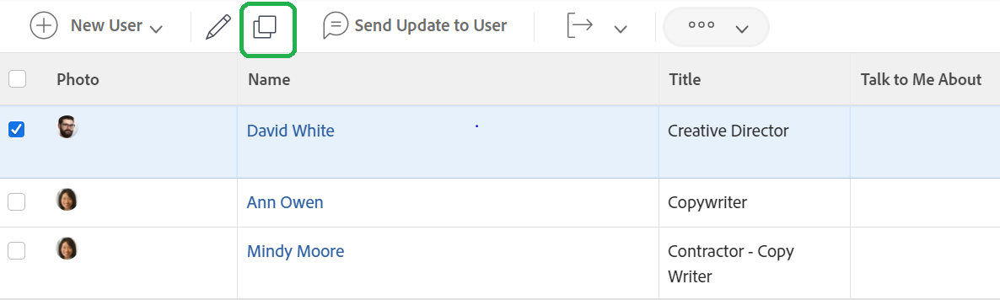

# Create an individual user profile in [!DNL Adobe Workfront]

When a new employee is hired, or someone transfers into a department using [!DNL Workfront], the system administrator needs to create just one user. This can be done quickly and easily from the [!UICONTROL Users] area in [!DNL Workfront].

1. Select **[!UICONTROL Users]** from the **[!UICONTROL Main Menu]**.
1. Click the **[!UICONTROL New Person]** button.
1. Enter the user’s first and last names in the [!UICONTROL New Person] window.
1. Enter the user’s email address. This is their [!DNL Workfront] login and must be unique within your instance of [!DNL Workfront].
1. If you want the user to receive an email about their new login, check the send invite box.
1. Assign the person an access level. This grants their main permissions in [!DNL Workfront].
1. Assign the user to a home group to ensure they have access to the right work.
1. Select **[!DNL Add this Person]** to finish creating the user.

![[!UICONTROL New Person] window](assets/admin-fund-adding-users-1.png)

The [!UICONTROL Show Advanced Options] link opens the complete user details window. This allows the system administrator to set additional organization and resource planning information like teams and job roles, plus enter personal information about the user (phone number, job title, etc.).

![[!UICONTROL New Person] window after clicking [!UICONTROL Show Advanced Options]](assets/admin-fund-adding-users-2.png)

Some of this information can be modified by the user, some of it can’t (depending on the user’s access level permissions).

## Copy an existing user to create a new user

Use an existing user in the system as the base for creating a new login. Some of the existing user’s information will copy, but some of the information needs to be filled in from scratch.

1. Select **[!UICONTROL Users]** from the **[!UICONTROL Main Menu]**.
1. Select the user you want to copy by checking the box next to their name.
1. Select the arrow on the **[!UICONTROL New Person]** button and choose **[!UICONTROL New from Selected Person]**.
1. Fill in the **[!UICONTROL Personal Info]** section with the new user’s information.
1. Some fields are copied from the original user. Change the information, as needed.
1. Select **[!UICONTROL Add This Person]**.

![[!UICONTROL New Person] window](assets/admin-fund-adding-users-4.png)

<!--
Learn more URLs
Add users
-->
