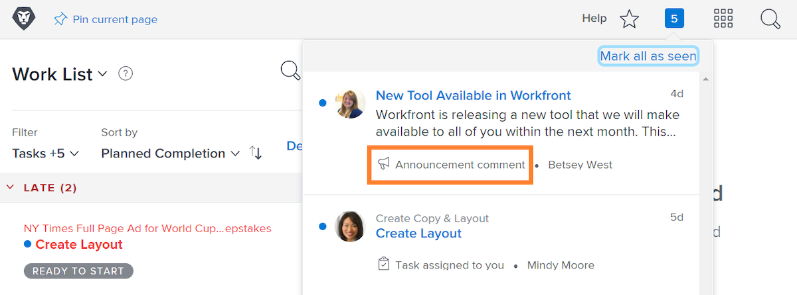

<!---
this has the same content as the system administrator notification setup and mangement section of the email and inapp notificiations learning path
--->

# Send [!UICONTROL Announcement Center] messages

The [!UICONTROL announcement center] is a centralized location for system administrators to receive communications from [!DNL Workfront] or send announcements to your organization’s [!DNL Workfront] users.

[!DNL Workfront] sends announcements to system administrators about software releases, upcoming webinars, system maintenance, and more. The [!UICONTROL announcement center] puts all of this important information in one place, so you don’t lose them among the other messages in your email inbox.

The notification icon shows any unread notifications and announcements sent through [!DNL Workfront]. Announcements in the list are labeled and are clickable if you want to open it.

System administrators also can use the [!UICONTROL announcement center] to send [!DNL Workfront]-wide messages to users. You can send reminders about who to contact for support, offer a “tip of the day,” and more.

![[!UICONTROL All Announcements] link](assets/admin-fund-announcements-2.png)

**To send an announcement**

1. Click the **notification icon**.
1. Click **[!UICONTROL All Announcements]**.
1. Click the **[!UICONTROL New Announcement]** button. By default, the [!UICONTROL Send to] line fills in with [!UICONTROL Everyone] to send a message to all [!DNL Workfront] users. You can delete this and enter names of users, job roles, teams, groups, or companies.
1. Enter a subject line.
1. Then type in the text of the announcement, using the editing tools as desired.
1. Attach files to share by clicking the **[!UICONTROL Add Attachment]** button, if applicable.
1. Click **[!UICONTROL Send]**.

![Writing an announcement on the [!UICONTROL Announcements] page](assets/admin-fund-announcements-3.png)

The announcements area looks like an inbox, with received messages in the left panel. Click a message to read it.

