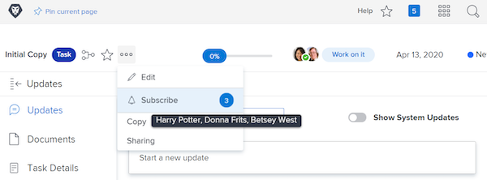

# Subscribe to work items

Event notifications update you about work you’ve been assigned to. However, there may be times when you want to follow work items you’re not assigned to because it may affect the work you do. Subscribing to a specific item is the perfect solution.

For example, you’re interested in the progress of the Initial Copy task. You aren’t assigned to this task, but you’re responsible for editing that initial copy and would like to know what’s going on. You can subscribe to the task and, when updates are made, get an email notification giving a real-time update on how that work is progressing.

It’s important to note that subscription emails and in-app notifications are sent only when comments are made on the item. Emails and notifications are not sent on other actions, such as due date modifications or assignment changes.

In order to subscribe to a work item you must have at least a View sharing permission for that item.

![[!UICONTROL Task Access] window](assets/admin-fund-user-notifications-11.png)

Once you have access to the work item, subscribe to it by:

1. Going to the landing page of the project, task, or issue.
1. Clicking the **[!UICONTROL Actions]** menu.
1. Clicking **[!UICONTROL Subscribe]**.

![[!UICONTROL Subscribe] option in task menu](assets/admin-fund-user-notifications-12.png)

You can see who else has subscribed to the work item by hovering over the number next to [!UICONTROL Subscribe/Unsubscribe] in the menu.

If you have [!UICONTROL Manage] or [!UICONTROL Share] permissions to the work item, you can subscribe other [!DNL Workfront] users to a project, task, or issue by:

1. Clicking the number next to the **[!UICONTROL Subscribe]** option.
1. Adding the name of the person(s) that you want to subscribe to the work item.
1. Clicking **[!UICONTROL Save]**.

![[!UICONTROL Subscribe] window](assets/admin-fund-user-notifications-15.png)

The people you subscribe are not notified of the subscription. All subscribers are given View permissions to the item. However, if the subscriber already had [!UICONTROL Contribute] or [!UICONTROL Manage] permissions to the item, those permissions remain unchanged.

An entry in the [!UICONTROL Updates] tab on the individual item also indicates who subscribed and when. The [!UICONTROL Updates] tab also logs when a user is subscribed by someone else.

![[!UICONTROL Updates] page on a task that shows subscription](assets/admin-fund-user-notifications-16.png)

To unsubscribe a user, click the bubble again to open the [!UICONTROL Subscribers] window. Then click the X next to the person’s name. The user is not notified that they’ve been unsubscribed.

![[!UICONTROL Unsubscribe] menu option on a project](assets/admin-fund-user-notifications-14.png)

<!---
learn more URL: Subscribe to items in Workfront
--->
