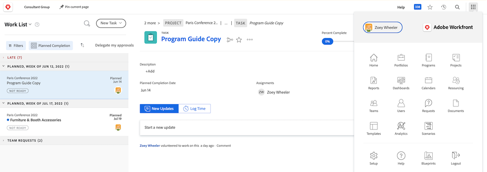
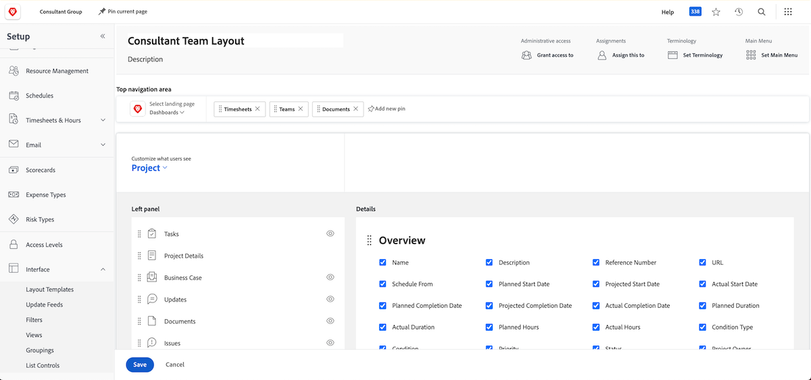
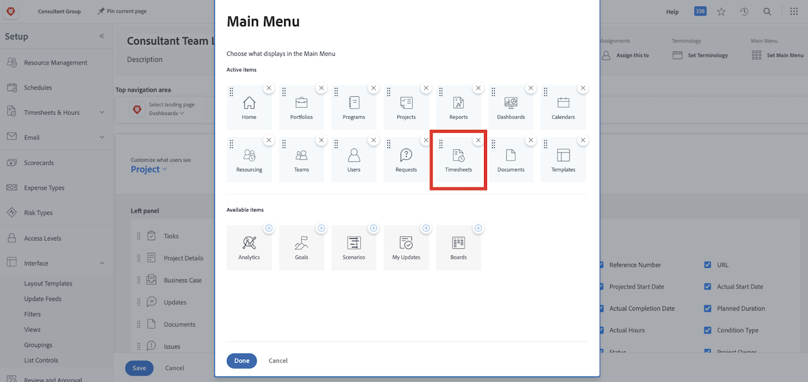

# What are layout templates?

Workfront has a lot of good tools to help you get work done. But too much of a good thing can be overwhelming. 

Layout templates let system administrators and group administrators customize the user’s experience and allow those users to focus on what’s important to them.

For example, the majority of your organization doesn't log time. However, the consultant team does bill clients, so they need to log time to ensure accurate billing. With a layout template, timesheets can be hidden for those who don't need them and show for those who do.

## Before you build

Workfront recommends talking with your users before creating a layout template. Involving those who will be using the layout template, such as the group administrators, will make placing the right information and tools in front of the right people a lot smoother.

And don’t be afraid to make changes after a template has been created. Continue to get feedback on what they need and want to see and access. Remember, layout templates are meant to create a clean and easy experience for your users.
