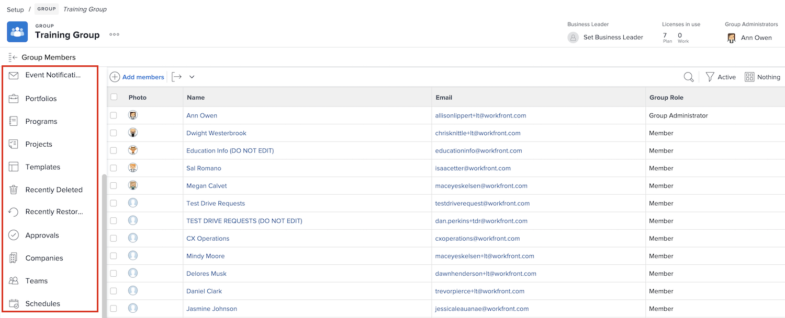

# Understand the need for group administrators

<!---
21.4 updates have been made
--->

When you’re the system administrator for a large company or one that has a lot of [!DNL Workfront] users, maintaining [!DNL Workfront] settings for each group and subgroup can be time consuming. 

Appointing group administrators who can perform some administrative functions for their own groups in [!DNL Workfront] helps balance the load when it comes to updating and maintaining the system.

Group administrators tend to be more in tune with the daily challenges of their group, so they can manage the group’s needs. That allows you, as the system administrator, to focus on the [!DNL Workfront] configurations that benefit your organization as a whole.

Some of the things group administrators can do in [!DNL Workfront] include:

* Create subgroups and add users to the subgroups. 
* Create layout templates for their group. 
* Create approval processes for the group. 
* Create group-level workflow statuses. 
* Access projects, programs, and portfolios associated with the group from the group page. 
* Manage group-level project, task, and issue preferences. 
* Manage group-level timesheet preferences. 
* Manage group-level event notifications. 
* Log in as other group members. 
* Assign a business leader to the group. 
* Manage a company. 

As a system or group administrator, you can create subgroups within the groups and subgroups you administer. Those subgroups can be assigned their own group administrators.

>[!NOTE]
>
>There is a limit of 14 levels of subgroups under one group.

**Learn more about group administrators**

<!---
bullet points below need hyperlinks
--->

For a list of what system administers, group administrators, and subgroup administrators can do in [!DNL Workfront], see the article Actions allowed for different types of administrators.

## Manage a group

Quickly and efficiently manage group members, subgroups, group statuses, group project preferences, and more from the group page in [!DNL Workfront].

1. Select **[!UICONTROL Setup]** from the **[!UICONTROL Main Menu]**.
1. Go to **[!UICONTROL Groups]** in the left panel.
1. Select the name of a group to open it.
1. Open the section you want to make updates in by clicking it in the left panel.

<!---
learn more URLs
Create and manage groups 
Create and manage subgroups 
Business leader overview 
--->
