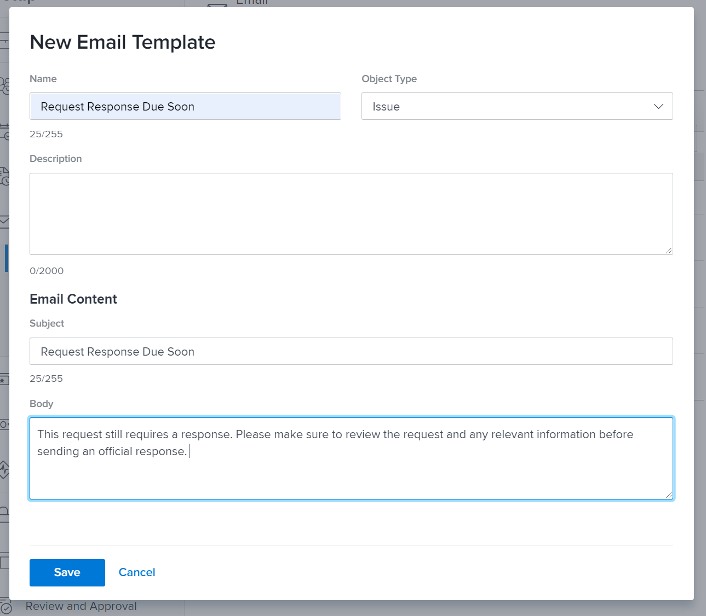

<!---
this has the same content as the system administrator notification setup and mangement section of the email and inapp notificiations learning path
--->

# Set up reminder notifications

Reminder notifications are created by system administrators in the [!UICONTROL Setup] area. Then they can be attached and used by project, task, and issue owners as reminders for when work is due soon or overdue. 

Reminders are object-specific and have to be manually attached to the corresponding work item so the notification can be sent.

**Create a reminder notification**

1. Click **[!UICONTROL Setup]** in the **[!UICONTROL Main Menu]**.
1. Click the **[!UICONTROL Email]** section.
1. Click the **[!UICONTROL Notifications]** section.
1. Click the **[!UICONTROL New Reminder]** tab. 
1. Click the **[!UICONTROL +New Reminder Notification]** button.
1. Select the desired object for the drop-down menu.
1. Fill in the required information.
1. Click **[!UICONTROL Save]**.

![[!UICONTROL New Reminder Notification] window](assets/admin-fund-reminder-notification-1.png)

When setting up the reminder, there are a few things to consider:

* **[!UICONTROL Reminder Notification Name] —** This is the name that will be seen by project managers when they attach a reminder to an object. Make sure the name is succinct but descriptive.
* **[!UICONTROL Qualifying Period] —** The number of hours, days, weeks, or months before/after the date selected in the Timing section.
* **[!UICONTROL Timing] —** Select whether the reminder should be sent before or after the object’s planned, projected, or actual start/completion dates. Options for timesheets are related to the start date, end date, or last update date.
* **[!UICONTROL Criteria] —** Specify the criteria to qualify the reminder to be sent. Options vary depending on the object-specific reminder. 
* **[!UICONTROL Recipients] —** Select who the reminder should be sent to. The stakeholder options vary depending on the object type selected for the reminder.
 
Once the reminder settings have been established and saved, the reminder notification is available to object owners to use within [!DNL Workfront].

## Email customization

Reminder notifications use a default email format and message. If you want to customize the email, you can create a template. Learn more with the [!DNL Workfront One] article, Configure email templates.

<!---
paragraph above needs a hyperlink to an article
--->

<!---
learn more URLs
--->
