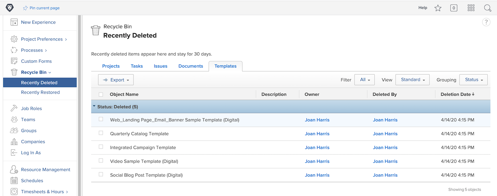
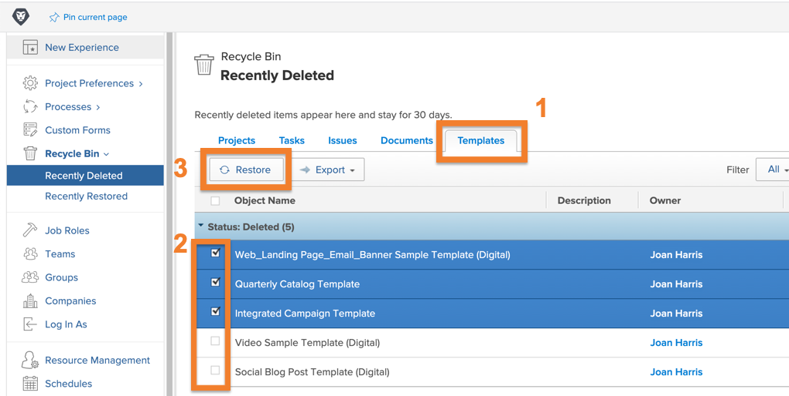

# How to restore objects from the Recycle Bin

Project work goes through many changes. You might delete something, only to realize 30 minutes later that the task was needed or the document was vital to the issue you're trying to resolve.

With the Recycle Bin, when the object is deleted, Workfront places it in the  for up to 30 days. The system administrator can restore the object to its original position in Workfront, along with all its information (updates, logged hours, documents, etc.).

## Restore an object

1. Select the **Setup** area in the **Main Menu**.
1. Click **Recycle Bin** in the left panel.
1. Select **Recently Deleted**.

Each restorable object has a tab to make it easier to find the particular item to restore.

1. Click the desired object's tab.
1. Check the box next to object(s) to restore.
1. Click the **Restore** button.

The object(s) being restored will briefly pop up in an [!UICONTROL In Progress] section. Once the screen refreshes, the object(s) no longer appears on the screen because it has been restored. The items appear where they were previously in [!DNL Workfront], which you can verify on the [!UICONTROL Recently Restored] screen.

Group administrators can restore a project that is associated with the group they manage, along with any tasks, issues, or documents associated with the project.

<!---
learn more URL
Restoring deleted items
Viewing items that have been recently restored
--->
