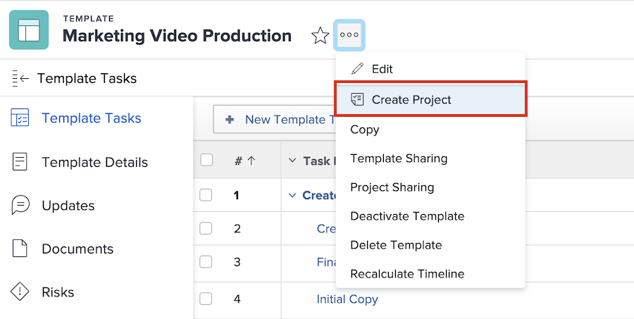

# Create a project directly from a template

<!---
21.4 updates have been made
--->

If you happen to be working on a template and need to create a project using that template, click the 3-dot menu next to the template name. Then select [!UICONTROL Create Project].

The details window allows you to make changes to the settings of the new project.

![[!UICONTROL New Project] details window](assets/project-templates-project-details.png)

<!---
add URL to sentence below
--->

Learn more about how to fill out these fields and other ways you can create a project using a template in the Planner Fundamentals Part 1: Create a project learning path.

<!---
add URL to sentence below
--->

>[!NOTE]
>
>In order to create a project using this method, you need access to the [!UICONTROL Templates] area of [!DNL Workfront]. If you are unable to access templates, you can still use a template to create a project from the [!UICONTROL Projects] area or when converting an issue/task. Refer to the Planner Fundamentals course for details.

## Pro tip

If there’s a template you use frequently, make it a favorite! You’ll see the template listed in the New Project menu, in addition to it appearing under the Favorites and Recents menu in the navigation bar.

![[!UICONTROL New Project] menu showing [!UICONTROL Favorite templates]](assets/project-templates-template-favorites.png)

