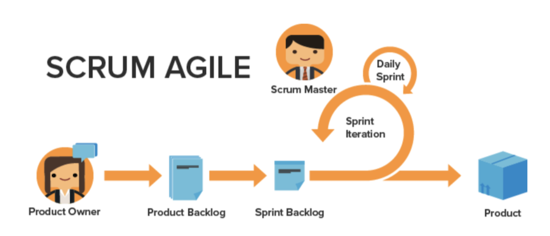

# Benefits of using Agile

## Ability to adjust and pivot quickly 

As the name suggests, the Agile methodology allows teams to be better equipped to quickly change direction and focus. Software and marketing companies are especially aware of the tendency for changes in demand to happen from week to week. Agile allows teams to re-evaluate the work they are doing and adjust in given increments to make sure that as the work and customer landscape changes, the focus also changes for the team. 

## Transparency into a team’s work 

Agile teams use daily meetings called “stand-ups” to make sure the team is staying focused on the prioritized list of features or products to develop. No longer do they experience the confusion of not knowing what everyone else on their team is working on. They keep regular tabs on what the team has accomplished from the day before, any issues/roadblocks they may have that need to be addressed, and what they plan to work on that day. 

 

Having this transparency and unified direction allows everyone to move forward, faster. 

 

## Frequent feedback 

The final major benefit of adopting Agile would be the feedback loop that is incorporated at the end of each iteration (remember: an iteration is a set amount of time in which the team has to work toward completing specific deliverables). The feedback loop allows a team to look back at the last couple of weeks to determine what issues came up, how the plan may be changing moving forward, what the customer now needs if previous needs have changed, and lessons learned as a team.
