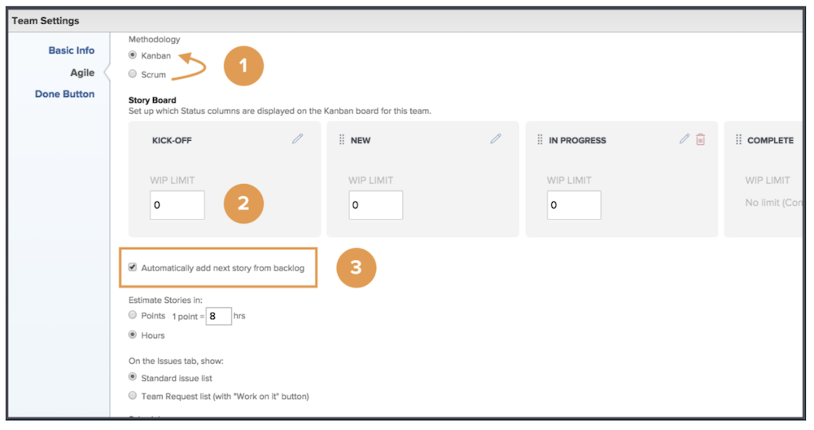
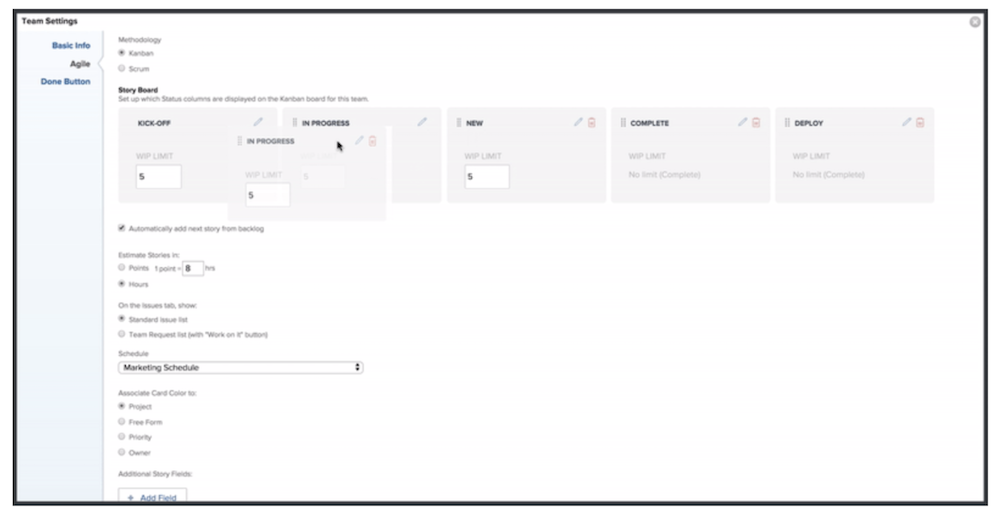
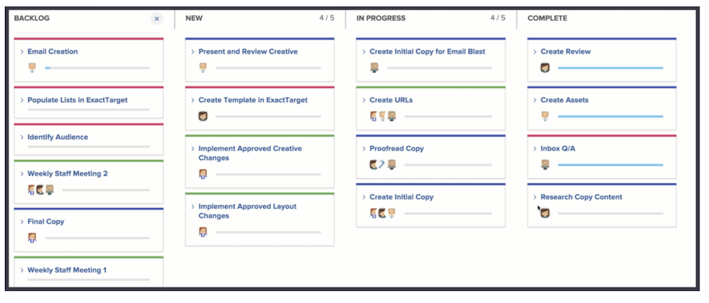
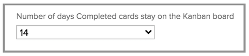

# Creating a Kanban team

## Set up a Scrum Team

Create a Kanban team
The Creative Marketing Team has been using Scrum for a while now. They appreciate the flexible environment of an agile team, but they’re finding it difficult to commit stories to a specific timeframe because of how often priorities change for their team.  

They do have an alternative to Scrum. It’s called Kanban. 

Kanban works for teams that don’t want to define what they’re working on within the timeframe that a Scrum based iteration requires. Instead, Kanban allows teams to work continuously through their backlog. 

Let’s switch the Creative Marketing Team from a Scrum team to a Kanban team [1]. Make this change in the Agile section of the Team Settings.  

After you change the methodology, you need to specify how many stories a Kanban team can have at a time in each column by adjusting the “WIP limit.” [2]. WIP stands for Work in Progress. The number you choose to put here depends on how many active items the team can handle. It will display on the team’s storyboard to help remind them if they are over-allocated or not. You (and any member of the team with editing rights) can also change the WIP limit right from the storyboard. 

Notice that you can drag and drop status columns to put them in the order you’d like them to be in. 

Kanban teams can also choose to have the next story on the backlog automatically appear on the storyboard when a story is completed [see number 3 in top image]. This will help teams who prefer a continuous work cycle.  

The image below shows what it looks like when a new story automatically appears on the storyboard when a story is completed. 

To help manage your completed work more efficiently, stories stay on the board for 14 days by default. 

If needed, that setting can be adjusted to between 1 and 30 days in the team settings window. 

Keep in mind that even though this is a different methodology, it’s still important when working in an agile environment to continually groom the backlog by discussing story requirements and adjusting story priority. Anytime you want to re-prioritize the backlog, you need to move one tab over to the Backlog tab to rearrange it. 

