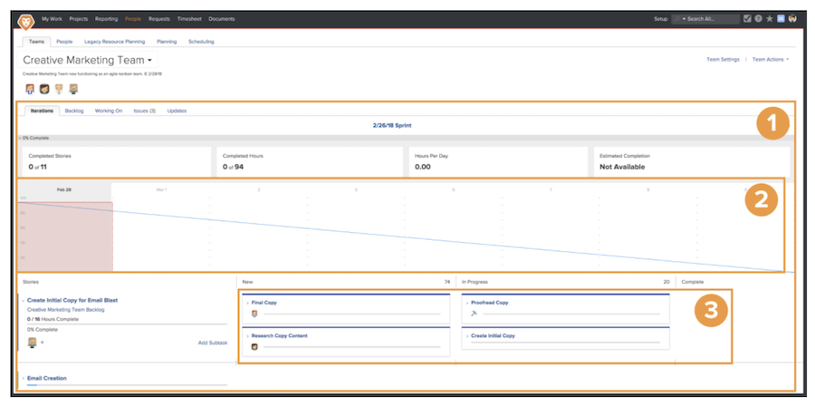

# Create a Scrum Agile Team

## Set up a Scrum Team

An Agile team in Workfront completes its work from the iteration page [1]. The burndown chart [2] at the top of the page is an overview of the progress that's been made so far during this iteration. Below the burndown chart are the stories [3] the team has committed to for this iteration.

In this video, you will learn how to create an agile team, select the scrum methodology, and determine settings for the scrum team.

### Set up a Scrum team from scratch 

Now that you know what it will look like once it’s set up, you can jump right into how to set it up in Workfront. Let’s walk through the setups using a case study for a company called Swains. You’re in charge of operations for the creative team, and you’ve given the OK for the creative marketing team to move to Agile.  

This particular team has decided to adopt Scrum methodology because they love that the storyboard gives them so much more visibility into who is doing what and what status or stage work items are in. Being able to plan out short iterations works well with their current work demands. The team is typically given 2-3 week marketing campaigns and needs to be able to prioritize what their team can do or handle in such a short amount of time.  

## Create a Scrum Agile team in Workfront

In this video, you will learn how to:

- Create an agile team
- Select the scrum methodology
- Determine settings for the scrum team

>[!VIDEO](https://video.tv.adobe.com/v/346281/?quality=12&learn=on)

Already have a team in Workfront that you want to convert to an Agile team? No problem! Go to the Team Settings and check the “This is an Agile team” box. 

 

## Scrum team setup change 

The “On the issues tab, show” option is no longer included on the team settings page because the Issues tab is no longer needed by Agile teams. Issues assigned to a team are found on the Backlog tab, which makes it easier to plan iterations that include both tasks and issues.
