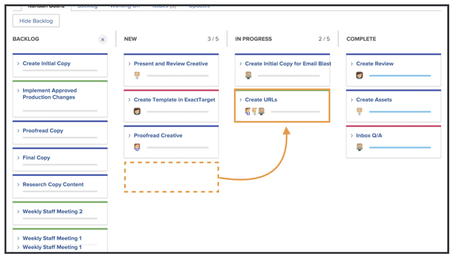
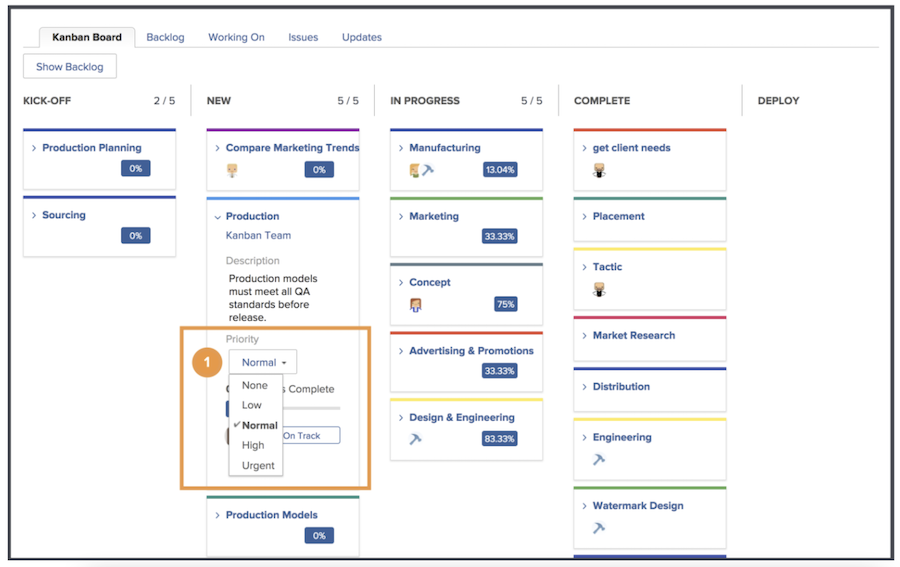
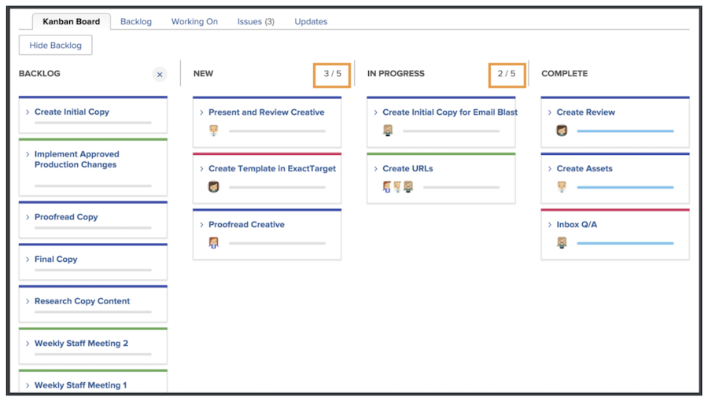
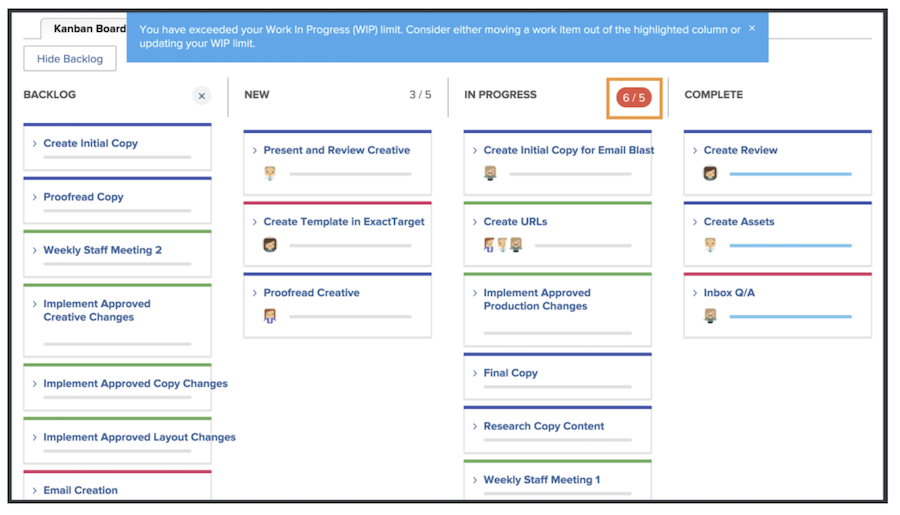

# Manage work as a Kanban team

Manage work as a Kanban team
Add stories to the Kanban backlog 
There are multiple ways you can add stories to the Creative Marketing team’s backlog.  

The team can add stories directly from their backlog. 
They can also be assigned tasks on a project. If the Creative Marketing team has requests routed to them, those requests will appear in the team’s Requests tab. These will appear on the team’s backlog if the team selects the request and converts it to a story. 
 

## Using the Kanban board 

After prioritizing stories in the backlog, it’s time to move to the Kanban board. You are able to make assignments by dragging and dropping the avatars of the team members who will be working on that story onto the story card. 

As progress is made on stories, the team will move them to the appropriate status on the storyboard. Team members can use the Kanban flags to indicate if a story is On Track, Blocked, or Ready to Pull. This communicates to other team members which work items are on track and if they are ready to be worked on or not.

Team members can also make updates to the cards right on the storyboard to reflect changes in things like description, status, or priority. They do this by clicking the dropdown menu on a story card and making their edits to the appropriate field [1]. 

## Kanban story execution  

Note that you are using a Work In Progress limit of five stories. Looking at your board, you see that as you move tasks into status columns, the number of tasks in each lane shows at the top right of each status column.

If you exceed the limit in a status column equating to New or In Progress, you will get an error message indicating that you’ve gone over the work in progress limit. 

If your team decides that they can handle more or less items at a time, you (and other team members with editing rights) can change the Work in Progress number right from the storyboard by clicking on the WIP number and editing it to reflect your new decision. 

