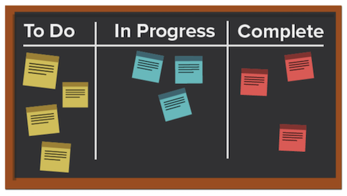
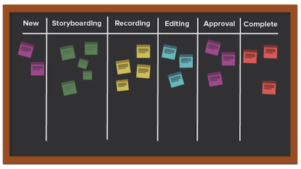
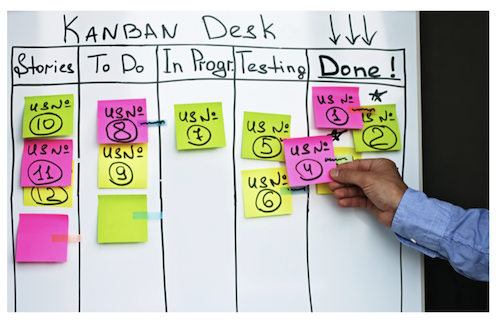

# What is the Kanban methodology and how does it work?

Unlike other agile methodologies that focus on a cyclical process, the Kanban methodology focuses on an optimized workflow. Kanban looks to improve the flow of work by visualizing the work utilizing a Kanban board, setting a limit on the amount of work that can be in progress, and analyzing the flow to make continuous improvements. 

 
Let’s take a look at some of the key elements of Kanban. 

 

## Key players 

The key players in a Kanban team are similar to those in a Scrum team, except there is no Scrum master. It may still make sense for someone to act as a project manager or supervisor, but theoretically this role should occur naturally as the need arises. 

## Visualization: Kanban board 

There are many ways to format your Kanban board. Teams operate off a board that can have any number of columns. Each column represents the status of work being done. 

In the most simplistic board, the first column might be “to do,” the second “in progress,” and the third “complete.” 

Many companies have their own terminology for the column names, or they may even list out each step in a process, but the intent is the same. Team members move their stories from column to column depending on what state the work is in. 

## Prioritization 

Team members work with a product manager or project manager to make sure the stories in the backlog and other status columns are prioritized and that work continues to move forward toward completion. The product manager is still responsible for ensuring the customer’s voice is heard and the product moves in the correct direction.

## Limit work in process 

One unique aspect of Kanban is that teams have a limit on their capacity for the amount of stories they can handle at any given time. Teams choose a certain amount of stories that they are willing to have in their “to do” and “in progress” columns, and they don’t go over that number in order to prevent burnout. Once a story is moved to “complete,” a story from the backlog takes its place in the “to do” column.   

## Continuous improvement 

Kanban allows for continuous improvement by providing a system for teams to measure their effectiveness. They can clearly see how their work flows operate, how long every piece of the workflow takes, and how often they are getting their deliverables out the door on time. This makes it easier to experiment with different ways of doing things to optimize output.
