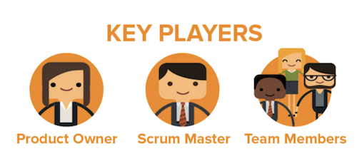
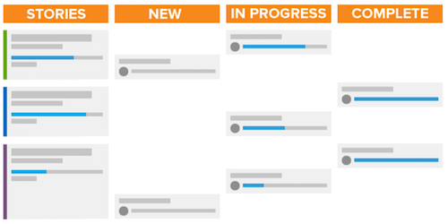
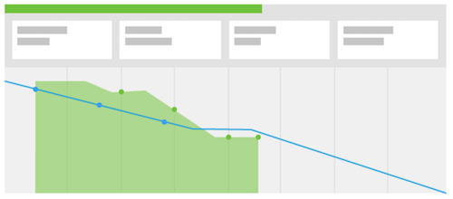

# What is the Scrum methodology and how does it work?

The Scrum methdology encompases the flexibility model but differs from other methdologies in that it has defined roles for those who are part of the team -- such as Product Owner, Scum Master, etc. -- and defined practices to define and complete work.

## Scrum team overview

When you’re deciding whether or not to switch to Scrum, you’ll need to look at the structure of your teams to see if they can easily transfer to the new methodology. A Scrum team has three types of members: a product owner, a scrum master, and team members. 

### Product owners 

Product owners own the product and have the vision for what the product is or will be. They are a voice for the customer and the primary driver of business decisions and the prioritization of product features. 

### Scrum masters 

Scrum masters help the team get work done by finding needed resources and creating consensus among the team to get their work done as efficiently as possible. They also facilitate communication and consensus throughout the process.  

### Team members 

A team is usually cross functional and has members with lots of different job roles and skill sets. They are in charge of planning, executing, and delivering product increments. They will benefit from being physically located in the same place or having access to tools that allow for quick and easy collaboration, both with each other throughout the day and in their daily team stand-up meetings. 

## Working as a Scrum team 

Once you’ve assembled these key players, they will follow a new style of workflow for getting their work done and delivering a product to the customer. Again, in comparison to traditional or waterfall methodology, they will no longer follow a linear process of coming up with a plan for a final product, then going through the steps or phases needed to deliver that product. Instead, Scrum teams first build a backlog.  

 

### Building a backlog 

The Scrum team looks at a list of priority features and desired functionality referred to as stories. They need to ask the customer and discuss as a team what they want/need out of the system or product they are going to build.  

Once they have created their major stories, they need to groom their backlog. As a team, they need to go through four major steps. 

* Break down big stories into smaller increments by discussing what needs to be done for each story. 

* Prioritize their stories and decide which features should be developed first.  

* Clarifies the requirements and acceptance criteria for a story to be considered done.  

* Estimate the amount of effort the team needs to expend to complete each story and the backlog. This can be done in hours or in points. Points allow you to tell how hard or complex the story is instead of planning out time required for each component of the story.  
 

### Iteration planning 

After the backlog is groomed and prioritized, it’s time to plan the iteration. (Many organizations use the word “sprint” and “iteration” interchangeably.) The team decides on which stories to complete based off of stories that are considered ready to go. The team makes assignments and decides on the duration of the iteration. 

 

### Executing the iteration 

Now, it’s time to execute the iteration. Team members begin to do their work like a traditional team would, but they now incorporate a quick, daily meeting called a stand-up meeting. 

Members of the team will literally stand-up for this short meeting and answer three questions:  

* What did I get done yesterday?  
* What will I get done today?  
* What are the roadblocks that they are running into preventing progression of their assignments?  
 

These meetings keep everyone on the same page and moving forward quickly. 

 

## Using a burndown chart and storyboard to track progress 

As a team answers the three primary questions in their standups, it’s important that they monitor and track their progress toward the iteration completion. Doing so allows them to determine if they are moving quickly enough through their stories to deliver all features on time at the end of the iteration. There are two components to do this in the Scrum process.  

### Storyboard 

Using a storyboard, teams move their stories through status columns to show when work items are New, In Progress, or Complete. 

### Burndown chart 

A burndown chart can be used to monitor if the team is completing stories at a fast enough rate, or velocity. Burndown charts can be used on individual iterations or the entire product release. 

