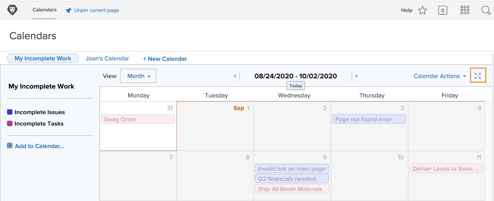
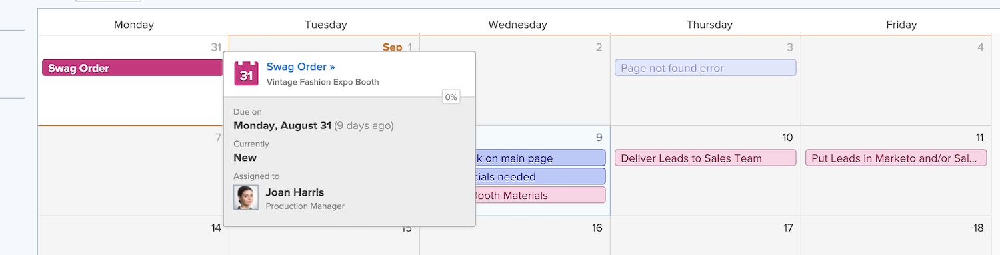

# Understand the calendar interface

In this section you will learn about:

* Calendar groupings
* Calendar views
* Calendar Actions menu
* And how to create an ad-hoc calendar item
 
Before creating your own custom calendars, let’s take a tour of the basic features available on custom calendars.

## Calendar groupings

A single calendar can be organized into distinct work item groupings. Each grouping can be toggled on and off, allowing users to focus on the work items that matter most at any moment.

## Calendar views

The calendar can be displayed in month, week, or [!UICONTROL Gantt] format. Use the scroll bar on the side or the arrows at the top to move through the calendar. The [!UICONTROL Gantt] view lets you see your work from a different perspective. Find the view that works best for you. 

![An image of the calendar screen in the [!UICONTROL Gantt] view](assets/calendar-1-1bb.png)

## [!UICONTROL Calendar Actions] menu

Just like other work items, calendars have an [!UICONTROL Actions] menu, allowing you to view weekends on a calendar; delete or copy a calendar; share a calendar with individual Workfront users, system-wide, or with external users; and add the calendar to your [!UICONTROL Favorites] menu.

![An image of the [!UICONTROL Calendar Actions] screen](assets/calendar-1-1c.png)

## Fullscreen mode

View the calendar in fullscreen mode by clicking the full screen icon. Click again to return to the original size.

## Summary information

Select an item on the calendar to display summary details of that item, including name, originating project, status, assignment, progress status, and due date.

## Ad hoc events

Double-click to create ad hoc events on a calendar to represent your schedule or other work items.

>[!NOTE]
>
>Creating an ad hoc event does NOT create a task in Workfront.

