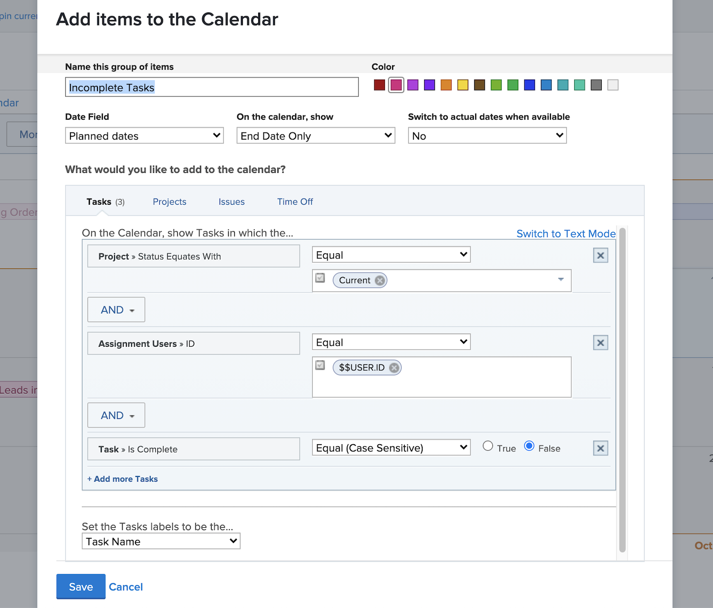
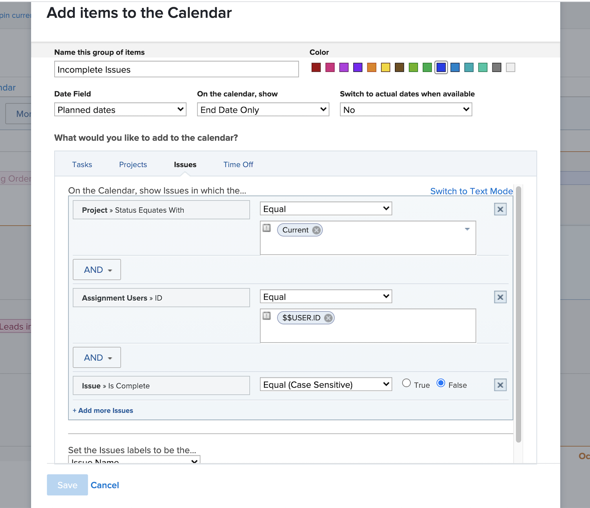
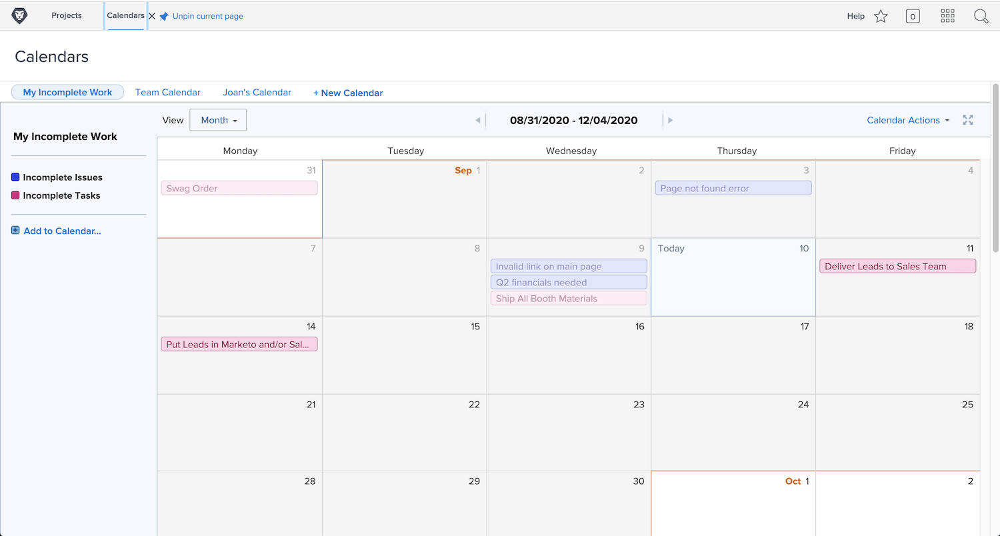

# Your turn to create a calendar

In this activity you will get hands on experience creating your own calendar.

## Activity: Create a calendar

Create a customer calendar named “My Incomplete Work”.
Include a calendar group named “Incomplete Tasks” showing all incomplete tasks assigned to you on Current projects.
Select red as the color for these items.
Include another calendar group named “Incomplete Issues” showing all incomplete issues assigned to you on Current
projects. Select blue as the color for these items. 

## Answer

1. Navigate to the Calendars area from the
Main menu.
2. Click the New Calendar button and Name
the calendar “My Incomplete Work.”
3. Under the first grouping, click Add advanced
items.
4. In the Add items to the calendar window that
pops up, name the group “Incomplete Tasks.”
5. Select red as the color.
6. Change the Date Field to Planned Dates.
7. Set the On the calendar, show field to End
Date Only.
8. Set the Switch to actual dates when available
field to No.

9. In the What would you like to add to the
calendar? section, select Tasks.
10. Add three filter rules:
• Project > Status Equates With > Equal >
Current
• Assignment Users > ID > Equal > $$USER.
ID
• Task > Is Complete > Equal > False
11. Click Save.

12. Create a second grouping by clicking Add to
Calendar.
13. Under this grouping, click on Add advanced
items.
14. In the Add items to the calendar window that
pops up, name the group “Incomplete Issues.”
15. Select blue as the color.
16. Change the Date Field to Planned Dates.
17. Set the On the calendar, show field to End Date
Only.
18. Set the Switch to actual dates when available
field to No.
19. In the What would you like to add to the
calendar? section, select Issues.
20. Add the following three filter rules:
• Project > Status Equates With > Equal >
Current
• Assignment Users > ID > Equal > $$USER.ID
• Issue > Is Complete > Equal > False
21. Click Save.

Because you used $$USER.ID in the filters, you can share
this calendar with others and they will see their own
incomplete tasks and issues.
