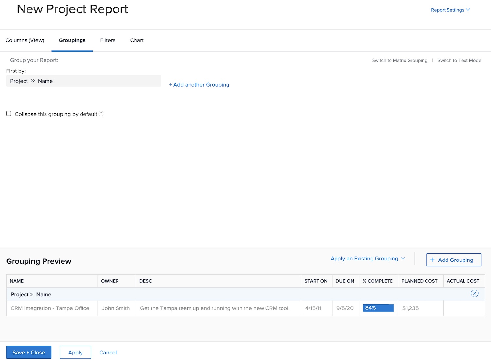

# Create reports with charts

In this video, you will learn:

* How charts can improve the visualization of data 
* How to use Workfront’s chart tools

>[!VIDEO](https://video.tv.adobe.com/v/335155/?quality=12)

## Activity: Add a chart to a report

The end of the quarter is nearing, and you want to see how recently completed projects stuck to their budgets. Create a report that shows the planned cost vs. the actual cost for projects. You want to see only projects that were completed in the last quarter. Add a combination column chart using custom colors.

## Answer

1. Select **[!UICONTROL Reports]** from the **[!UICONTROL Main Menu]**.
1. Click the **[!UICONTROL New Report]** menu and select **[!UICONTROL Project]**.
1. In the **[!UICONTROL Columns (View)]** tab, click **[!UICONTROL Add Column]**.
1. Select [!UICONTROL Project] > [!UICONTROL Planned Cost] and summarize this column by **[!UICONTROL Sum]**.
1. Click **[!UICONTROL Add Column]** again.
1. Select [!UICONTROL Project] > [!UICONTROL Actual Cost] and summarize this column by **[!UICONTROL Sum]**.

   

1. In the **[!UICONTROL Groupings]** tab, set the report to group by [!UICONTROL Project] > [!UICONTROL Name].

   

1. In the **[!UICONTROL Filters]** tab, add two filter rules:

   * [!UICONTROL Project] > [!UICONTROL Status Equates With] > [!UICONTROL Complete]
   * [!UICONTROL Project] >[!UICONTROL  Actual Completion Date] > [!UICONTROL Last Quarter]

   

1. In the **[!UICONTROL Chart]** tab, choose **[!UICONTROL Column]** for the chart type.
1. For the [!UICONTROL Left (Y) Axis], choose [!UICONTROL Project] > [!UICONTROL Planned Cost].
1. For the [!UICONTROL Bottom (X) Axis], choose [!UICONTROL Project] > [!UICONTROL Name].
1. Click the **[!UICONTROL Combination Chart]** button and select [!UICONTROL Project] > [!UICONTROL Actual Cost] in the **[!UICONTROL Value]** field.
1. Click the arrow next to the color box to change the [!UICONTROL Actual Cost] color. Select one of the colors that appears or click the box in the lower-right corner to bring up the color palette.
1. Click on **[!UICONTROL Save + Close]**. When prompted for a report name, call it “Planned vs Actual Cost by Project Completed Last Quarter.”

   
