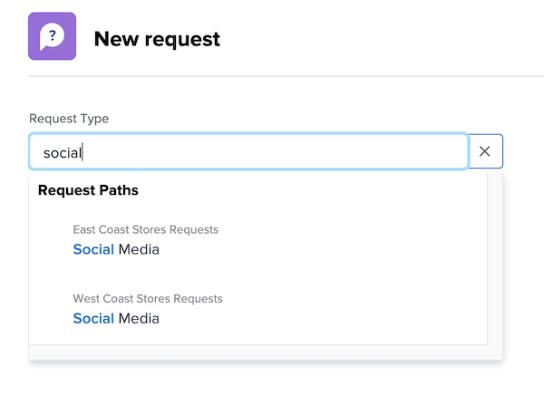

# Make a request

In this video, you will learn how to:

* Navigate to the request area
* Make a request
* View submitted requests
* Find a draft of a request

>[!VIDEO](https://video.tv.adobe.com/v/336092/?quality=12)

## Access request queue paths quickly and easily 

When you click into the [!UICONTROL Request Type] field, the last three request paths you recently submitted to automatically display at the top of the list. Select an option to file another request to that same queue.

At the bottom of the list are all the request queues you have access to. If you're not sure which queue to use for your request, use the keyword search to quickly and easily find the one you need.

As you type in keywords, [!DNL Workfront] brings up matches so you can find the request queue path that suits your needs. For example, to make a request for a social media post, start typing “social media” in the [!UICONTROL Request Type] field and the list dynamically updates to show any matches.

Select the option you want, fill out the request form, and submit the request. 

<!---
Learn more
Requests area overview
Create and submit Workfront requests
Guides
Make a work request
--->
