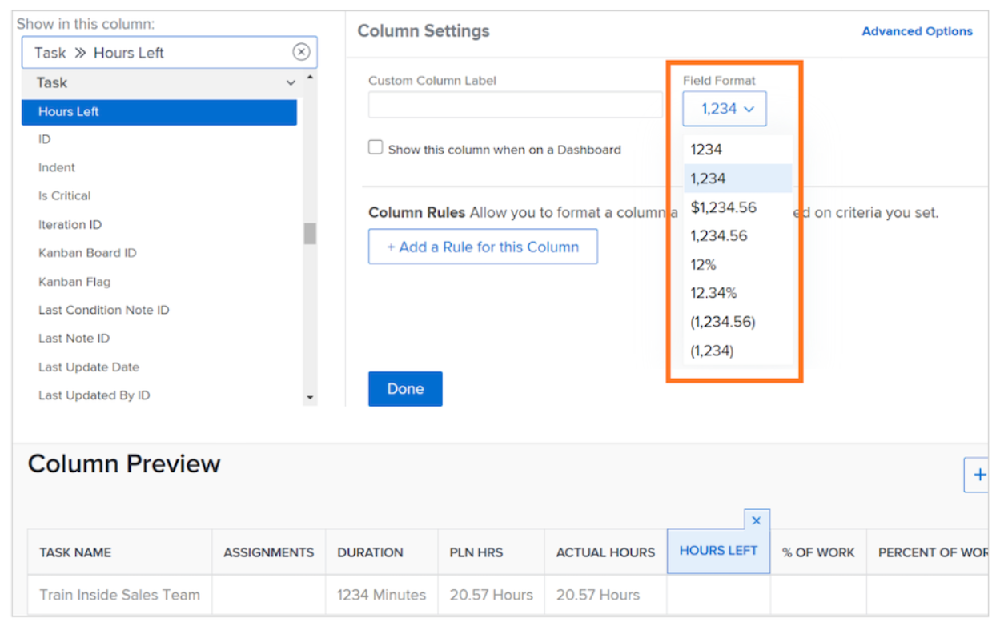
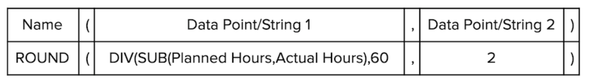

# Create a SUB, SUM, DIV, or PROD data expression

In this video, you will learn:

* What the SUB, SUM, DIV, and PROD expressions do
* How to create a SUB data expression in a calculated field

>[!VIDEO](https://video.tv.adobe.com/v/335177/?quality=12)

## Additional Information: ROUND expression

### Create a ROUND expression

The ROUND expression takes any number and rounds it to a certain number of decimal places. 

Most of the time, the ROUND data expression is used in conjunction with another data expression and when the format field is left as either Text or Number.

Let’s create a calculated field to determine the difference between the number of hours planned and actually logged on a task, which will require the SUB expression and look like this: 

**SUB(Planned Hours,Actual Hours)**

And since time is tracked in minutes and the preferred format is to show the information in hours, the expression also needs to be divided by 60 and look like this:

**DIV(SUB(Planned Hours,Actual Hours),60)**

If the format is changed to Number when building the calculated field in the custom form, you can change the number format when adding the field in a view.

However, if the field format when creating a custom field is left as Text, the format can’t be easily changed within the view. The ROUND expression has to be used to avoid seeing numbers like this in your project:

Use the ROUND data expression in a calculated field
The ROUND expression includes the name of the expression (ROUND) and, typically, two data points. These data points can be an expression or a field in [!DNL Workfront], followed by a number to indicate how many decimal places you would like to go.

An expression would be structured like this: ROUND(data point, #)

In the expression calculating the difference between planned and actual hours, use this expression —DIV(SUB(Planned Hours,Actual Hours),60)—as the first data point. Then make sure whatever number comes from that expression doesn’t go more than 2 places to the right of the decimal. 

The expression could be written like this: ROUND(DIV(SUB(Planned Hours,Actual Hours),60),2).
