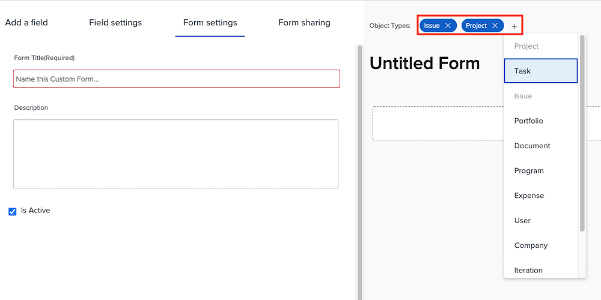

# Create and share a custom form

In this video, you will learn how to:

* Determine what objects to use for your form
* Add unique fields in a variety of formats
* Organize fields using sections and logic
* Share forms with other users

>[!VIDEO](https://video.tv.adobe.com/v/335172/?quality=12)

## Custom forms work with multiple object types

Adobe Workfront has recently updated custom forms to support multiple object types. Now, when you click on the [!UICONTROL New Custom Form] button, you can select as many objects as you want to use with a single custom form. All the fields you add to this form will be available to any of the selected objects when the custom form is attached to them.

![Custom form window showing the [!UICONTROL New Custom Form] object options](assets/create-custom-form.png)

When you edit a custom form you can see all the object types selected. You can add or delete object types from this list.

You might want create a custom form of type project and issue. When attached to an issue, you can fill out any of the fields relating to the issue. Later, if you decide to convert the issue to a project, the custom form will automatically be loaded to the project and the data you put in the fields of the issue custom form will be available to view or edit in the project custom form.  

## Custom field options

**[!UICONTROL Label] and [!UICONTROL Name] fields**

The [!UICONTROL Label] and [!UICONTROL Name] fields on a custom field serve different purposes. [!UICONTROL Label] is the field name that users will see in [!DNL Workfront]. [!UICONTROL Name] is what can be used with integrations, such as API.

![Custom form window showing [!UICONTROL Label] and [!UICONTROL Name] fields](assets/custom-forms-field-label-and-name.png)

This provides the flexibility to change the user-facing label to match changes in your organization, without affecting integrations or other connections that rely on a specific field name.

**[!UICONTROL Text Field with Formatting]**

The [!UICONTROL Text Field with Formatting ]contains basic text markup tools that allow users to add bold, italics, or underline on text while filling in the field on a custom form.

![Custom form window showing [!UICONTROL Text Field with Formatting] option](assets/custom-forms-text-field-with-formatting.png)

The field also has a 15,000 character limit, allowing for plenty of space to provide vital information and use formatting to make it easy for others to read.

**[!UICONTROL Typeahead] field**

The [!UICONTROL Typeahead] field allows the system to automatically populate a list of options based on the object selected for the field.

![Custom form window showing [!UICONTROL Typeahead] field option](assets/custom-forms-typeahead-1.png)

For example, if you create a [!UICONTROL Typeahead] field called "Marketing Manager Approval Name" and select [!UICONTROL User] as the referenced object type, a list of user names appears when a user fills in that field on a custom form. The [!UICONTROL Typeahead] field is meant to connect your custom data with information captured in the system and eliminate the need to manually maintain many options in drop-down fields.

![Custom form window showing [!UICONTROL Typeahead] drop-down menu](assets/custom-forms-typeahead-2.png)
