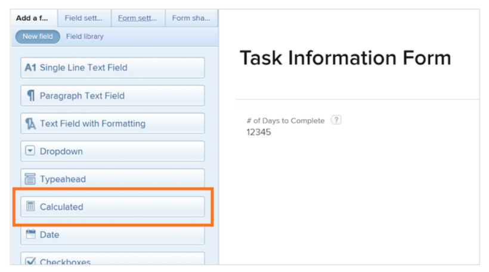

# Get started with calculated fields and expressions

<!-- **Note**: The expression examples shown are simple and some may be mitigated by fields already supplied by Adobe Workfront. However, the examples are used to illustrate the foundational knowledge needed in order to build expressions in Workfront.-->

[!DNL Workfront] provides a variety of fields that are common across multiple areas of business and are regularly used for work management. Fields like planned completion date, project budget, task assignee name, etc.

Yet, each organization has data specific to its industry and company that needs to be gathered in order to understand if company objectives are being met. For instance, your organization wants to keep track of:

* What line of business a project will contribute to.
* If funding is coming from suppliers, internal, or both.
* What resolution is needed for images used.

Although those fields are not inherently built into [!DNL Workfront], you can create custom data entry fields and pre-populated, multi-select answer fields through a [!DNL Workfront] custom form.

This learning path focuses on the calculated field. You will learn what a calculated field is, the different types of information you can pull into the calculated field through data expressions, and how to build those calculated fields to enhance your data collection and reporting.

**Custom form reminder**

Fields are object specific. For example, if you create a calculated field on a task custom form, you can use that field in any task report.

## What is a calculated field?

A calculated field houses custom data created by using data expressions and existing Workfront fields. 

For instance, your organization has a specific project numbering, or work number, system that includes the:

* Year the project was created,
* Initials of the project owner, and
* The [!DNL Workfront] project reference number.

Using expressions in a calculated field, you can take each piece of information already stored in [!DNL Workfront] and create that unique project ID, or work number, which can then be added to a report like this:

Depending on the specific data needed, calculated fields can be simple, using one or two expressions, or more complicated, using several embedded expressions. Just keep in mind that [!DNL Workfront] can only use data already stored or pulled into the system for calculated fields.
