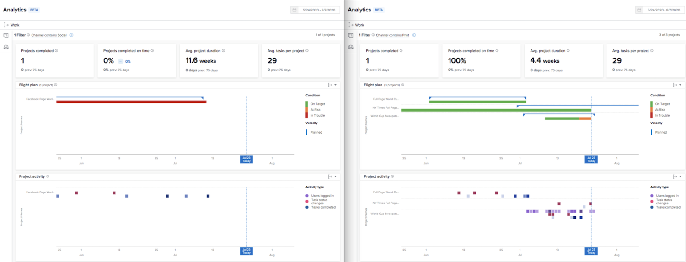

# Understand KPIs

In this video, you will learn:

* How to get value from the KPI data

>[!VIDEO](https://video.tv.adobe.com/v/335046/?quality=12)

## Compare KPIs

KPIs not only provide valuable information for what's happening in the present, but they give users the power to compare changes in activity over time or the difference between portfolios, programs, project owners, or any other filter used.

For example, you can pull up analytics in two browser tabs to compare KPIs.
