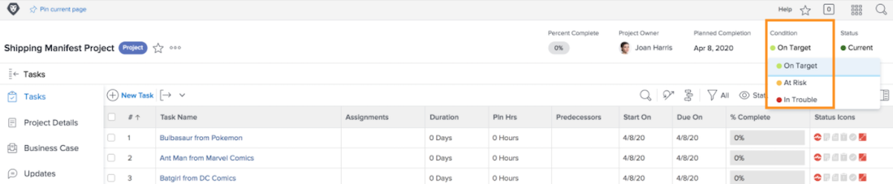

# Understand navigating and reviewing projects

In this video, you will learn:

* How to read the Flight plan chart

>[!VIDEO](https://video.tv.adobe.com/v/335047/?quality=12)

## Flight plan chart

On the chart, you see:

1. Project names are on the left.
1. Dates are shown across the bottom. 
1. The vertical blue line shows the specific date where your mouse is hovering. 
1. Horizontal blue lines show the planned start and end dates of the project.
1. Green lines indicate the project is On Target.
1. Orange lines indicate the project is At Risk. 
1. Red lines indicate the project is In Trouble. 

Seeing this information about your projects helps you determine:

* What events extend a project past the planned completion date.
* When a project starts to run into issues.
* How many projects are open over the same time period.
* How many projects are active.
* Which projects need extra attention or support.

## Condition is based on progress status

The project condition is a visual representation of how the project is progressing. Workfront determines the condition based on progress status of tasks within the project.

The condition of a project can be set:

* **Manually**, by users with access to manage the project, when the project’s condition type is set to manual. This allows you to set the condition of the project independently from the critical path.
* **Automatically**, by Workfront, when the condition type of the project is set to Progress Status.

Workfront recommends that you set the condition type to Progress Status so you have a clear indication of the true progress of the project, based on the progress of your tasks.

In this case, the project condition can be:

* **On Target**—When the progress status of the last task on the critical path is On Time, the condition of the project will be On Target. The project is on track to finish on schedule.
* **At Risk**—When the progress status of the last task on the critical path is Behind or At Risk, then the condition of the project is At Risk. The project is on track to finish late but isn't late yet.
* **In Trouble**—When the progress status of the last task on the critical path is Late, then the condition of the project is In Trouble. The due date is in the past and the project is now late.

>[!NOTE]
>
>Conditions can be customized for your environment, so you may find more than three options or the names may be different than the ones above. For information about customizing conditions, see the article Create or edit a custom Condition.
