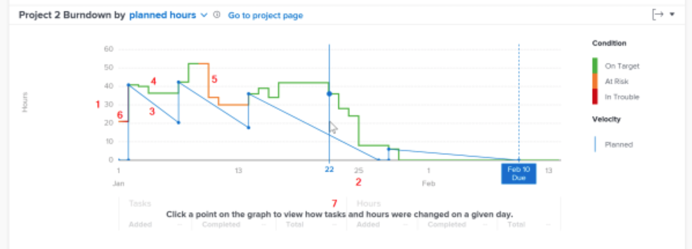

# Burndown overview - accessing and reviewing the burndown

In this video, you will learn:

* How to access the Burndown chart
* How to understand the relationship between remaining hours, the project condition, and velocity on a project

>[!VIDEO](https://video.tv.adobe.com/v/335051/?quality=12)

## Track project velocity

The Burndown chart allows you to understand the relationship between remaining hours, the project condition, and velocity. The solid line shows the hours spent on the project over time, as well as the condition of the project each day. The dashed line—which shows the planned velocity from the start date to the planned completion date—adjusts as dates on tasks are changed.

Seeing this information helps you determine:

* How problems coming in (unplanned work) affected the planned work.
* Which events extended your project past the planned completion date.

On the chart, you can see:

1. Number of hours on the left.
1. Dates are shown across the bottom, including the project's planned completion date if it appears in the selected date range.
1. The solid blue line shows the velocity of the project (either the planned hours or duration over time), turning into a dashed vertical line when it reaches the planned completion date for the project.
1. Green lines indicate when the project condition is On Target.
1. Orange lines indicate when the project condition is At Risk.
1. Red lines indicate when the project condition is In Trouble.
1. Information about tasks and hours (totals, amount added, and amount completed) on a specific day display below the x axis when you click a specific point on the chart.
