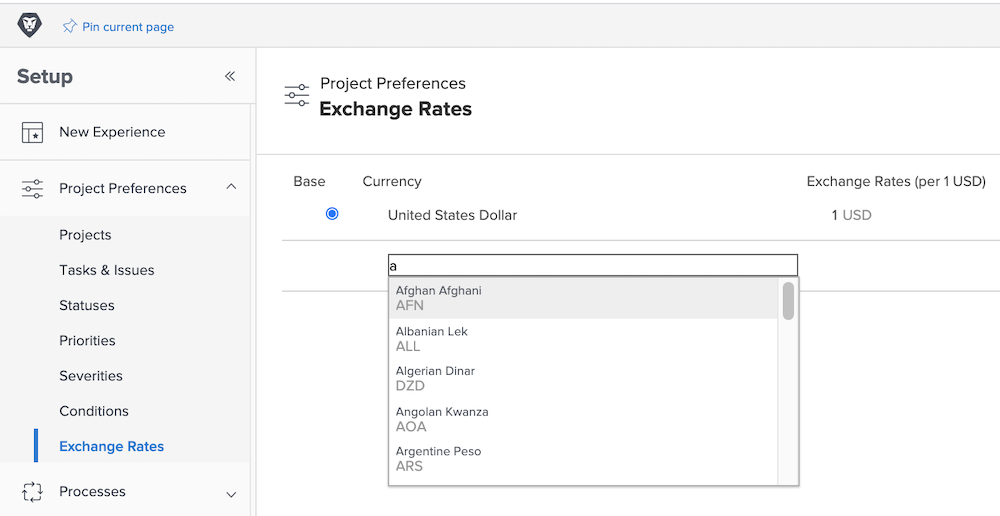

# Set up exchange rates

[!DNL Workfront] supports different currencies for customer organizations that are multinational companies. Exchange rates can be used on projects and reports to reflect financial information in different currencies from around the world.

Exchange rates are managed by system administrators. Additional currencies can be set up as needed for your organization.

[!DNL Workfront]’s base (default) currency is the United States dollar. This is the currency that financial information will be calculated in by default, unless a different currency is specified on an individual project.

## Set up currencies and exchange rates

**Select [!UICONTROL Setup] from the main menu.**

1. Expand **[!UICONTROL Project Preferences]** in the left menu panel.
1. Click **[!UICONTROL Exchange Rates]**.
1. Click the **[!UICONTROL Add Currency]** button.
1. Select the country currency from the dropdown.
1. Enter the desired exchange rate for the currency.
1. If a currency other than the U.S. dollar should be the [!DNL Workfront] system’s base (default) currency, click the button next to the currency name.
1. Click **[!UICONTROL Save]** when all currencies have been added.

>[!NOTE]
>
>Workfront does not update or track current market values for exchange rates. Updates, if needed, must be done manually.

