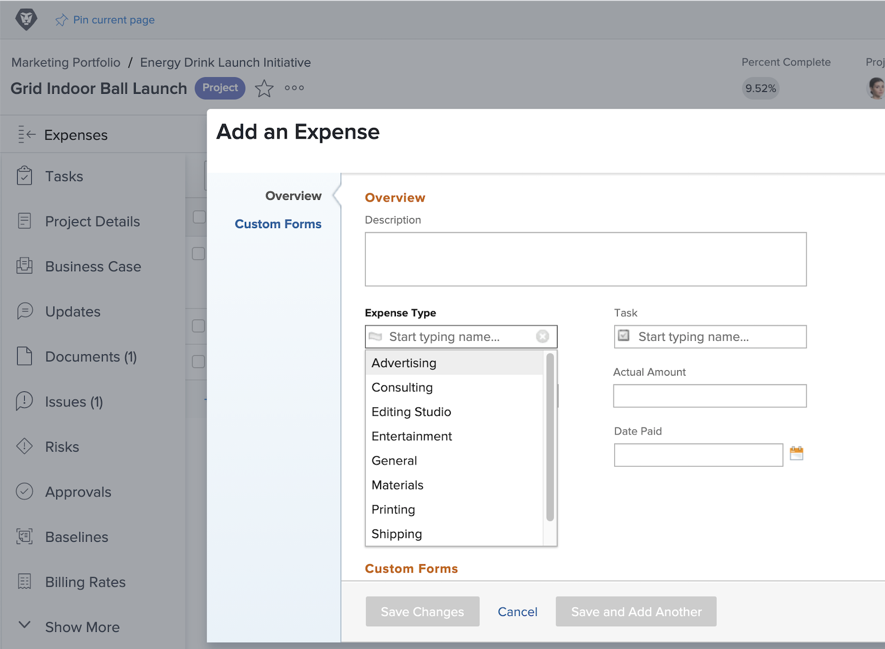

# Set up exchange types

Expenses in [!DNL Workfront] represent non-labor costs associated with projects and other work. Expenses could be, for example, travel expenditures while visiting a client or the purchase of supplies needed to complete a photo shoot. These expenses should be logged within the project so planned costs and actual costs can be calculated and reported on for any project.

[!DNL Workfront] has pre-built expense types that can be used when entering expenses. The defaults cannot be deleted or modified, but new ones can be added.

* Advertising
* Consulting
* Entertainment
* General
* Materials
* Printing
* Shipping
* Travel

A system administrator can add expense types needed for their organization. These additional expense types can be modified, hidden, or deleted to support the financial reporting needed in your organization.

Project managers, executives, and others can generate expense reports — grouping the individual expenses by type, if desired — for tasks, projects, programs, or portfolios within [!DNL Workfront]. Project financials become much more manageable using expense types.

## Create an expense type

**Select [!UICONTROL Setup] from the main menu**

1. Click **[!UICONTROL Expense Types]** in the left panel menu.
1. Click the **[!UICONTROL New Expense Type]** button.
1. Name the expense type.
1. Add a description, if needed.
1. Click the **[!UICONTROL Save]** button.

![An image of creating a new [!UICONTROL Expense Type]](assets/setting-up-finances-6.png)

## Using expense types

The expense options show up in the **[!UICONTROL Expense Type]** dropdown when users create an expense on a project or task in [!DNL Workfront].

