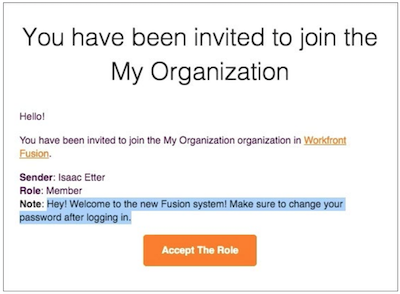
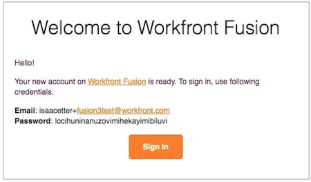

# Log in as a new user

When you are invited as a new user to a Workfront Fusion instance you receive two emails.

One email has a note the Workfront Fusion system administrator added when they created your profile and invited you to the organization. At the bottom of the email is [!UICONTROL Accept The Role] button. **Don’t click this button yet!**

The other email contains your login credentials.

To start using Workfront Fusion, click the [!UICONTROL Sign In] button in the second email and sign in using the password provided.

After signing in the first time, you are prompted to change your password.

Once you’ve signed in, go back to the other email and click the [!UICONTROL Accept The Role] button.

Once you do that, go back to Workfront Fusion and refresh the page. You can now see your team and the overview sections in the left panel.
