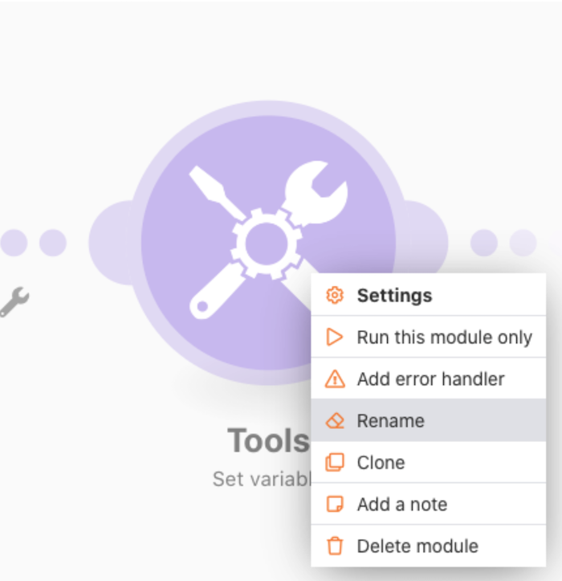
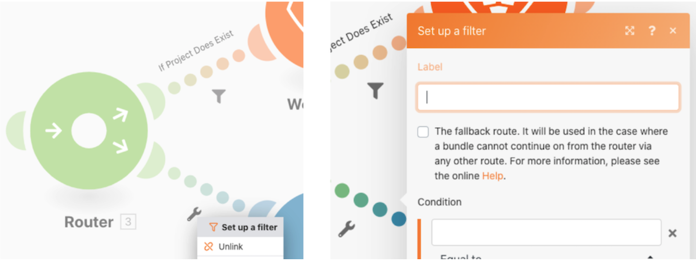
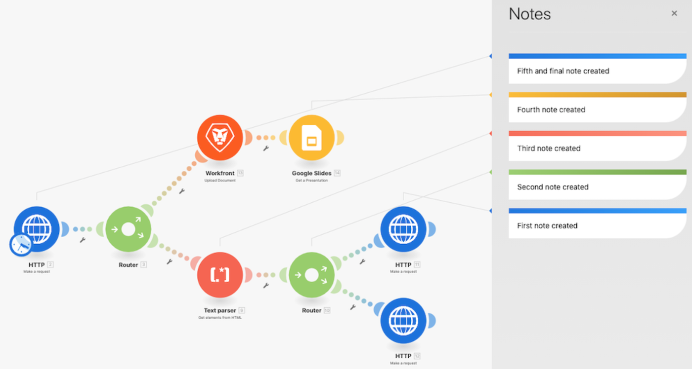
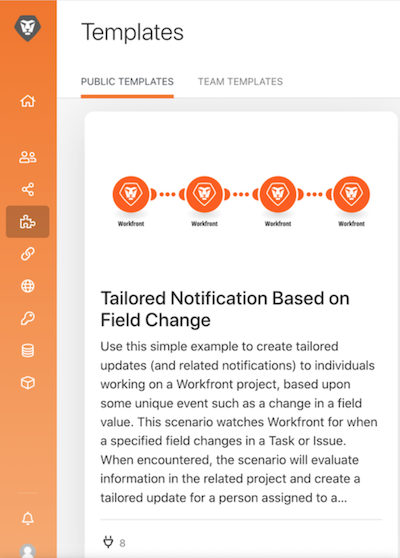
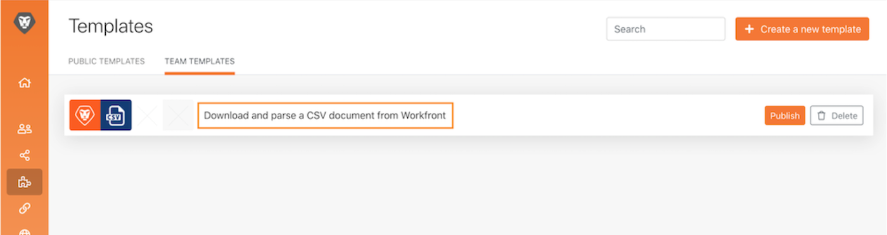
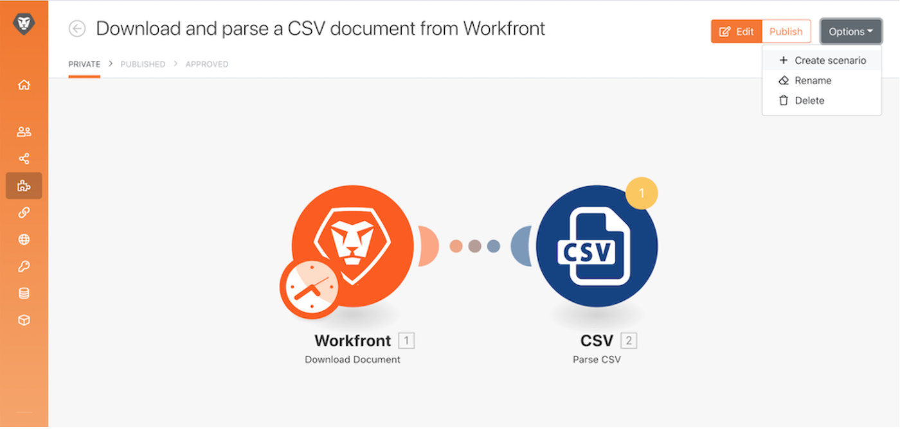
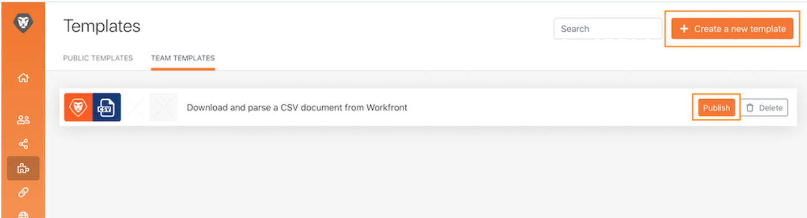
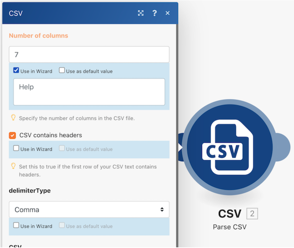

# Accessibility and clarity

Early in the Workfront Fusion training, you learned some basic best practices for making scenarios easy to read, share, and understand. These practices help make things easier for future Workfront Fusion users or anyone troubleshooting or supporting your Workfront Fusion instance. Pay it forward by following the guidelines below when designing scenarios.

## Labels and notes

As a general rule, a primary goal in Workfront Fusion is always to have simple scenario designs. Here are some ways to make for simple-to-interpret designs.

* Make sure you are naming all modules. Right-click a module and select Rename. Module labels should be short yet understandable for what the module is performing. For example, “Create Mktg Proj w/ Ch Template.”

* Label routing paths as well. Even if a path doesn’t use a filter directly after a router, you can apply a label without filling out the filter logic. Doing this allows others to understand what bundles pass down which paths and why. To create a label for a router path with no filter, right-click the path, add a label, and save.

* Add notes where applicable in a scenario if a module label or routing path label is going to be too short to clarify what’s actually happening. You can add notes whenever you want throughout your design and iteration process.

However, it may be easiest to read and understand if you add notes at the very end of your scenario design when you are ready to launch. Work from the end of your scenario design (the far bottom, right corner) backward. That way the notes that apply to the beginning of your scenario are at the top of the list when opening the notes panel. 

After saving or closing the notes panel, notes are sorted with the most recently created at top. In the image below, the first note created appears at the bottom of the list. Notes were intentionally created from the bottom right to the path above and finally to the trigger— essentially the reverse order a bundle of data would pass through the scenario. This makes the notes appear in the order the scenario actually executes on the bundle of data.

## Workfront Fusion templates

A great way to streamline the labeling of modules and routing paths is by using templates. Best practice templates can speed up creating scenarios for common use cases.

### Template example

When starting a scenario, first check if there is a template available that will help. For example, you want to create a scenario that starts by downloading a CSV document from Workfront, then parses it. 

Click the Templates section to see if any public templates meet your needs.

Click the Team Templates tab to see if someone on your team created a template that might be useful. 

If you find a template you want to use, click the name to open it. 

Then go to the upper-right corner, click Options, and select Create scenario.

### Create a template

You can create a template in the Team Templates section. The template you create is available to you and your team, but when you click the Publish button you can share it with people outside your team.

When building the template, you can include a wizard to guide people who use it to build their scenarios, changing the connections, mapped data, and other panel fields as appropriate.

Check the “Use in Wizard” checkbox to add instructions that will be available when someone builds a scenario using your template. This information will appear in the Help field. To allow users to see this text when using the template, enable Use as default value.

## Want to learn more? We recommend the following:

[Workfront Fusion documentation](https://experienceleague.adobe.com/docs/workfront/using/adobe-workfront-fusion/workfront-fusion-2.html?lang=en)
