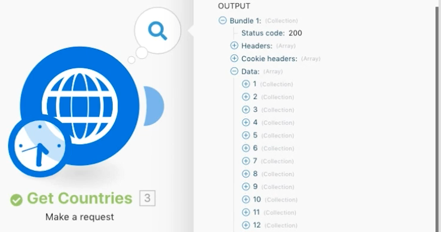
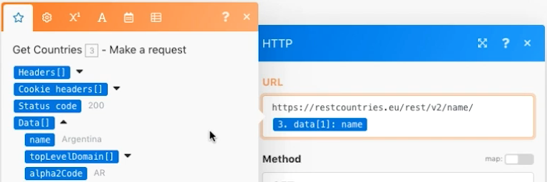
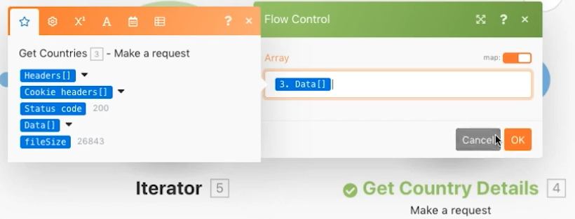
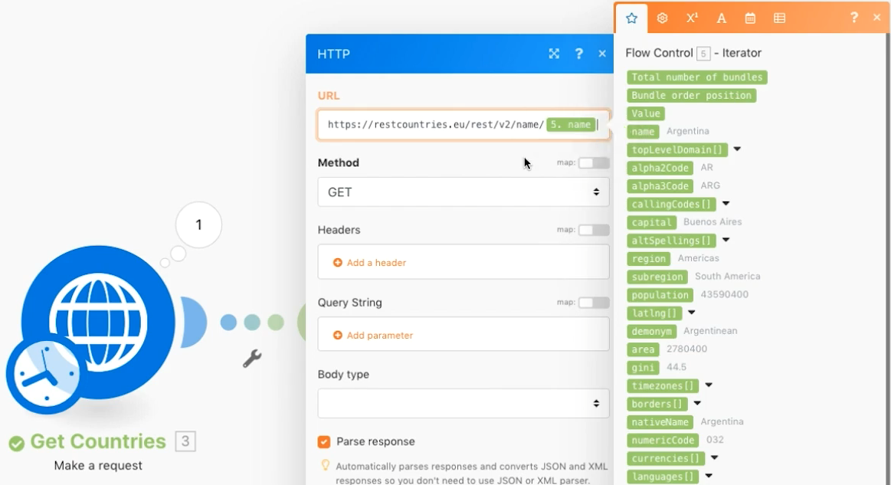
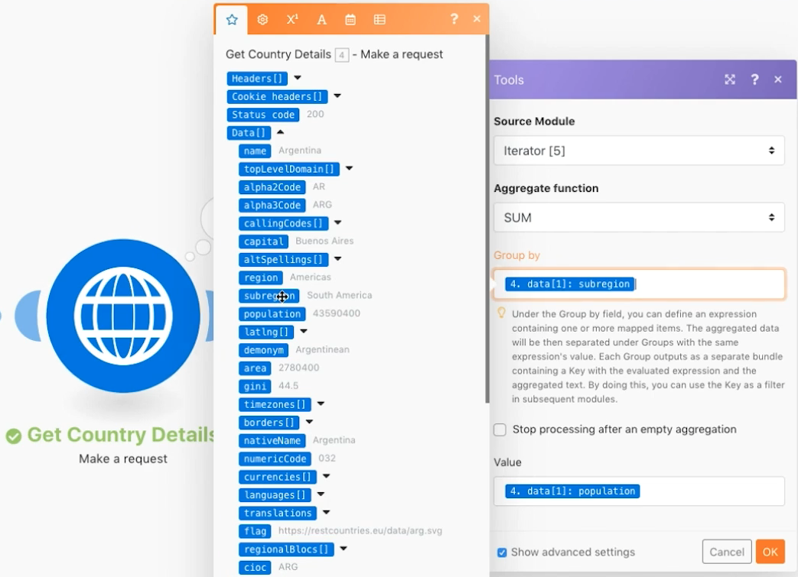
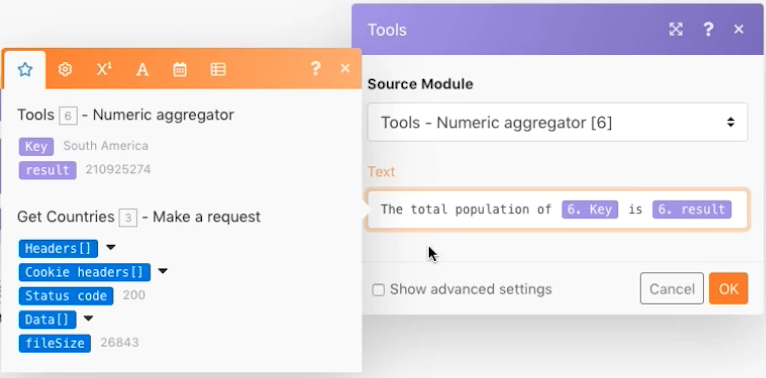

# Advanced Aggregation

Understand how to use groupings when aggregating.

## Exercise overview

Call a web service to return details about multiple countries and identify the total population of all countries, grouped by subregion.

   

## Steps to follow

   **Get country details.**

   

   1. Create a new scenario and name it "Advanced aggregation."
   1. Set the trigger module to an HTTP - Make a request module.
   1. Use this URL, https://restcountries.eu/rest/v2/ lang/es, which gives you a list of all countries where Spanish is spoken.
   1. Leave the Method as Get.
   1. Click the Parse response checkbox.
   1. Rename this module "Get Countries."
   1. Click Save and Run once.

   **The output is a single bundle, but it comes in an array with 24 collections, one for each Spanish speaking country.**

   

   **You need to gather subregion information for each of the countries, so you'll need to make an additional HTTP request.**

1. Add another request to get subregion information. It will only return the first country, but that's OK for now. Add another HTTP Make a request module and use the URL https://restcountries.eu/rest/v2/name/.
1. To get the name of the first country, go to the mapping panel and click Data, then Name in the array. The [1] in the data field means it will return the first item in the array.

   + Click the number and change the index if needed, but in this case you just want the first item.

   

1. Check Parse response in the mapping panel, then click OK.
1. Rename this "Get Country Details."
1. Click Save, then Run once.

   + The output is information for a single country.

1. To get the other countries, you need to iterate through the array. Add an iterator, which takes a list of things and outputs a bundle for each item on the list.

   **Add the iterator and aggregator.**

1. Right-click between the HTTP modules and add the Iterator Flow Control module.
1. In the Array field, select Data from the Get Countries module.

   

1. In the Get Country Details module, update the URL field to take the name field from the iterator instead of from the Get Countries module.

   

1. Now add a numeric aggregator after Get Country Details to group and sum the populations.
1. The source module is the iterator module.
1. The aggregate function is SUM.
1. The value is [data:population] from the Get Country Details module.
1. Click the Show advanced settings option at the bottom and group by [data:subregion] from the Get Country Details module.

   

   **Finish with a text aggregator to aggregate what you grouped within the numeric aggregator.**

1. Add a text aggregator to the end.
1. The source module is the numeric aggregator.
1. In the Text area, insert "The total population of [KEY] is [result]."

   

1. Save and Run once.

   + Review the output from the final module.
