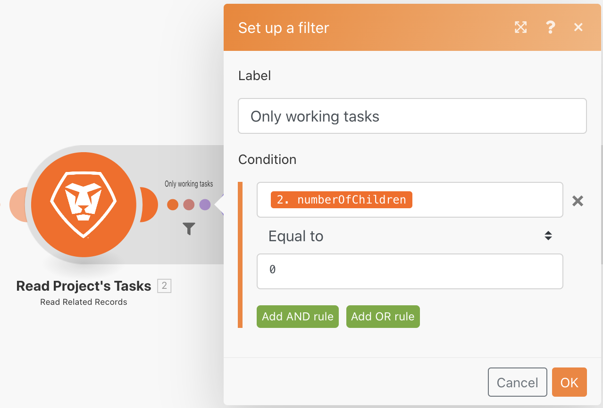
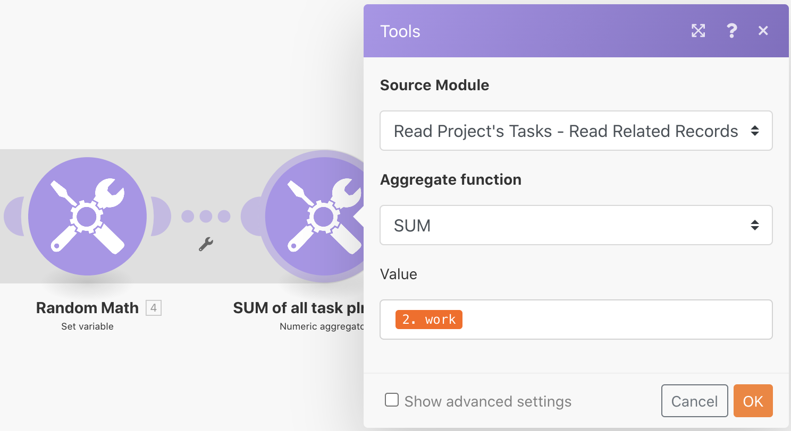
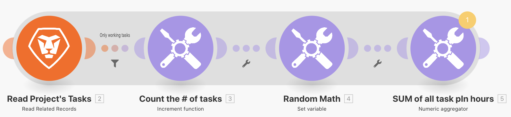
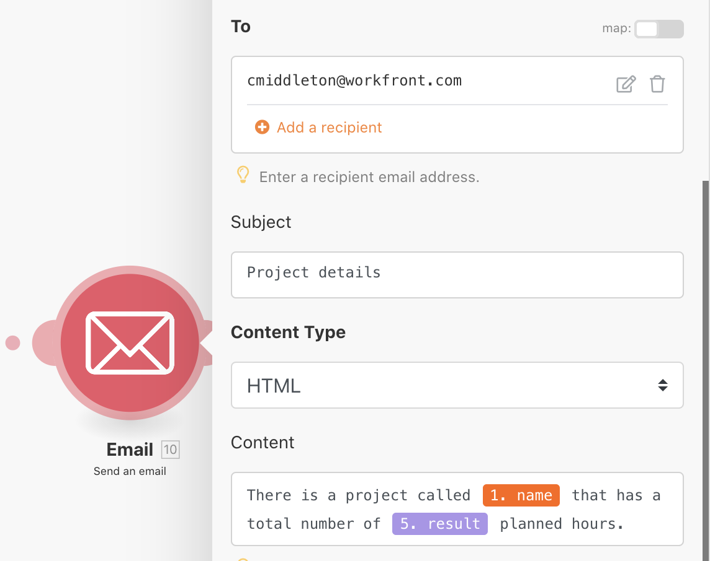

# Aggregation

Learn to aggregate multiple bundles of information into a single value.

## Exercise overview

Using the "Introduction to iteration" scenario you built in the last exercise, aggregate the planned hours on every working task in the project and send an email to yourself with that information.

## Steps to follow

**Add a filter and SUM the planned hours.**

1. Clone the "Introduction to iteration" scenario you created in the previous exercise, and name it "Introduction to aggregation."

1. Add a filter between the Read Project's Tasks module and the Count the # of tasks module. Name the filter "Only working tasks."

1. Set the condition to Number of Children <Numeric Operator: Equal to> 0.

1. After the Random Math module, add a Numeric Aggregator tool module.

1. Set the source module to Read Project's Tasks.

1. Set the Aggregate function to SUM.

1. Set the Value to the Work field from the Read Project's Tasks module.

1. Rename this module "SUM of all task pln hours."

**Note the shadow that shows that the aggregation ends the iteration.**

**Send an email with aggregated hours.**

1. Add a Send an email module from the Email app, after the numeric aggregator.

1. Send the email to yourself.

1. Subject line is "Project details."

1. In the Content field, put "There is a project called [project name] that has a total number of [result] planned hours." The "[project name]" is taken from the Read a Record module and "[result]" is taken from the aggregator module.

1. Save and Run once. Find the email in your inbox.

Within the iteration, the individual bundles can be accessed. But outside of the iteration, in the Send an email module, only aggregated fields can be accessed.
