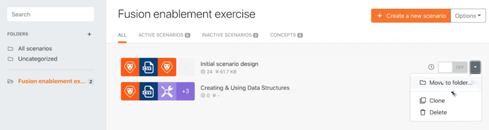
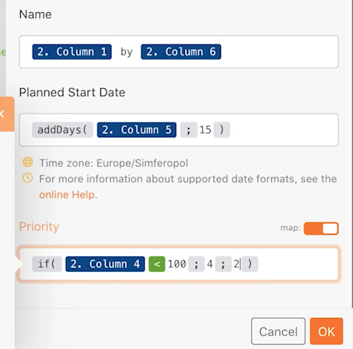

# Beyond basic mapping

Learn how to use the mapping panel formulas to manipulate or convert field(s) sent to a module.

## Exercise overview

Change the project name, planned start date, and priority from the Beyond Basic Mapping walkthrough exercises using the mapping panel formulas.

   

## Steps to follow

   **Make a clone of your Initial scenario design scenario.**

1. Select the Clone option to the right of the Initial scenario design in the scenario section, as shown below. Name it "Beyond basic mapping."

   

   **Now we're going to use the mapping panel in the Create Workfront projects module to configure the project name, planned start date, and priority fields.**

1. Click the Create Workfront projects module to edit the settings. Using the mapping panel, change the Name field to be "[My Project Name] by [Sponsor]."

   + The [My Project Name] is column 1 from the Parse CSV module and [Sponsor] is column 6. The word "by" is just typed between the two.

1. Next go to the Planned Start Date and use the addDays formula to add 15 days to the field, as described in the Beyond basic mapping walkthrough video.
1. Find the Priority field and toggle the Map button at the top right of the field. The picklist menu changes to a number. Create an if statement to label a project as High(4) priority if the CSV file confidence rating is less than 100, otherwise it can be Normal(2).

   + The confidence rating is in Column 4.

   **At this point, your mapping panel should look like this:**

   

1. Click OK and then click Run once.
1. Find the project in your Workfront instance to make sure everything was mapped correctly.
1. Save your scenario.
