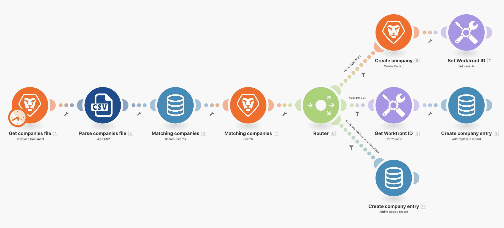
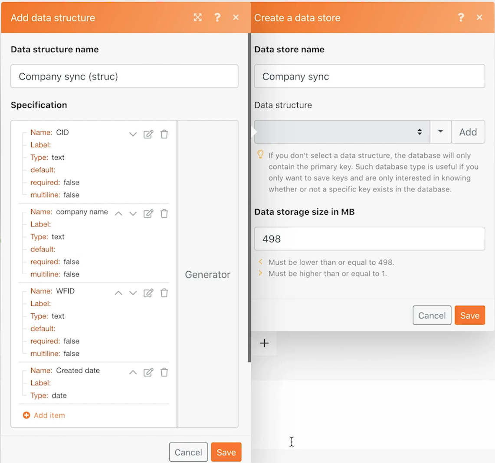
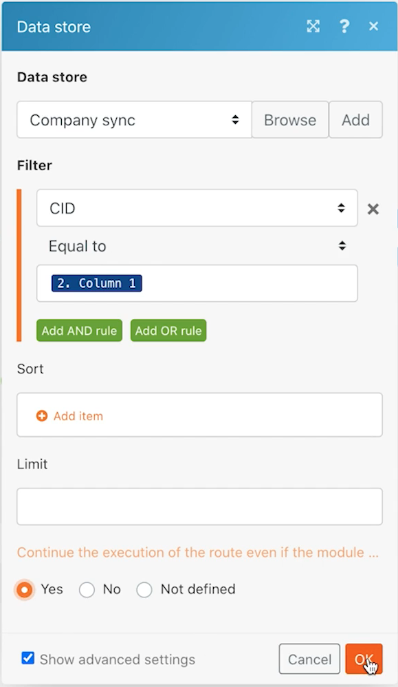
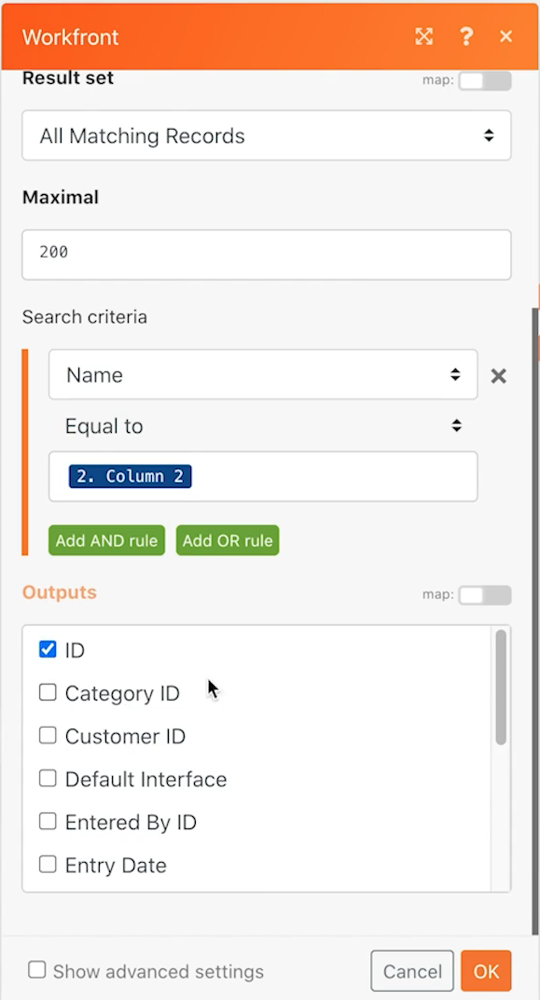
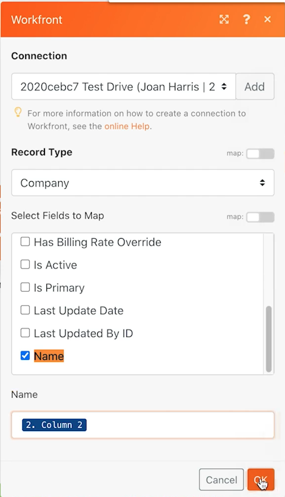
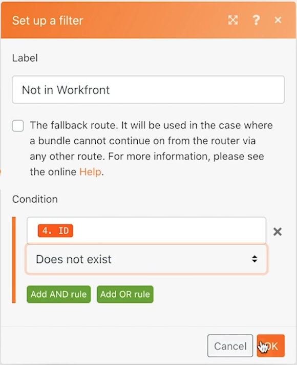
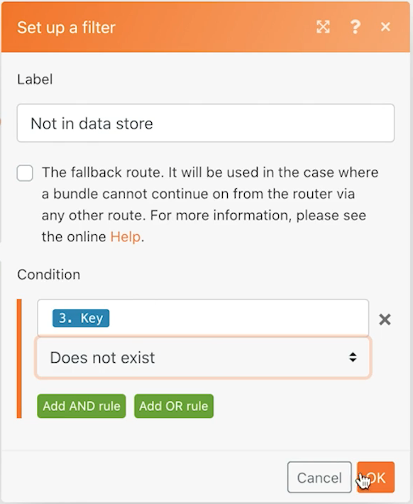
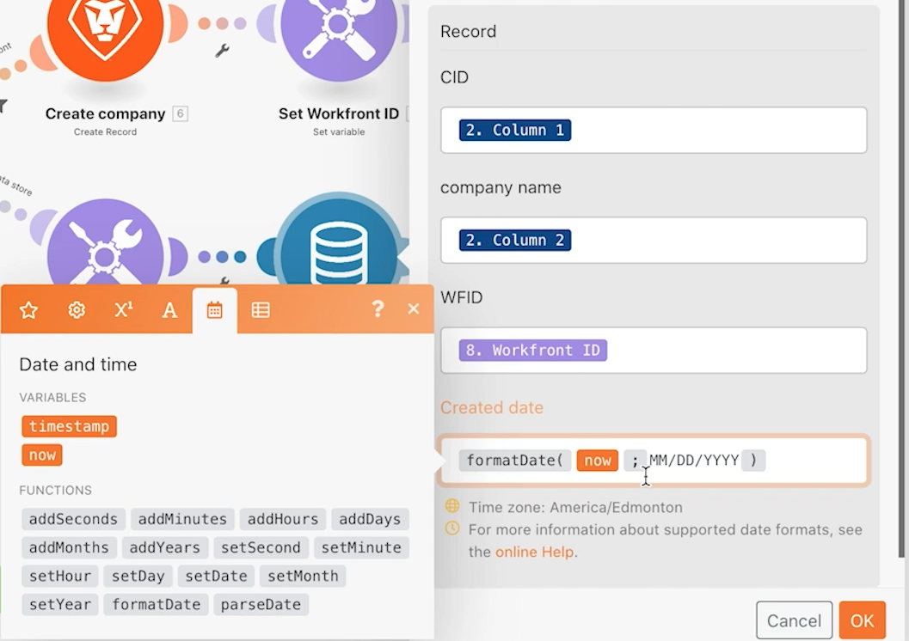
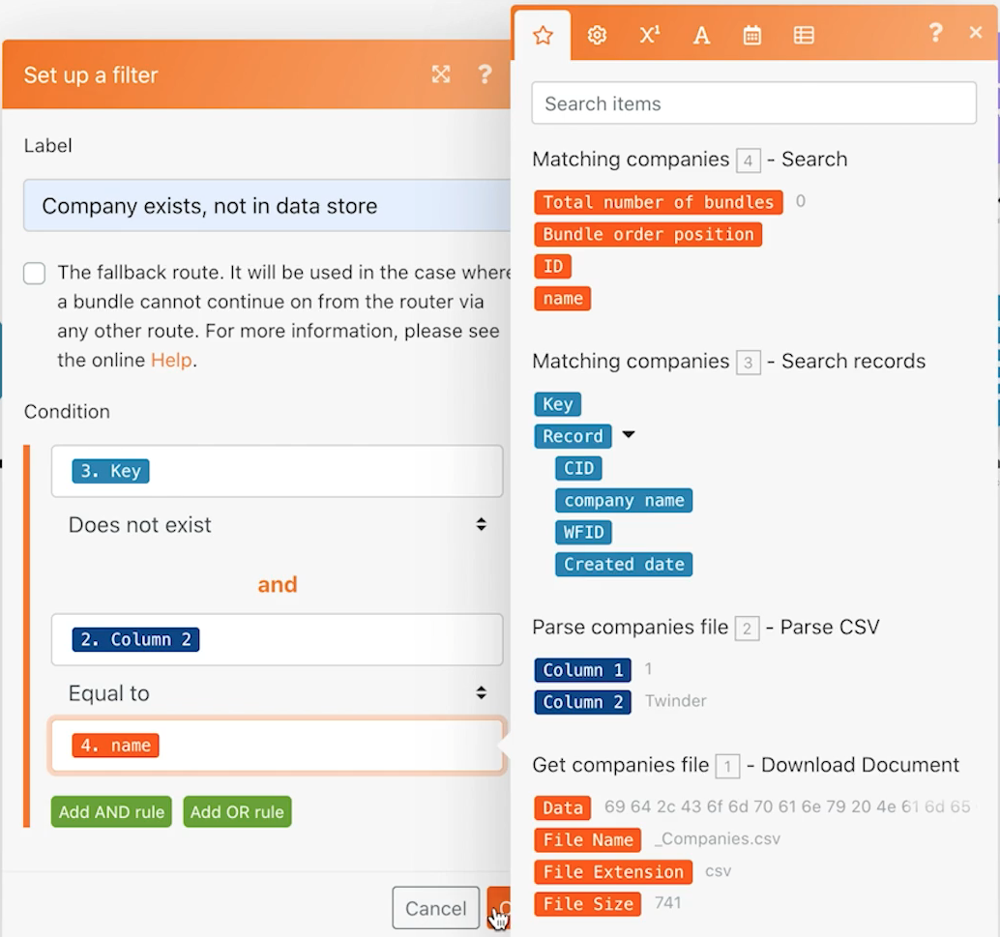
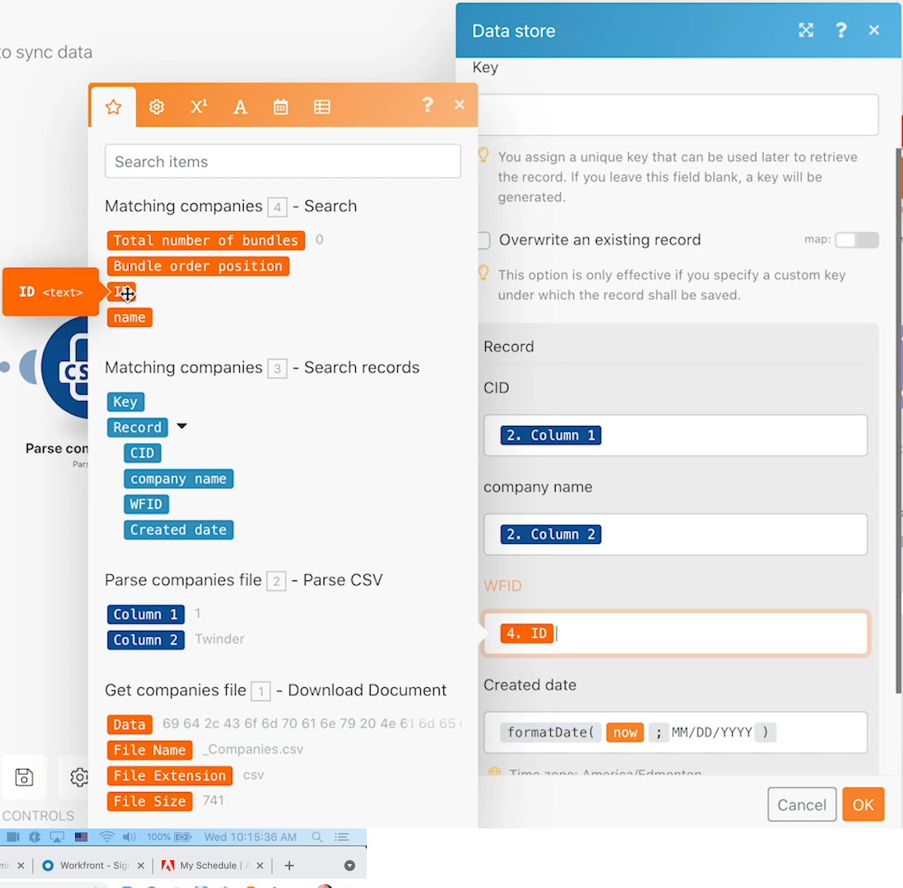

# Data stores

Learn how to synchronize company names between two systems.

## Exercise overview

This is the first part of a one-directional synchronization of companies in Workfront and another system. For now, it only syncs between a Fusion data store and Workfront. A table in a data store keeps track of the Workfront ID (WFID) and the company ID in the CSV file (CID) for each company. This allows for a bi-directional synchronization at some point in the future.

   

## Steps to follow

   **Download the file from Workfront.**

1. In the Workfront "Fusion Exercise Files" folder, select "_Companies.csv" and click Document Details.
1. Copy the first ID number from the URL address.
1. In Fusion, create a new scenario named "Using data stores to sync data."
1. For the trigger module, select the Workfront Download Document module.
1. Set up your Workfront connection and include the document ID copied from the Workfront URL.
1. Name this module "Get companies file."
1. Now add a Parse CSV module.
1. For the Number of columns field, type 2.
1. Map Data from the Download document module in the CSV field.
1. Name this module "Parse companies file."
1. Save your scenario and click Run once.

   **Create a data store and a data structure.**

1. Add a data store Search records module.
1. Create a new data store named "Company sync."
1. Within the data store, create a data structure named "Company sync (struc)."
1. Create four fields.
 
   + CID - The company ID in the CSV file
   + Company name
   + WFID - The Workfront company ID
   + Created date -Make sure that the data type is date

   

1. Click Save on the data structure, then set the data storage size to 1 and save the data store.
1. Continuing in the Data store module, set up a Filter where the CID is equal to the ID of the company from the Parse CSV module (Column 1).
1. Click Show advanced settings and select the option to "continue the execution of the scenario or the route, even if this module returns with no results."

   

1. Rename this module "Matching companies."
1. Add a Workfront Search records module.
1. Choose Company as the record type.
1. Search criteria is the company name within Workfront is equal to the company name in the CSV file.
1. For outputs, select the company name and the ID.

   

1. Click OK and rename this module "Matching companies."

   **Create different paths based on whether the company exists within Workfront or the data store.**

   **Routing path 1 - Create a company.**

1. Add a router module to the right of the Workfront Search records module.
1. Add a Workfront Create Record module to the top path.
1. Set the record type to Company.
1. Select Name from Fields to Map. Map the name field to the output from the Parse CSV module (Column 2).
1. Rename this module "Create company."

   

1. Add a filter after the router to only create a company if it's not already in Workfront. Name it "Not in Workfront."
1. Set the Condition to the ID from the Workfront Search module and does not exist.

   

   **Prepare to update the data store in the next path.**

1. Add a Set variable module to the end of the top path.
1. Set the Variable name to "Workfront ID."
1. Set the Variable value to the ID from the Create company module.
1. Rename this module "Set Workfront ID."

   **Routing path 2 - Update the data store.**

1. Create a filter on routing path 1. Name it "Not in data store."

1. Set the Condition to the Key from the Data store module and does not exist.

   

1. The first module in this path is the Get variable module.
1. Set the Variable name to "Workfront ID."
1. Rename this module "Get Workfront ID."
1. Add another module from the Data store app, Add/replace a record.
1. In the Data store field, choose Company sync. This is the data store you created earlier.
1. Leave the Key field blank.
1. Map the CID field from Column 1 in the Parse CSV module.
1. Map the company name field from Column 2 in the Parse CSV module.
1. Map the WFID field from the Get Workfront ID module.
1. For the Created date field, use the formatDate function from the Date and time tab to format the current date as MM/DD/YYYY.

   

1. Click OK and rename this module "Create company entry."

   **Routing path 3-Sync the data store between systems.**

1. Start by creating a filter on routing path 1. Name it "Company exists, not in data store."
1. Set the Condition to the Key from the Data store Search records module and does not exist.
1. Click the Add AND rule button and designate that the company name from the CSV file (Column 2) is equal to the name of the company found in the Workfront Search module.

   

1. Now add another Add/replace a record module by cloning the one at the end of routing path 2.
1. Drag the cloned module into place at the end of routing path 3. Delete the empty module that was there.
1. Click on the cloned module. All fields should stay the same except the WFID field. Map it from the Matching companies Search module.

   

1. Click OK and rename this module "Create company entry."
