# Data structures

Transform data from a source file into a destination file.

## Exercise overview

Open a CSV file that contains a list of time entries. These time entries are for minutes logged throughout certain days by multiple users. The goal is to take this information and produce a new CSV that shows the total time, in hours, logged by each user, each day.

   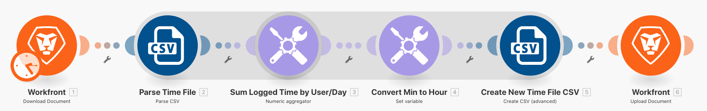

   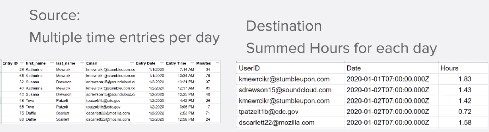

In this scenario, you will open a file that contains a list of time entries for minutes worked, including the date and time, how many minutes were entered, and the email address of who made the entry. There are 100 time entries, some made by the same individuals and some of those were made on the same day as others.

To produce a file that shows the total time, in hours, worked each day by each individual, you'll follow these steps:

1. In the trigger module, get a file from the Workfront folder. Download the file.
1. In the first CSV module, parse the time entry data to output one bundle for each time entry. This is an iterator.
1. The first Tools module is a numeric aggregator. This will SUM all the minutes and group the rows by email address, then by date. The result is the total minutes worked each day by email address.
1. The second Tools module is a Set Variable module. Use this to format the minutes to divide by 60 and round to 2 decimals.
1. In the second CSV module, set up the output file.
1. In the final module, upload the CSV file into Workfront.

## Steps to follow

   **Download the file from Workfront.**

1. In the Workfront "Fusion Exercise Files" folder, select "_Fusion1.0JanTime.csv" and click Document Details.
1. Copy the first ID number from the URL address.
1. Create a new scenario. Name it "Creating & using data structures."
1. Start with the Download Document module from the Workfront app.
1. Set up your Workfront connection and include the Document ID you copied from the Workfront URL.

   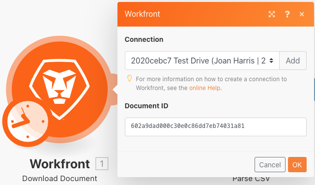

   **Parse the time entry data.**

1. Add another module, selecting Parse CSV.
1. Set up Parse CSV for 7 columns. Check the CSV contains headers box. Choose the Comma delimiterType and put Data in the CSV field.

   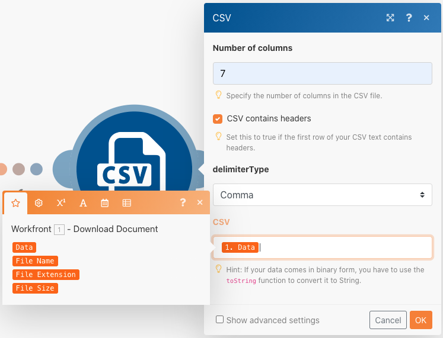

1. Click Run once to view the output.
1. Open the execution inspector to see the inputs and the outputs of the Parse CSV module. There is one bundle (a CSV file) as input and several bundles as outputs (one bundle for each row in the CSV file). It should look something like this:

   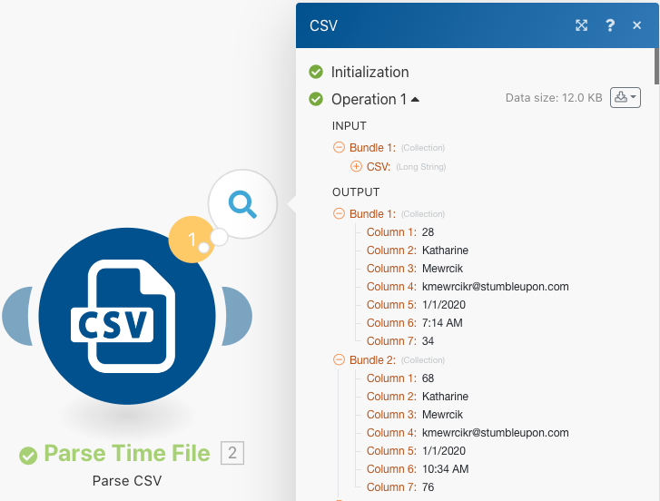

   **Next, transform the data into the desired output form, with aggregated time totals expressed in hours instead of minutes.**

1. Add a Numeric Aggregator tool module.
1. Select the source module, which is the Parse CSV module.
1. Select SUM for the aggregate function.
1. The Value field is column 7 from CSV file. This is the minutes logged by each user.
1. To sum the fields by group, click Advanced Settings and set Group by to email (column 4), date (column 5).

   + This will sum for every combination of the email and the date. Be sure to put a comma between column 4 and column 1. This will be used as a delimiter later on.

   **Your mapping panel should look like this:**

   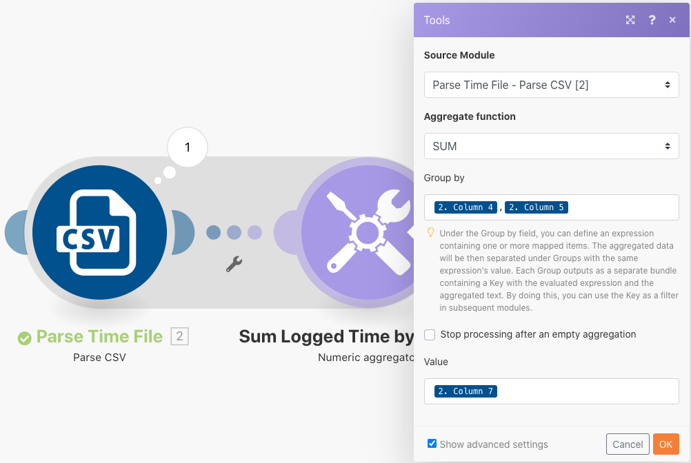

1. Click Run once to check the aggregation output.

   **The output bundles should look like this:**

   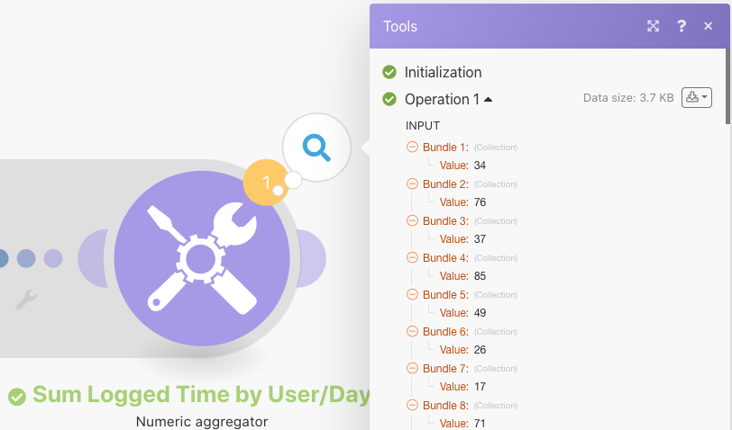

   **Now convert the aggregated minutes into hours.**

1. Add another tools module, selecting Set Variable.
1. Name the variable "Hours."
1. Set the variable value to formatNumber(result/60;2;.;,)

   **Your mapping panel should look like this:**

   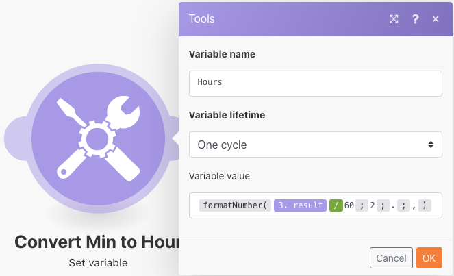

   **Next, get the values set up for the output file. You want the userID and the date value used for the groupings. You also want the hours that were calculated.**

1. Add another module-CSV module using the aggregator Create CSV (advanced).
1. The source module is the Tools - Numeric aggregator.
1. Click Add by the Data structure field and name our data structure "Time Logged Daily Sum."
1. Click Add Item to create the first item.
1. Name the item "UserID" and set the type to Text. Click Add.
1. Click Add Item again to create the second item.
1. Name the item "Date," set the type to Date, and click Add.
1. Click on Add Item one more time.
1. Name the item "Hours," set the type to Number, and click Add.

   **Your data structure should look like this:**

   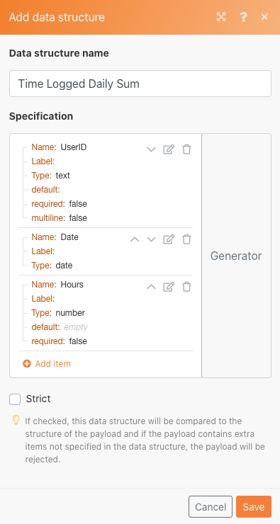

1. Click Save to finish the Time Logged Daily Sum data structure.

   **Now you supply the values for the three fields you just created. You should see those three fields in the CSV mapping panel.**

1. Click in the UserID field and choose GET from the general functions tab. In the first parameter, put SPLIT from the text and binary functions tab. The first parameter for the SPLIT function is the Key field. Add a comma as the delimiter and 1 as the index. This indicates you want the GET to retrieve the first field in the Key array.
1. Copy this expression into the Date field. Change the index from 1 to 2 to GET the second value in the array.
1. For the Hours field, add the Hours field from the Set Variable tool.

   **Your CSV mapping panel should look like this:**

   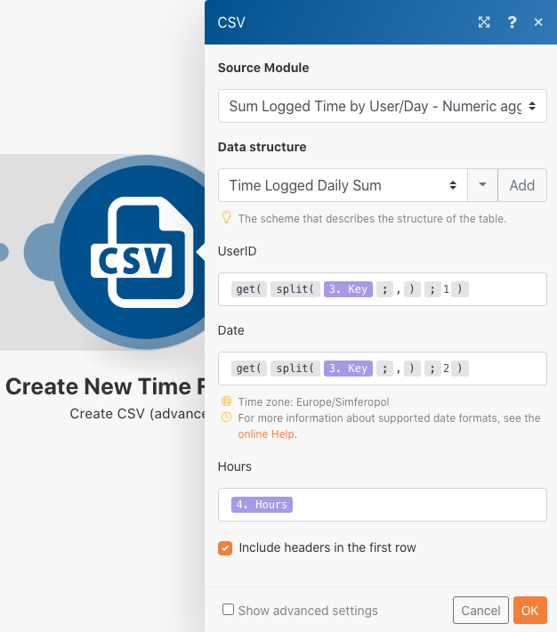

   **If you run the scenario now, you should see this output:**

   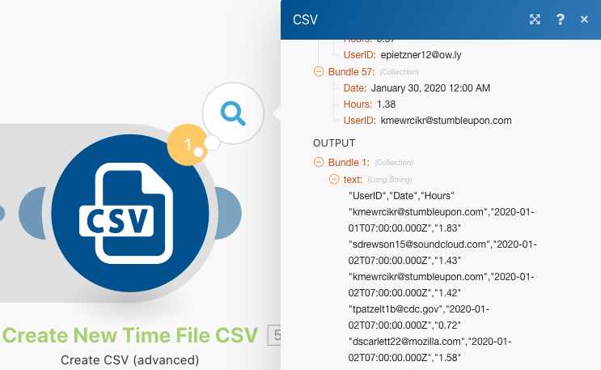

   **Now, add a module to take this output and upload it as a document to an existing project in Workfront.**

1. Open the project in Workfront and copy the project ID from the URL.
1. Go back to the scenario in Fusion and add another module-the Upload Document module from the Workfront app.
1. Paste the project ID into the Related Record ID field.
1. Choose Project for the Related Record Type.
1. Choose the Map option for the Source file.
1. For the Document Name, use the file name you downloaded, adding "Updated " in front of it.
1. For the File content, use the Text output from the Create CSV module.

   **Your mapping panel should look like this:**

   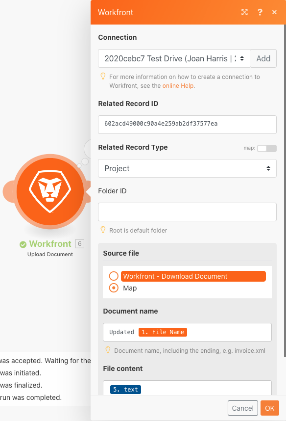

1. Click OK and Save the scenario.
1. Click Run once to run the scenario.

   **Check the execution inspector in the Upload Document module to confirm the document was uploaded.**

   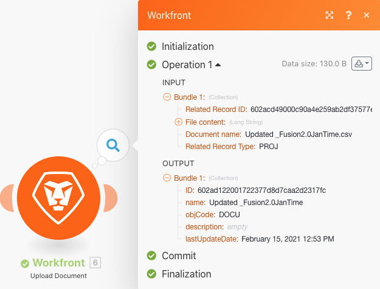