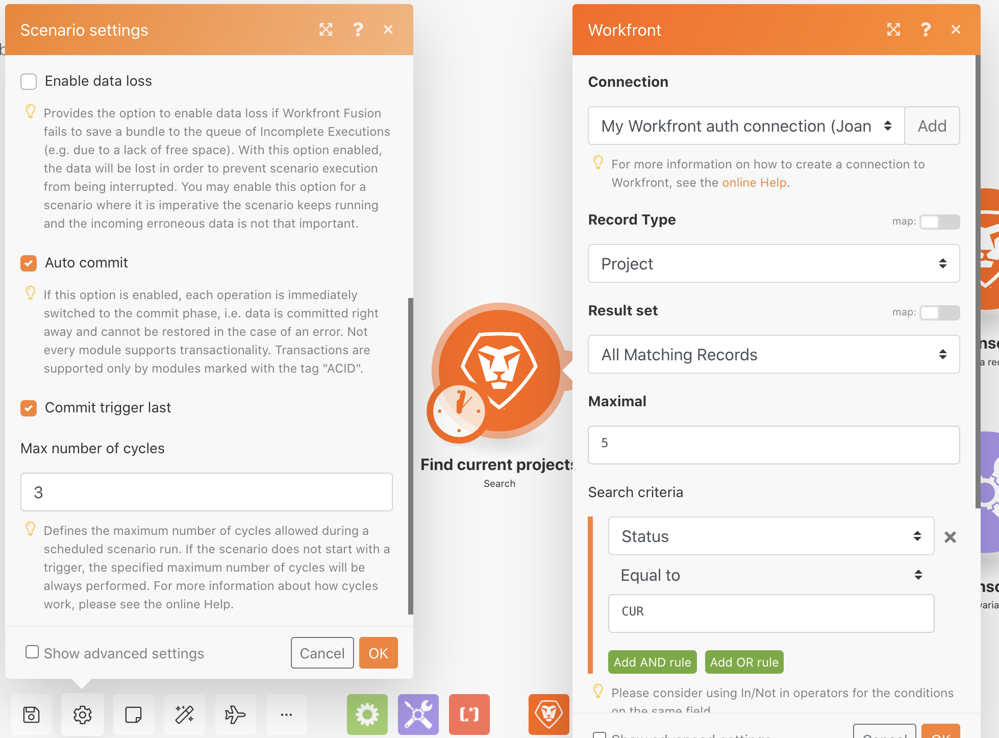
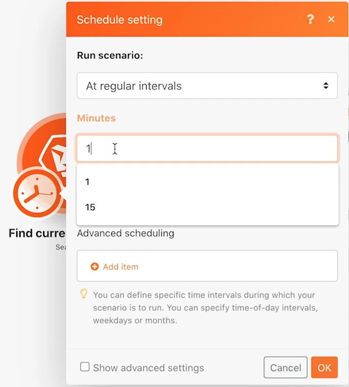
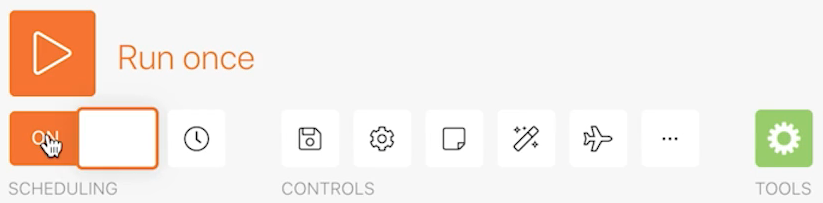
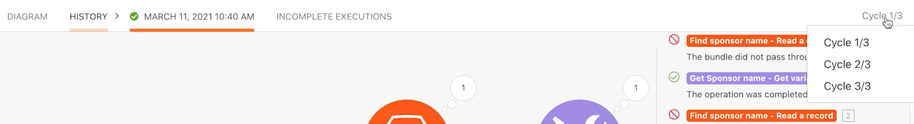

# Exploring runs, cycles, and bundles

Understand how runs, cycles, and bundles behave using the execution history of a scenario.

## Exercise overview

Practice with different scenario configurations to explore using runs and cycles.

   

## Steps to follow

1. Clone the scenario named "Sharing variables between routing paths." Name the new scenario "Sharing variables between routing paths - Cycles test."
1. Remove the Send an email module, as it's not needed for this test.

    **Set up your scenario to process 3 cycles per run. Process 5 projects in each cycle.**

1. Click the trigger module and change the Maximal field to 5, so only 5 projects are processed in each cycle.
1. In the Search criteria, remove the second filter that restricts the search to a single project.
1. Click OK.

1. In the Fusion toolbar, open Scenario settings and change the Max number of cycles field from 1 to 3.
1. Click OK.

   

    **Schedule the scenario to run every minute.**

1. Click the clock icon by the trigger module and change the Minutes field to 1 minute.

   
   
1. Next, switch the Scheduling toggle under the Run once button to On. Save your scenario.

   

1. Go to the Execution History for the scenario and watch as a new history record appears within the next minute. You may need to refresh the page.

   

1. Click the Details button of a run. Click through the Simple log in the right panel, similar to what you did in the execution history portion of the Workfront Fusion training.
1. Records of processed operations are sectioned into cycles.

   

1. A drop-down menu at the top-right of the window allows you to select any of the 3 cycles you set up to run every time.

   
