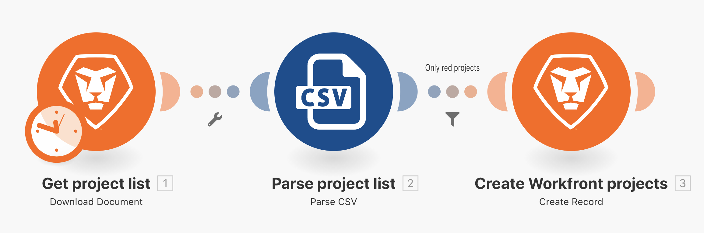
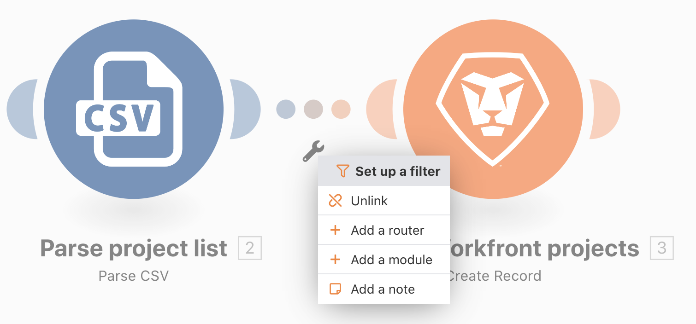
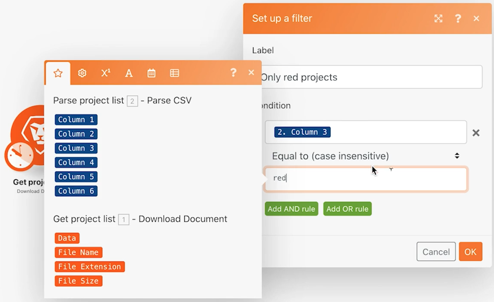
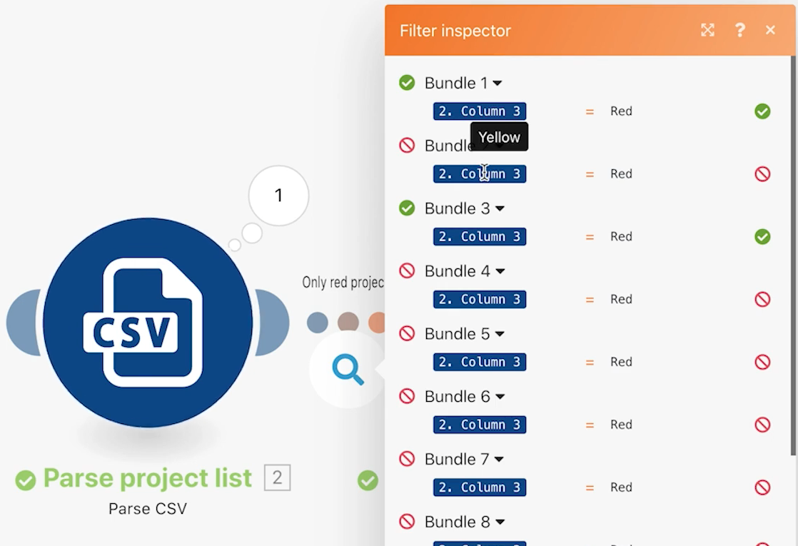

# Filters

Learn how to use the filter between modules to allow only certain types of bundles through.

## Exercise overview

Add a filter between the two modules in the Beyond basic mapping scenario to only create projects that have a "Red" project color in the CSV file.

## Steps to follow

1. Create a clone of the "Beyond basic mapping" scenario and name it "Using the mighty filter."

**Add a filter before the Create Workfront projects module to only allow red projects to be created.**

1. Add a filter by clicking the dotted line connecting the modules or clicking the wrench and selecting Set up a filter.

1. Use the Label field to name the filter "Only Red Projects."

1. In the Condition field, map the Project Color field (Column 3 in the CSV file). Select the Equal to (case insensitive) operator, and then type in "red."

1. Click OK.

**Test the filter and verify the results.**

1. Click Save to save the scenario and then Run once.

1. Click the execution inspector for the filter to see how each bundle was examined by the filter and either passed or failed to move on to the Create Workfront projects module.

1. Find the projects created in your Workfront instance.
