# Initial Scenario Design

Learn some basic navigation tips for when you first log into Workfront Fusion, as well as building your first scenario.

## Exercise overview

Create a new project in Workfront for each row in the Project List CSV file.

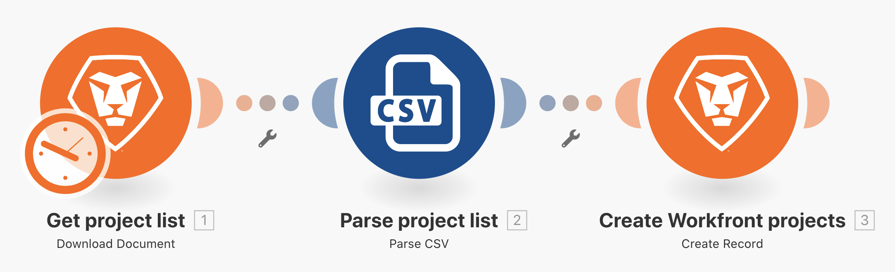

## Steps to follow

1. Create a folder in the Scenario section named "Fusion enablement exercises."
1. Click into the folder, then click Create a new scenario.

   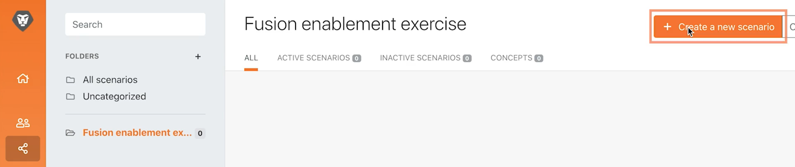

1. On the next page, search for Workfront and select that app. Then click Continue.
1. At the top left of the scenario designer screen, rename your scenario to "Initial Scenario Design Image 1."
1. Click the empty trigger module in the center of the screen and select the Workfront app, then select the Download Document module.

   **Authenticate the module's connection to your Workfront account.**

1. To create a connection for the first time, click the Add button.

   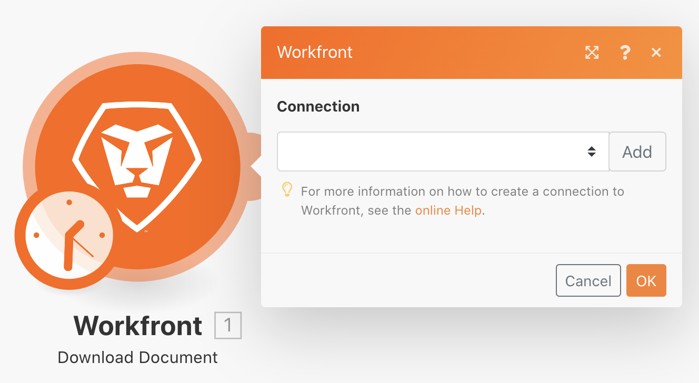

1. Give the connection a name, such as "My Workfront 201."

   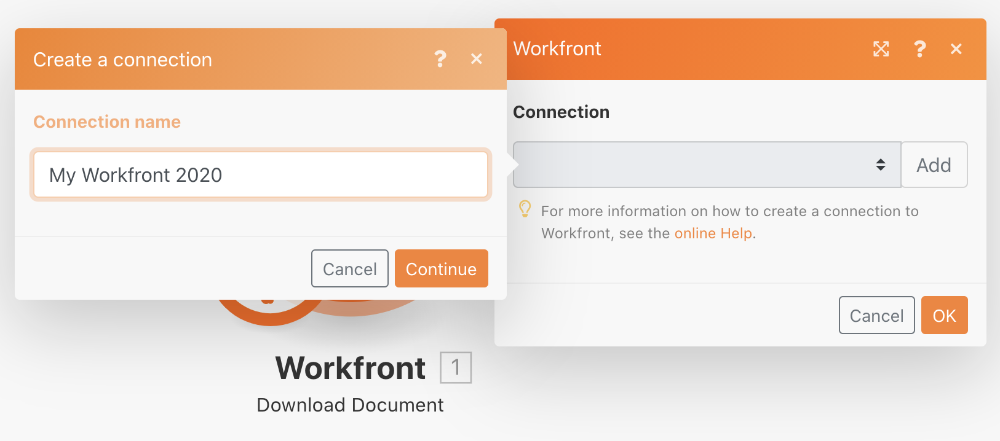

1. Enter the URL of your Workfront instance, then click Next.

   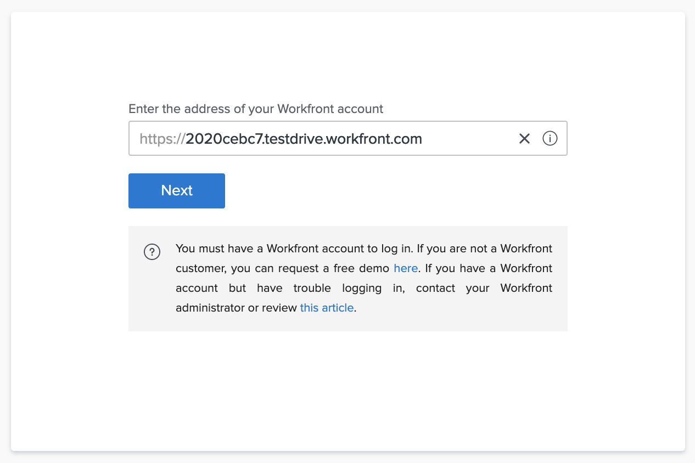

1. Enter your password and click Log in.

   **The connection is established. Now enter the document ID of the document you want to download from Workfront.**

   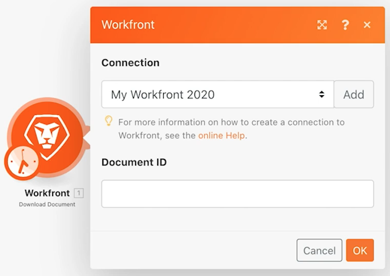

1. Go back to Workfront. In the "Fusion Exercise Files" folder, select "_Fusion2020_Project List.csv" and click Document Details in the left panel. Copy the document ID number from the URL address (this is the first long number in the URL).

   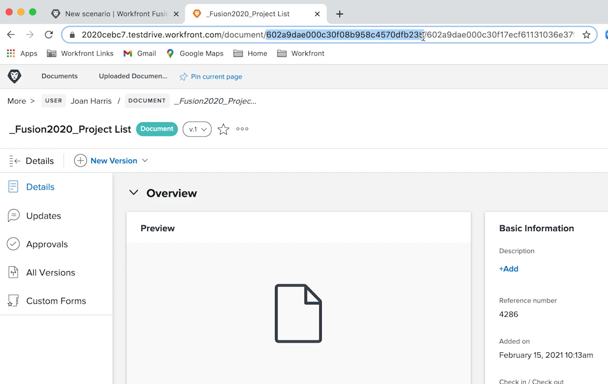

1. Go back to Fusion and paste the number in the Document ID field and click OK.
1. Best practice is to rename modules as you create them. Right-click on the Workfront module and choose Rename. Name the module "Get project list."

   **Next you're going to parse the CSV file you just downloaded so you can access each row in the file. You'll use this information when you create a project from each row.**

1. Click the right side of the Workfront module to add another module. Search for the CSV app and select the Parse CSV module.
1. Set up Parse CSV for 6 columns, CSV contains headers, Comma delimiterType, and put Data in the CSV field. Then click OK.

   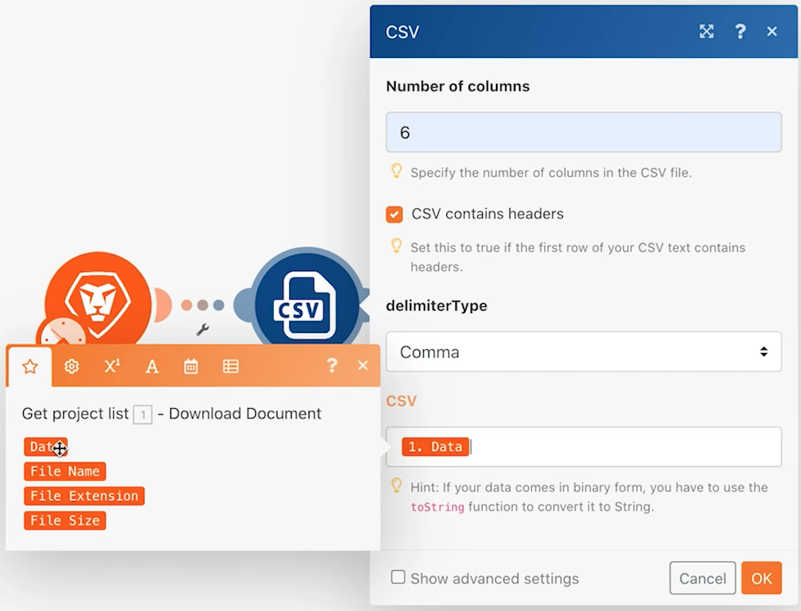

1. Rename this module "Parse project list."
1. At the bottom of the scenario designer, click Save to save your scenario.
1. Click Run once to view the output.

   >[!NOTE]
   >
   >Ignore the warning that a transformer should not be the last module (this is true, but doesn't matter for this test). Click Run Anyway.

   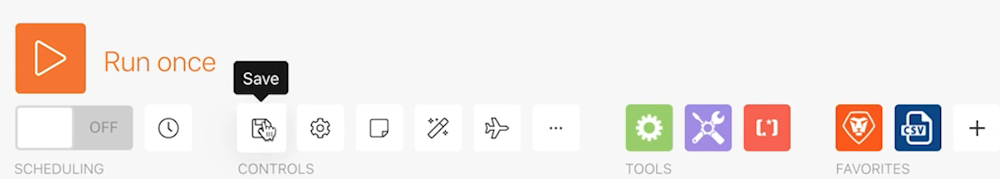

1. Open the execution inspector on the Parse CSV module to see the inputs and the outputs of the module. There is one bundle (a CSV file) as input and several bundles as outputs (one bundle for each row in the CSV file). It should look something like this:

   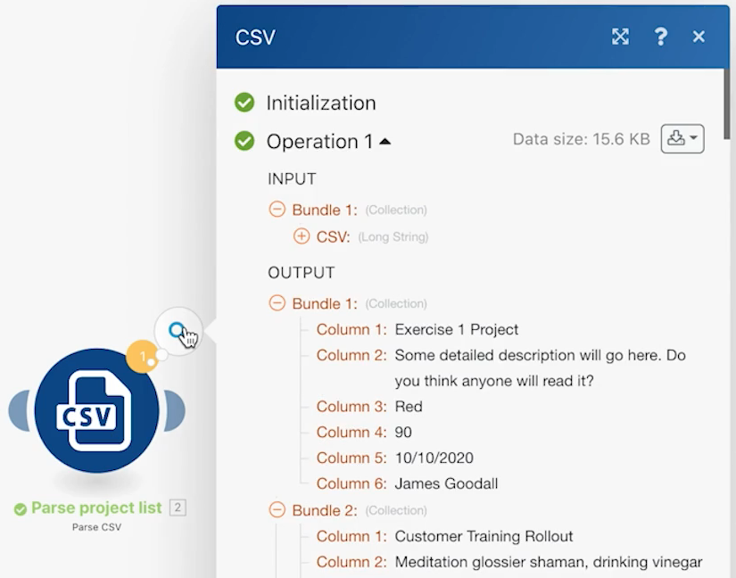

   **Add a module to create a project for each row in the CSV file.**

1. Add another module. Select the Workfront app, choosing the Create Record module.
1. Set the Record type as Project.

   >[!TIP]
   >
   >Search for it by starting to type a few letters, such as *proj*, to go right to it.

1. Then use Cmd/Ctrl+G to find Name (project name). Check the box next to Name; the field appears below.
1. Now check the boxes next to Planned Start Date and Priority.
1. Click into the Name field so the mapping panel appears. Click the Column 1 field from the Parse CSV module to add it to the Name field. This is the project name from the CSV file.
1. For the Planned Start Date, click Column 5 from the Parse CSV module.
1. For Priority, choose Normal from the drop-down menu.

   **Your mapping panel should look like this:**

   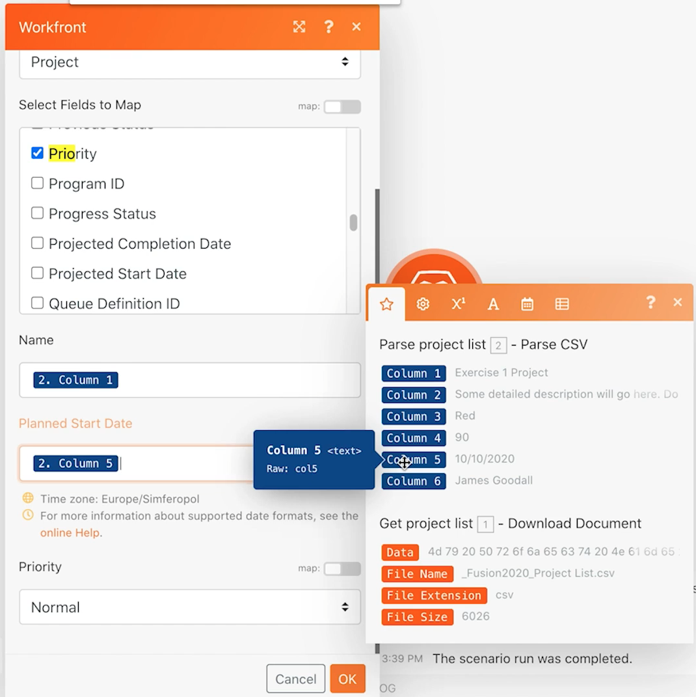

1. Click OK.
 
   >[!NOTE]
   >
   >If you don't click OK and accidentally click back into the designer, your work does not save and you will have to map again.

1. Right-click the Workfront module and rename it "Create Workfront projects."
1. Save your scenario and click the Run once button.
1. Click the execution inspector at the top right of the last module.

   + You'll see 20 operations were performed. Each operation took a bundle, meaning one row, from the CSV file as input and output one bundle, which was a project created in Workfront. The project ID of the project created appears with the output bundle.

   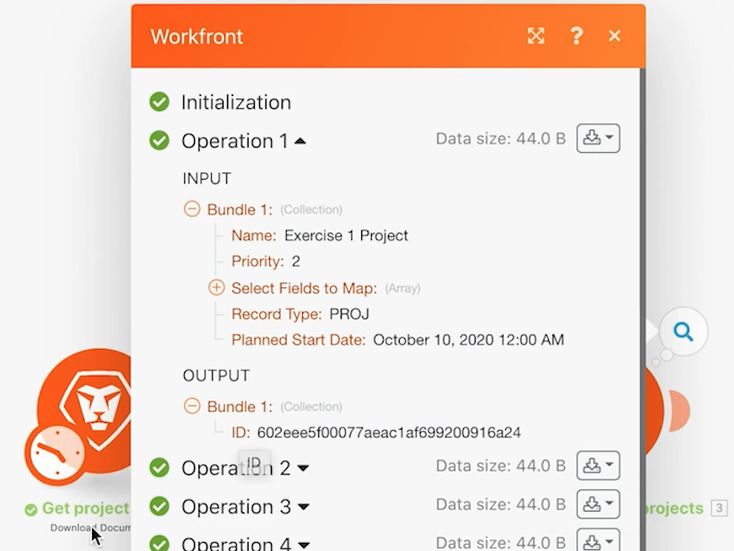

   **Using notes**

1. Notes help create more visibility into the scenario design. To add a note to the Create Workfront projects module, right-click and select Add a note. A panel at the right of the designer window pops out so you can add a note to the module. Type in "Create a project with Name, Planned Start Date, and Priority mapped from the CSV file."
1. Add another note to describe what the trigger module (the first Workfront module) is doing.
1. Close the notes panel by clicking the X at the top-right corner.

   + Access the notes again by clicking the notes button in the bottom toolbar or by right-clicking any module and adding a new note.
   + Notes are sorted in reverse chronological order.
   + An orange dot appears on the Notes button once notes are added.

   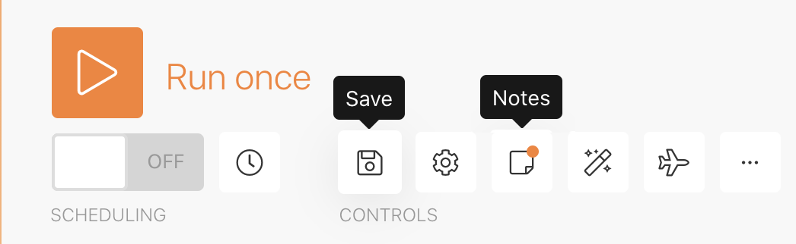

1. Save the scenario by clicking the Save button in the controls toolbar.
1. You can view the projects created in your Workfront instance.
