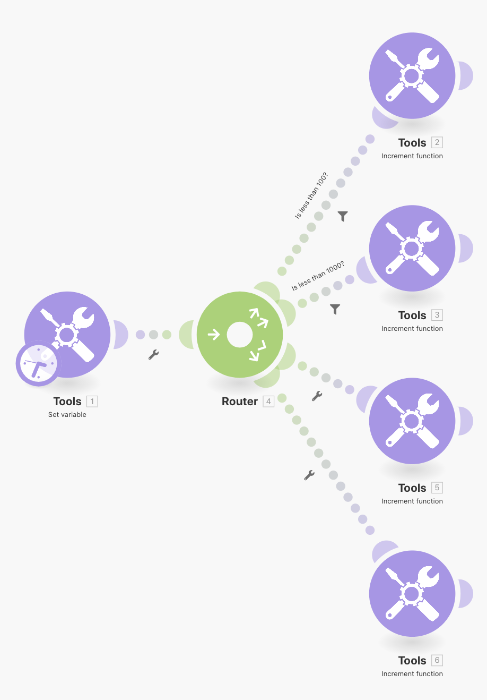
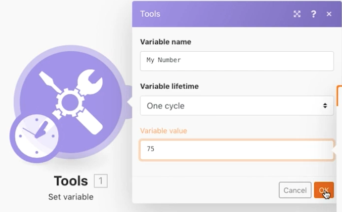
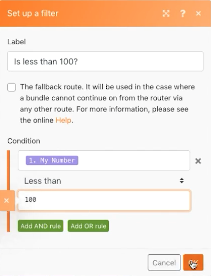
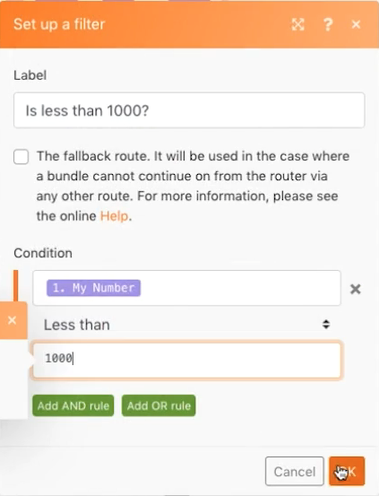
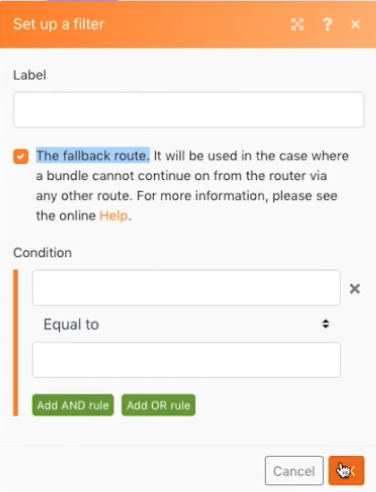

# Routing patterns

Reinforce your concept of routing and fallback routes without actually dealing with any other APIs.

## Exercise overview

Use the Set Variable module to send a number through multiple paths to see how filters and fallbacks behave when routing.

## Steps to follow

1. Create a new scenario and call it "Routing patterns and fallbacks".

1. For the trigger, add the Set Variable tool module. Put "My Number" for the Variable name, leave the Variable lifetime as One cycle, and set the Variable field to "71."

1. Add another module and choose the Router module. For both paths, choose the Increment function tool and click OK without making any changes for each.

   + For the first path, create a filter, name it "Less than 100," and set the condition to [My Number] Less than 100.

   + For the second path, create a filter, name it "Less than 1000," and set the condition to [My Number] Less than 1000. Make sure you use the Numeric operator for both.

1. Click Run once and watch the bundle pass down the "Less than 100" path.

1. Then change the Set Variable module field to 950 and Run once again. Watch it run down the second path.

1. Click the router and add one more path. Add the Increment function tool module. For the filter, click "The fallback route" checkbox. Notice how the arrow pointing to that path changes to a caret, indicating it's the fallback route.

1. Change the Set variable number to 9500 and Run once. Because the number is not less than 100 or less than 1000, the bundle travels down the fallback route.

If you add one more path with an Increment function tool module, but set no filter, what will happen when you click Run once again? Will a bundle ever go down the fallback route with the fourth route added?

+ No, because with no filter set, every bundle will always go down this path instead of the fallback route.
