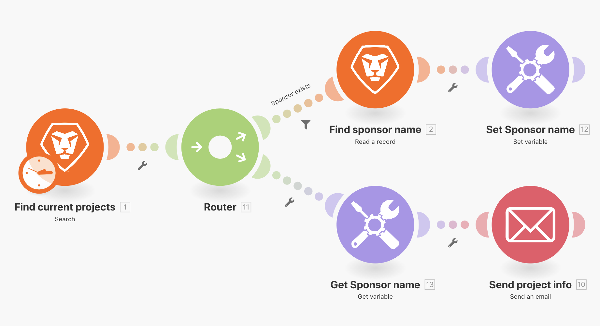
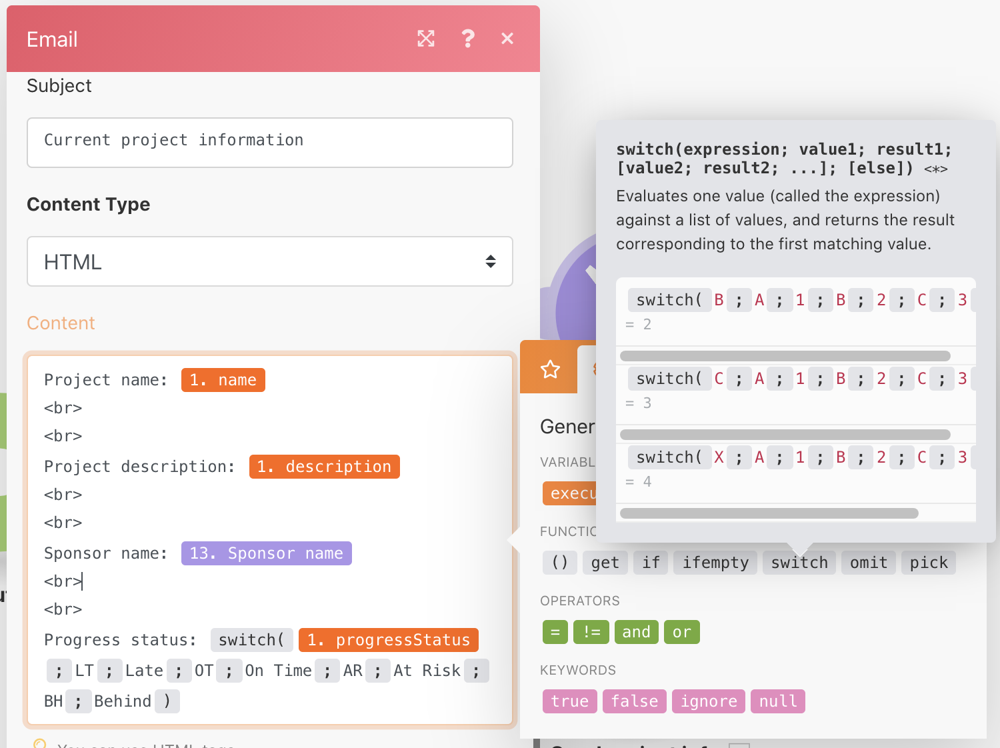

# Switch function

Learn how to use the switch functionality using the Switch function.

## Exercise overview

For simple data changes, use the Switch function to transform one value to another within a module field. In this exercise, change the two-letter key to the actual name for the project progress status to send in an email.

   

## Steps to follow

1. Clone the scenario named "Sharing variables between routing paths."
1. Name the new scenario "Sharing variables between routing paths - Switch."
1. Click the trigger module and add Progress Status to the Outputs section.
1. In the Send an email module, add Progress Status to the Content field.

   + If you just map over the value coming from the Search module, there's a two-letter code for the progress status.
   + To "switch" the code for the full name of each possible progress status, use the "switch" function from the General functions tab.

1. The switch function uses the Progress Status value or expression as a key, then returns the output value based on that key.

   + A key value is defined in the first position after the Progress Status ("LT") with the corresponding output defined in the second position ("Late").
   + The next key value is defined in the third position, with the corresponding output defined in the fourth position, etc., for as many keys as desired.

      