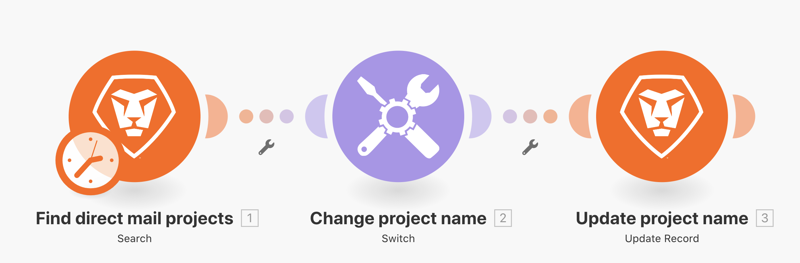
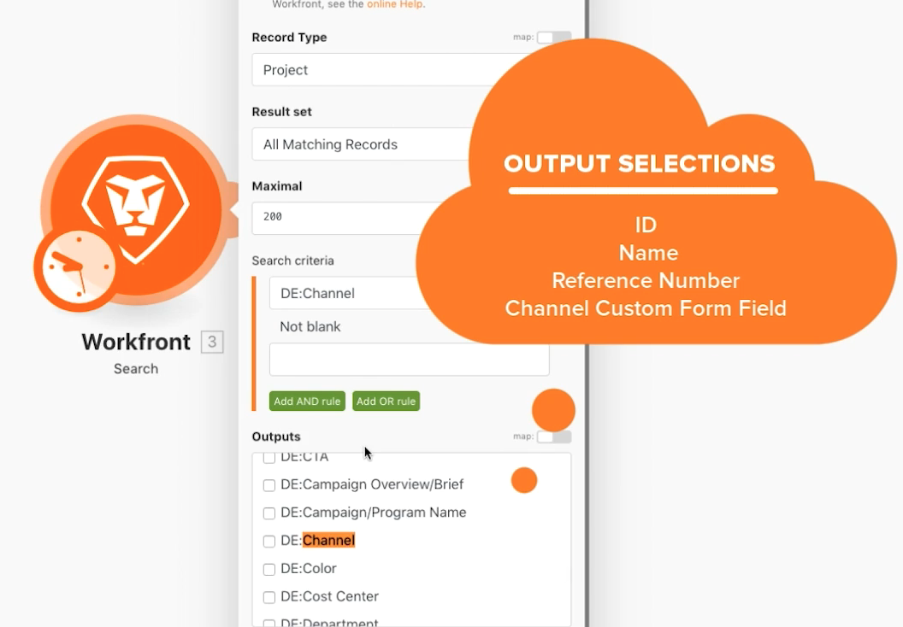
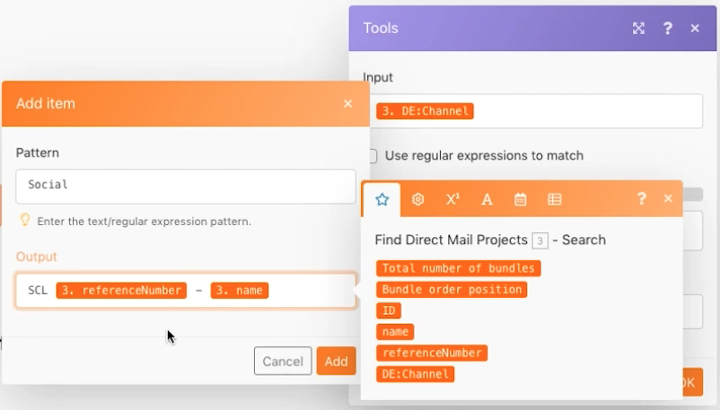
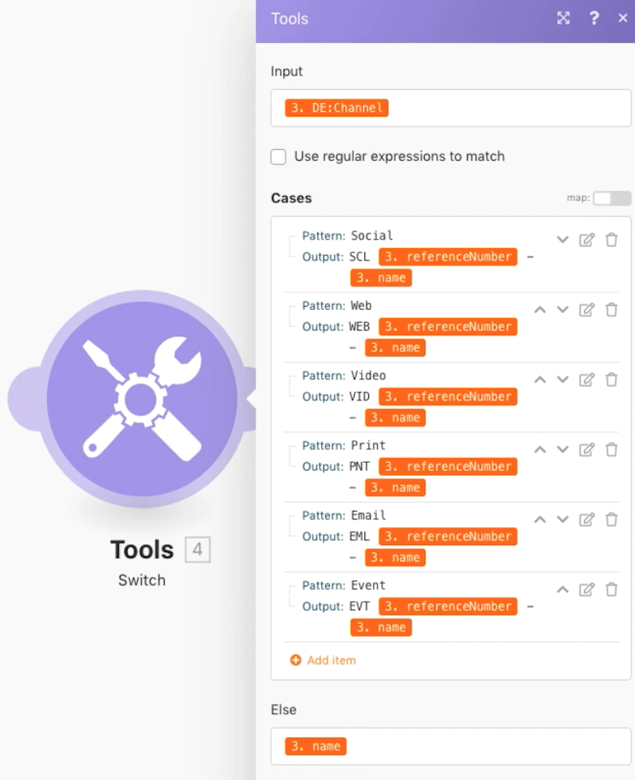
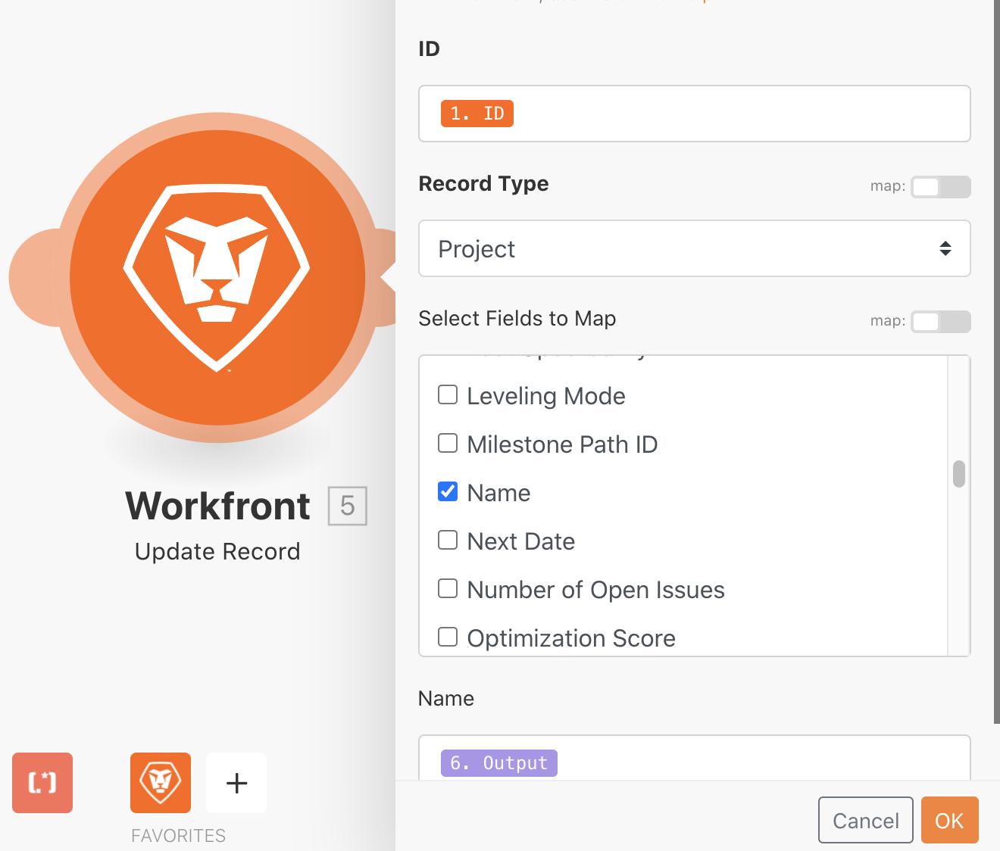

# Switch module

Understand how to use the Switch module when you need to perform more complex or dynamic data transformations.

## Exercise overview

Search for direct mail projects in your test drive, then change the name of each project based on a value selected in a custom field attached to the project.

   

## Steps to follow

1. Create a new scenario and name it "Using the Switch module."
1. For the trigger module, use the Workfront Search module.
1. Set up your Workfront connection, and set the record type to Project.
1. In the Search criteria, specify that you only want to see projects that have a value in the Channel custom field.
1. For outputs, select ID, Name, Reference Number, and the Channel custom field.

   

1. Add the Switch module from Tools.
1. For the Input field, map the Channel custom field from the Search module.

   

1. Next add cases for each possible value coming from the Channel custom field. The possible value goes in the Pattern field. You want the output field to include a specific 3 letter code followed by the project reference number, then the project name.

    **Your mapping panel should look like this:**

   

1. You can add as many additional cases as you want. Notice the Else field at the bottom. This will be used if the input value doesn't match any of the cases.

    **Update the project name in Workfront.**

   

1. Add a Workfront Update Record module.
1. In the ID field, map to the ID from the trigger module.
1. Set the Record Type to Project.
1. Select the Name field from the Select Fields to Map section, and map it to the output from the Switch module.
1. Save your scenario and Run once. View the updated project names in your test drive.
