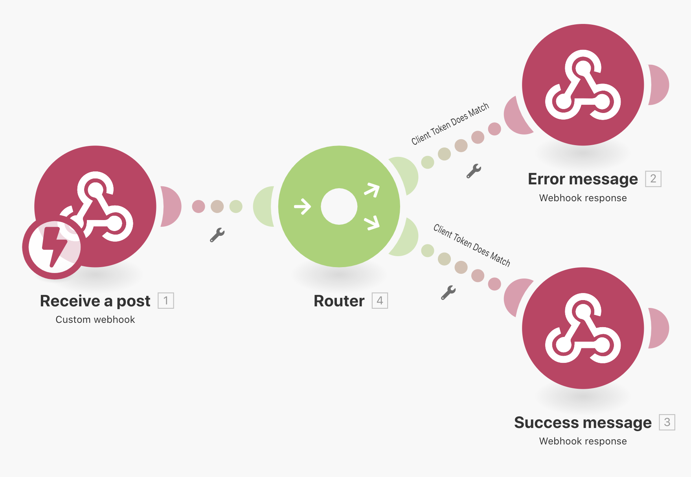
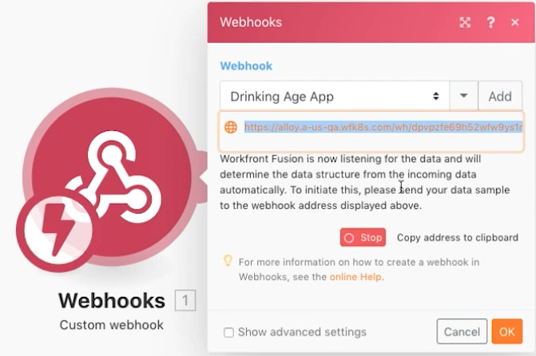
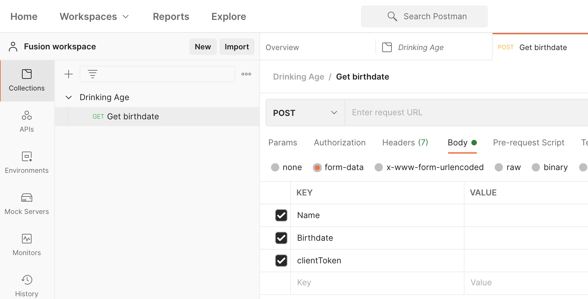
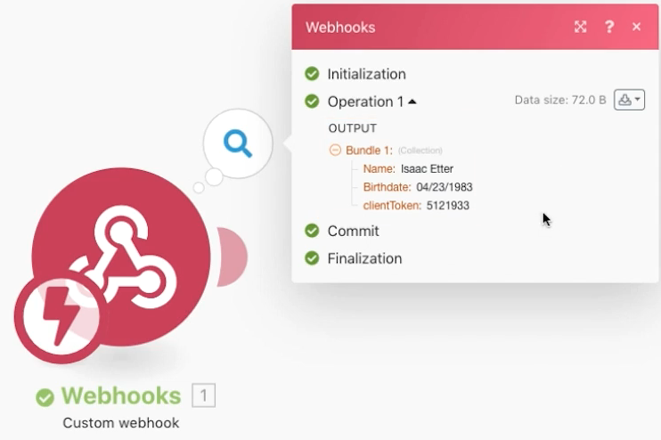
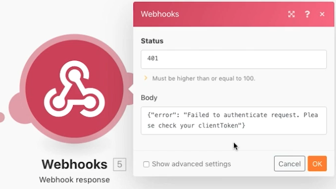
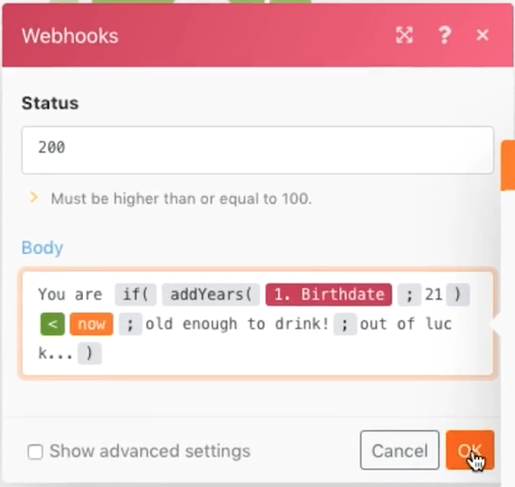
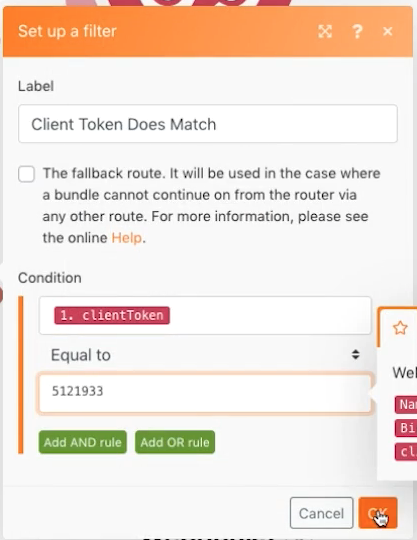

# Webhooks

Learn how to create, trigger, and manage webhook-initiated scenarios.

## Exercise overview

The purpose of this scenario is to create an app to sell to convenience stores so they can easily determine whether or not a customer is old enough to purchase alcohol. The cashier simply needs to post the name and birthdate of the customer to a URL they have been provided. That post will trigger the scenario which will calculate the answer and return it to the requestor.

1. The scenario consists of three webhooks.
1. The trigger module is a custom webhook that listens for a post.
1. When it receives a post it will output it to one of the next modules.
1. The next module returns a response to the requestor.

   

## Steps to follow

**Set up the trigger webhook.**

1. Create a new scenario and name it "Using webhooks."
1. For the trigger, add the Custom webhook module from the Webhooks app.
1. Click on Add to create a new Webhook.
1. Enter the Webhook name of "Drinking age app."
1. Leave IP restrictions blank, which means that anyone can send data into it.
1. Click Save.

   

1. Back in the Webhooks mapping panel a URL has been created for this specific webhook. Click on "Copy address to clipboard" to copy that URL.
1. Click OK.
1. Click Run once.
1. Use the URL in Postman to send a name and birthdate to your custom webhook. For instructions on setting up Postman, see section three of the Beyond basic modules in Workfront Fusion learning path.

    **The Webhooks module panel should look like this:**

   

    **The webhook is now in a state where it's listening for data to determine the data structure.**

1. You can define the data structure of the payload that you expect to get (data structures will be discussed later). If you don't define a data structure Fusion will determine the data structure automatically when the post is sent.
1. On the Postman side you want to send to the copied URL. The post should include basic form data. For this example you need three fields: Name, Birthdate, and clientToken.

   

1. After you click Send from Postman you should get an indication that the post has been accepted.
1. This is the point where your scenario will show that the data structure has been successfully determined.
1. You can see that the data has been received by opening the execution inspector.

   

    **Set up routing for client tokens.**

1. Add a router to the trigger module.
1. In the upper path, add a Webhook response module. This will be our path for when the client token does not match.
1. Set the status to 401.
1. Set the Body to {"error": "Failed to authenticate request. Please check your clientToken"}.

   

1. Create a filter between the router and the Webhook response module. Name it "Client token does not match."
1. For the Condition, use the clientToken field from the trigger module and do a numeric "Not equal to" comparison to the number 512191.

   

1. In the bottom path, add another Webhook response module. This will be our path for when the client token does match.
1. Set the status to 200.
1. In setting up the Body, use the mapping panel functions to test to see if the person is 21 or older. If they are, return "You are old enough to drink!", otherwise return "You are out of luck…"

   

1. Create a filter between the router and the Webhook response module on the lower path. Name it "Client token does match."
1. For the Condition, use the clientToken field from the trigger module and do a numeric "Equal to" comparison to the number 512191.

   

1. Click on the Scheduling button under Run once to activate your scenario so that any time there is a new post it will be received, go down either path, and generate a response.
