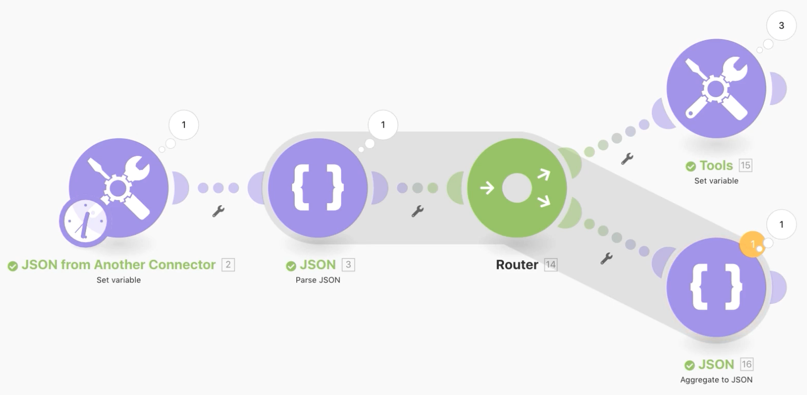
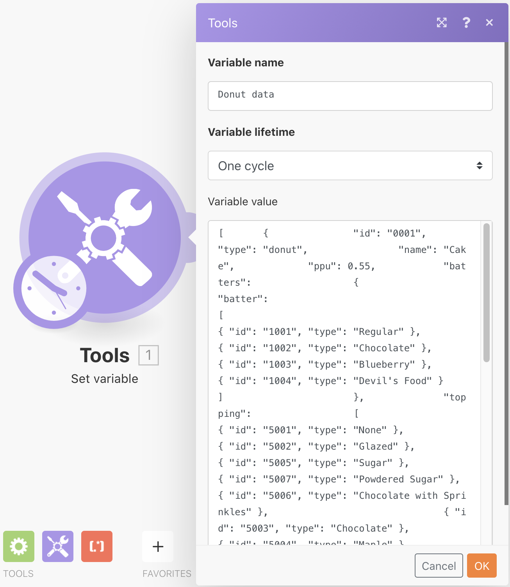
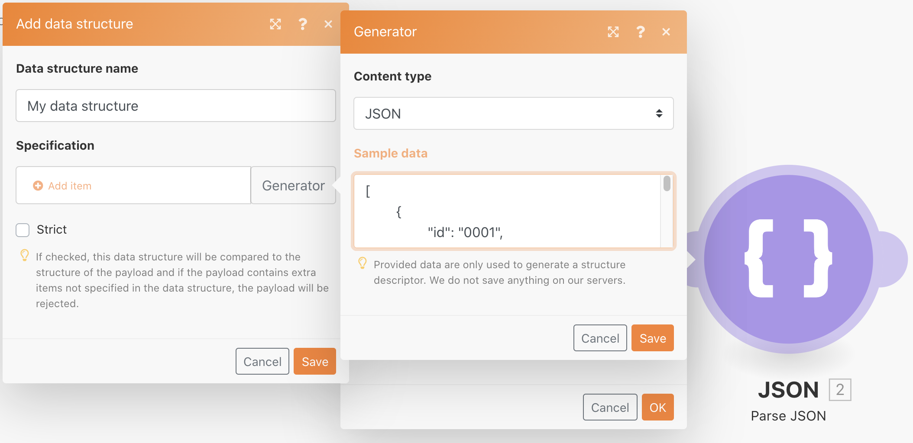
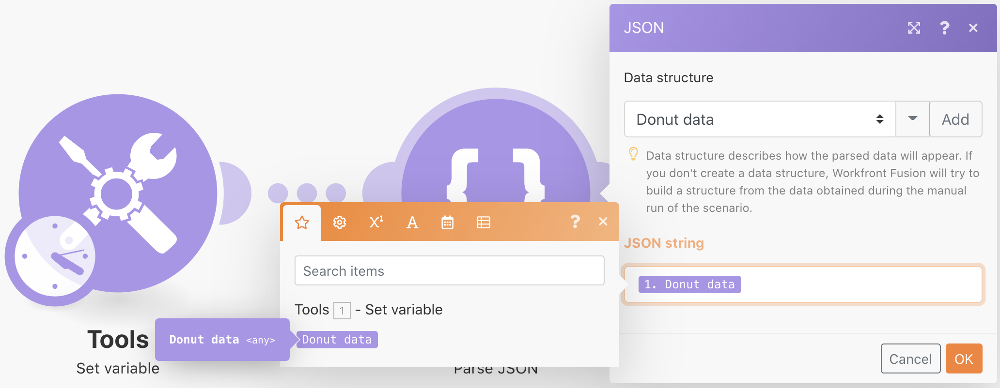
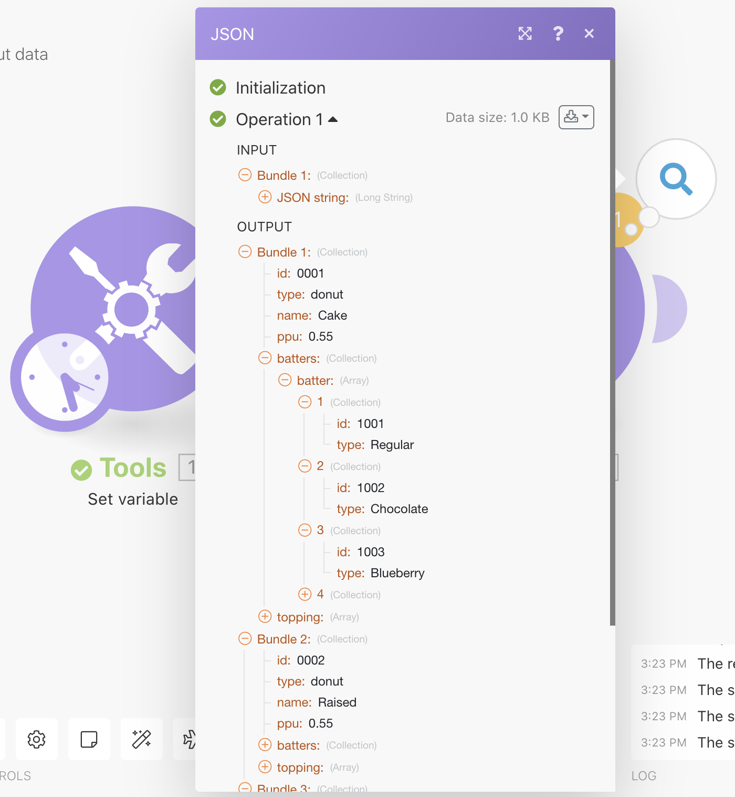
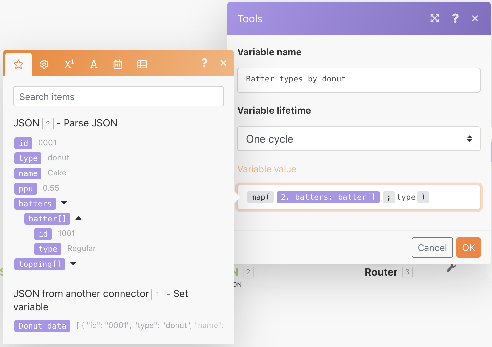
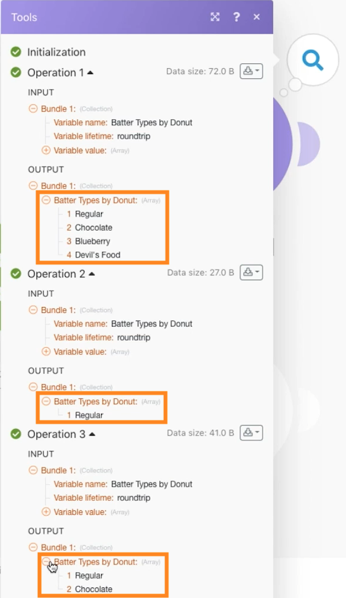
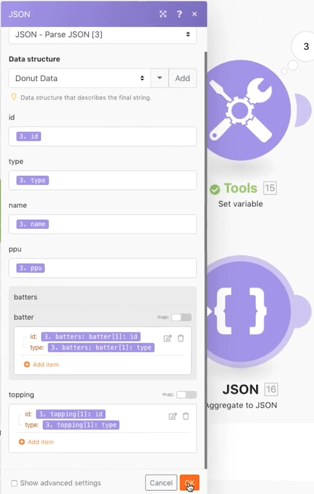
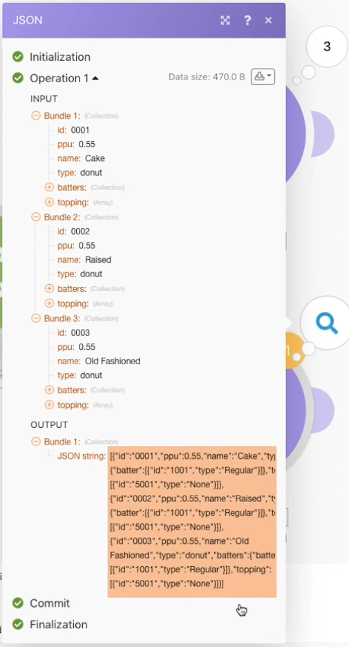

# Working with JSON

Learn how to create and parse JSON within a scenario to support your design needs.

## Exercise overview

The purpose of this exercise is to conceptually show how to utilize information sent into a scenario in a JSON format, parsing it into fields and items that you can map throughout your scenario. Then you can either grab information from those mapped arrays or aggregate the information into JSON to then be sent to another system that expects JSON as a receiving input.

   

## Steps to follow

   **Create a data structure and parsing JSON.**

1. Create a new scenario and name it "Working with JSON donut data."
1. For the trigger module, use the Set variable module.
1. For the Variable name, type in "Donut data."
1. For the Variable value, copy and paste the contents of the "_Donut Data - Sample JSON.rtf" document found in the Fusion Exercise Files folder in your test drive.

   

1. Rename this module "JSON from another connector."
1. Add a Parse JSON module.
1. Click Add for the Data structure field.
1. Select the Generator and paste the Donut Data - Sample JSON data that you copied into the Sample data field.

   

1. Click Save, naming the data structure "Donut data." Then click Save.
1. Map the Donut data from the Set variable module to the JSON string field.

   

1. Save your scenario, then click Run once to see the output.

    **The output of the Parse JSON module should look like this:**

   

    **Map to specific array variables.**

1. Add a router after the Parse JSON module.
1. In the top path, add a Set variable module.
1. For the Variable name, type "Batter types by donut."
1. For the Variable value, use the map function to get the batter types from the batters array.

   

1. Click OK, then Run once.
1. Open the execution inspector to see the output bundle for each of the three operations, showing the batter types for each.

   

    **Aggregate scenario data to JSON.**

1. On the lower routing path, add an Aggregate to JSON module.
1. For the Source Module, choose the iterator--the Parse JSON module.
1. For the Data structure, create or choose any data structure. For this example, use Donut data.
1. Go ahead and map the fields over directly for this example, as shown below.
1. When you get to batter and topping, notice these are arrays, so you need to click Add item to map them.

   

1. Save the scenario and click Run once.

Look at the execution inspector for the Aggregate to JSON module and notice how you were able to aggregate three bundles into a single JSON string. You can then send this string to other systems that expect JSON.

   
