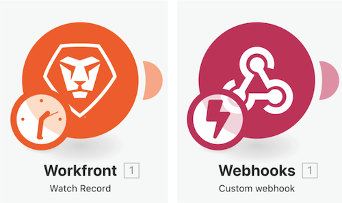
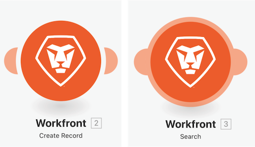

# Access previous versions walkthrough

In this video, you will:

*  Discover how you can restore previous versions after you’ve made changes to your scenario and saved multiple times.

## Accessing previous versions walkthrough

Workfront recommends watching the exercise walkthrough video before trying to recreate the exercise in your own environment.

>[!VIDEO](https://video.tv.adobe.com/v/335268/?quality=12)

>[!NOTE]
>
>After saving your scenario, a new version is available under the three-dot menu should you need to access it in the future. Previously saved scenario versions are only available for 60 days. If you need to access previous versions beyond the 60 days for audit purposes, Workfront recommends saving a blueprint of your scenario and archiving in an agreed location.

>[!TIP]
>
>For step-by-step instructions on completing the walkthrough, refer to the Adobe Workfront Fusion activity book.

## Add to your terminology

### Trigger Modules

Trigger modules can only be used as the first module and can return zero, one, or more bundles. These will be processed individually in subsequent modules, unless aggregated.  

**Polling Trigger (clock on Trigger)**—Special capabilities to keep track of the last record processed.

**Instant Trigger (lightning bolt on Trigger)**—Immediately triggered based on webhook.

### Actions and Search Modules

**Action**—Used to perform CRUD (Create, Read, Update, and Delete) operations

**Searches**—Used to search for zero, one, or more records and returns these as bundles, which will be processed individually in subsequent modules, unless aggregated.

## Want to learn more? We recommend the following:

[Workfront Fusion documentation](https://experienceleague.adobe.com/docs/workfront/using/adobe-workfront-fusion/workfront-fusion-2.html?lang=en)
