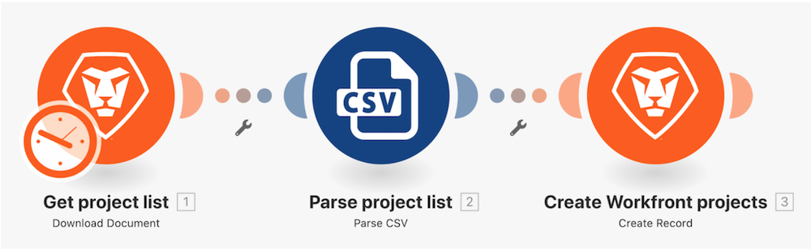

# Beyond basic mapping walkthrough

## Overview

Change the project name, planned start date, and priority from the "Initial scenario design" you created in the first walkthrough using the mapping panel formulas. 

## Beyond basic mapping walkthrough

Workfront recommends watching the exercise walkthrough video before trying to recreate the exercise in your own environment. 

>[!VIDEO](https://video.tv.adobe.com/v/335264/?quality=12)

>[!TIP]
>
>For step-by-step instructions on completing the walkthrough, download the [Adobe Workfront Fusion activity book](/help/assets/adobe-workfront-fusion-activity-book.pdf). **Disclaimer**: The Adobe Workfront Fusion activity book contains a few links to Workfront One, which do not work. This will be updated soon.

## Your turn

This practice exercise builds on what you learned in the walkthrough, but the solution is not provided.

Create a clone of the “Beyond basic mapping” walkthrough you just completed. You’ll continue using that scenario in the next walkthrough, so you don’t want to modify it with this exercise.

Create a task in each project you created as part of the previous walkthrough.

* Use “Initial Planning for a (Project Color) Project” as the task name.
* Set the planned start date to be the same as the project planned start date.
* Set the duration to 3 days and duration type to Calculated Assignment.
* Set the planned hours to be 10% of the Confidence Rating in hours.
* Set the Task Constraint to As Soon As Possible.

**Challenge:** If the project color is Red, assign the task to Rick Kuvec. If the project color is Yellow, assign the task to Mary Smith. If the project color is Green, assign the task to Ida Blankenship. 

## Want to learn more? We recommend the following:

[Workfront Fusion documentation](https://experienceleague.adobe.com/docs/workfront/using/adobe-workfront-fusion/workfront-fusion-2.html?lang=en)
