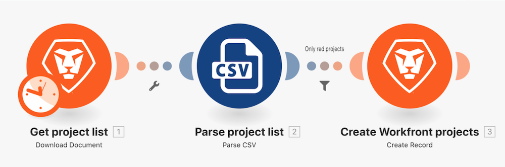

# Using the mighty filter walkthrough

## Overview

Using the “Beyond basic mapping” walkthrough exercise you created earlier, add a filter between the two modules in the modules to only create projects that have a “Red” project color in the Project List.

## Filters walkthrough

Workfront recommends watching the exercise walkthrough video before trying to recreate the exercise in your own environment. 

In this video, you will learn how to:

* Add a filter between the two modules in the modules 

>[!VIDEO](https://video.tv.adobe.com/v/335266/?quality=12)

>[!TIP]
>
>For step-by-step instructions on completing the walkthrough, download the [Adobe Workfront Fusion activity book](/help/assets/adobe-workfront-fusion-activity-book.pdf). **Disclaimer**: The Adobe Workfront Fusion activity book contains a few links to Workfront One, which do not work. This will be updated soon.

## Your turn

This practice exercise builds on what you learned in the walkthrough, but the solution is not provided.

Modify the filter you created during the filters walkthrough to only allow projects that are “Yellow” and the confidence rating is less than 100 or have the word “phase” in the project name and the planned begin date is in 2021. Name the filter “Practice Exercise Filter.”

**Challenge:** Try creating a filter that only allows projects with an even Confidence Rating to pass through. Need a hint? Look into the math formulas.

## Want to learn more? We recommend the following:

[Workfront Fusion documentation](https://experienceleague.adobe.com/docs/workfront/using/adobe-workfront-fusion/workfront-fusion-2.html?lang=en)
