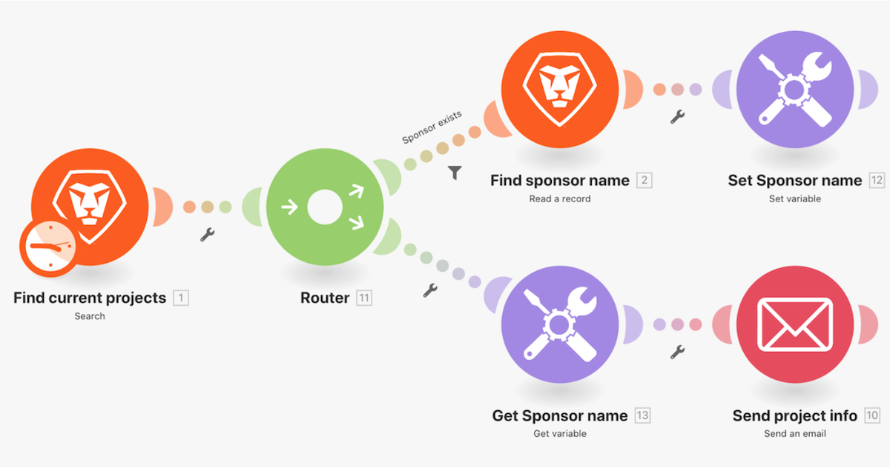

# Set and get variables walkthrough

## Overview

Look up information about a project in Workfront and send an email with related information.

## Get/Set variables walkthrough

Workfront recommends watching the exercise walkthrough video before trying to recreate the exercise in your own environment.

>[!VIDEO](https://video.tv.adobe.com/v/335276/?quality=12)

>[!TIP]
>
>For step-by-step instructions on completing the walkthrough, download the [Adobe Workfront Fusion activity book](/help/assets/adobe-workfront-fusion-activity-book.pdf). **Disclaimer**: The Adobe Workfront Fusion activity book contains a few links to Workfront One, which do not work. This will be updated soon.

## Your turn

This practice exercise builds on what you learned in the walkthrough, but the solution is not provided.

Make a clone of the “Sharing variables between routing paths” scenario you created in this walkthrough. Email the message you compose to the project owner and the project sponsor. You also want to include the project condition in the message. (For now, it's okay that the condition appears as a two-letter key.)

**Challenge:** Schedule your scenario to send this “email” every week at 8 AM on Monday.

## Want to learn more? We recommend the following:

[Workfront Fusion documentation](https://experienceleague.adobe.com/docs/workfront/using/adobe-workfront-fusion/workfront-fusion-2.html?lang=en)
