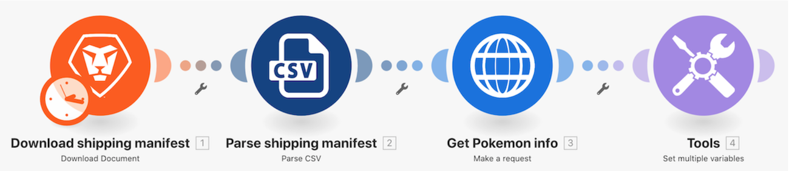

# Universal connectors walkthrough

## Overview

Using a Pokemon character in a spreadsheet, call the Poke API through an HTTP connector to gather and post more information on that character.

## Introduction to universal connectors walkthrough

Workfront recommends watching the exercise walkthrough video before trying to recreate the exercise in your own environment. 

>[!VIDEO](https://video.tv.adobe.com/v/335270/?quality=12)

### Exercise URLs

Pokemon API website: https://pokeapi.co/

URL for exercise: https://pokeapi.co/api/v2/pokemon/{Character}

>[!TIP]
>
>For step-by-step instructions on completing the walkthrough, download the . **Disclaimer**: The Adobe Workfront Fusion activity book contains a few links to Workfront One, which do not work. This will be updated soon.

## Want to learn more? We recommend the following:

