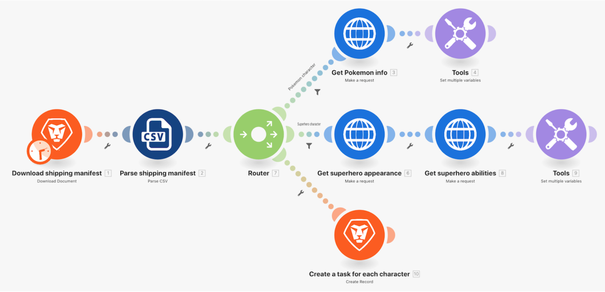
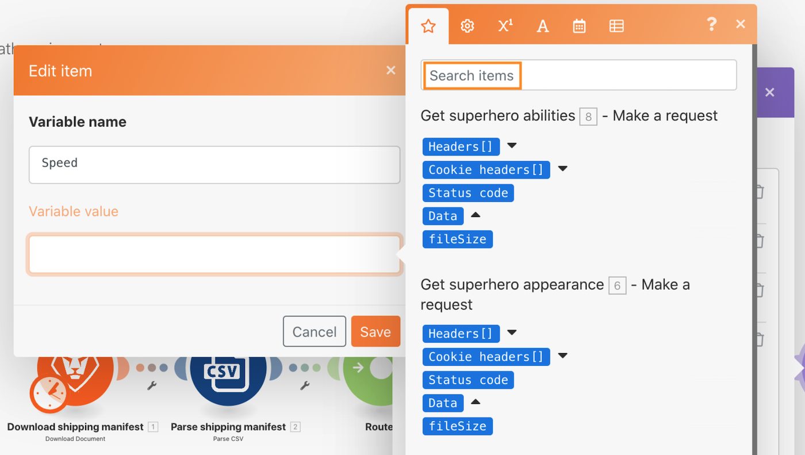
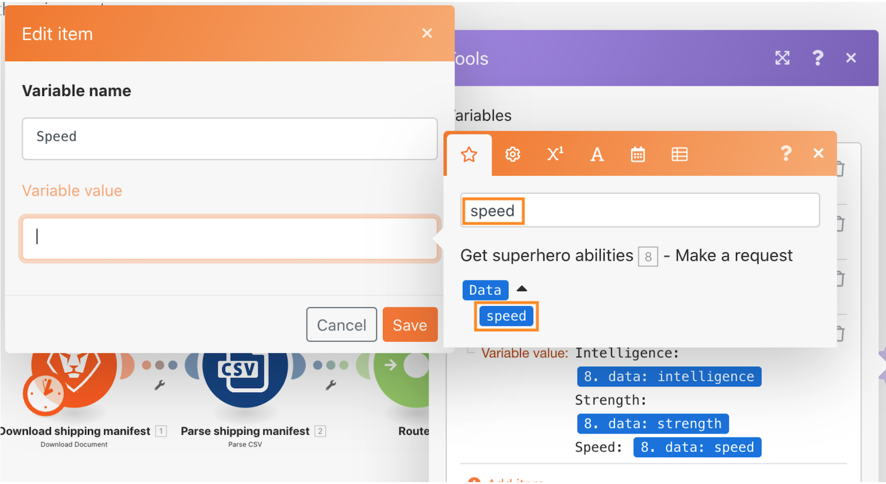
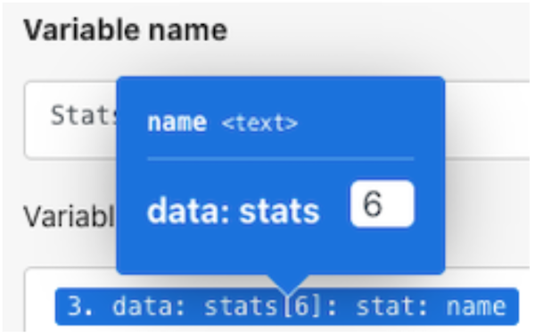

# Routers walkthrough

## Overview

Use a router to pass Pokemon vs. superheroes bundles down the correct path, then create a task for each character.

## Routers walkthrough

Workfront recommends watching the exercise walkthrough video before trying to recreate the exercise in your own environment.

>[!VIDEO](https://video.tv.adobe.com/v/335272/?quality=12)

## Exercise URLs

* Superhero API website: https://superheroapi.com/
* First URL for exercise: https://superheroapi.com/api/{access-token}/{character-id}/appearance
* Second URL for exercise: https://superheroapi.com/api/{access-token}/{character-id}/powerstats

If you have trouble accessing your own superhero token, you can use this shared token: 10110256647253588. Please be considerate of how many times you call to the superhero API so this shared token continues to work for everyone.

>[!TIP]
>
>For step-by-step instructions on completing the walkthrough, download the [Adobe Workfront Fusion activity book](/help/assets/adobe-workfront-fusion-activity-book.pdf). **Disclaimer**: The Adobe Workfront Fusion activity book contains a few links to Workfront One, which do not work. This will be updated soon.

## Search items in the mapping panel

The Search items field at the top of the mapping panels helps you quickly find fields in the panel, even if they’re nested in arrays. The search is case insensitive.

## Tips and tricks for working with APIs

Up to this point, you have worked with a very simple API (Application Programming Interface) that requires no extra authentication to pull information needed in the scenario. Here are a few tips to help you navigate working with APIs and universal connectors.

### Step 1: Determine the type of API

Workfront and many software systems are built using a REST (Representational State Transfer) API, which is the easiest and most standard type of API today. However, there are a few others, such as:

* SOAP (Simple Object Access Protocol) (Workfront’s Proof API is SOAP-based)
* FTP (File Transfer Protocol)
* SFTP (Secure File Transfer Protocol)
* To learn more, do a web search for API types and keywords of interest.

>[!NOTE]
>
>When connecting to larger platforms such as Salesforce, different areas of those platforms will provide different APIs. Make sure you find the right one for the service you want to connect to. 

### Step 2: Determine the type of authentication required by the API

API authentication is a form of identification used to control access to a service, such as when you try to connect through Workfront Fusion. It helps you prove to another system that you are authorized to access the system. OAuth 2 is the most common type of authentication used today. Learn more with an internet search about API authentication. 

Authentication can be the most difficult aspect of working with an API. One of the most valuable features of Workfront Fusion’s universal connectors is that Workfront Fusion can handle authentication for you when using common authentication methods like basic authentication, such as OAuth 2, API Key, and others. Once you create a connection using the appropriate Workfront Fusion module for your authentication method (e.g., OAuth 2), Workfront Fusion will continually generate API keys and/or tokens each time you want to run your scenario. 

Learn about the different types of authentication that Workfront provides in the Enhanced authentication overview article on Experience League.

## Step 3: Read the API documentation and find needed endpoints

When an API interacts with another system, the touchpoints of this communication are considered endpoints. An endpoint is the place where APIs send requests and where the resource lives.

When interacting with an API using a universal connector, you need to understand what endpoints the API supports and what data is required for each request. API documentation should describe an API’s endpoints and how to perform common operations like create, read, update, or delete. Performing these calls requires some practice, especially if you’re new to making API calls or to working with a new API.

Learn more about Workfront Fusion Universal Connectors and how to set them up to connect with the APIs you need on Experience League.

## Final note

You can check the entire list of our pre-built app connectors in Experience League. If you would like to suggest a new app connector to the Workfront Fusion product team, submit your idea to Innovation Lab. If you haven’t submitted before, learn more about the Innovation Lab, plus how you can vote for ideas and participate in the twice-a-year Leaderboard prioritization. If you already have access to Innovation lab, log in and submit your ideas.

## Your turn

This practice exercise builds on what you learned in the walkthrough, but the solution is not provided.

In the Set multiple variables module for Pokemon characters, create a variable called “Stat (Level).” Map the name of the Pokemon Stats into this variable. Use the array value capability to change how the array displays, so that each Stat is a new line as shown below.

**Hint:** There are only six different Pokemon stats with a corresponding level.

**Challenge:** See if you can use the array formulas to get the Abilities to display the same way as above as different rows rather than a string of values separated by a comma. There’s a hint in the screenshot below. 

## Want to learn more? We recommend the following:

[Workfront Fusion documentation](https://experienceleague.adobe.com/docs/workfront/using/adobe-workfront-fusion/workfront-fusion-2.html?lang=en)
