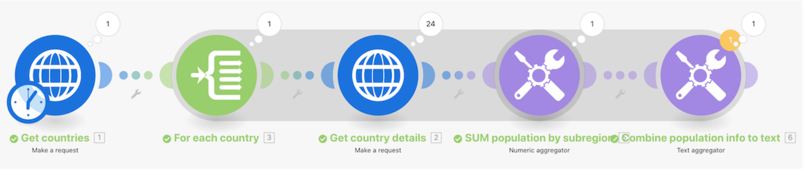

# Advanced aggregation walkthrough

## Overview

Call a web service to return details about multiple countries and identify the total population of all countries, grouped by sub-region.

## Advanced aggregation walkthrough

Workfront recommends watching the exercise walkthrough video before trying to recreate the exercise in your own environment.

>[!VIDEO](https://video.tv.adobe.com/v/335281/?quality=12)

## Exercise URLs

* https://restcountries.com/v3.1/lang/spa
* https://restcountries.com/v3.1/name/{country name}

>[!TIP]
>
>For step-by-step instructions on completing the walkthrough, download the [Adobe Workfront Fusion activity book](/help/assets/adobe-workfront-fusion-activity-book.pdf). **Disclaimer**: The Adobe Workfront Fusion activity book contains a few links to Workfront One, which do not work. This will be updated soon.

## Reinforcement of aggregation principle

Any time a module outputs multiple bundles, every module after that will execute each bundle.

To prevent this, add an aggregator after a module that potentially produces multiple bundles.

You'll see a shadow surrounding any segment in your scenario from a **beginning-iterator** to the **ending-aggregator**. This helps make these segments easy to spot in your Workfront Fusion scenario.

## Your turn

This practice exercise builds on what you learned in the walkthrough, but the solution is not provided.

Create a new scenario to sum all hours logged on tasks in projects in the marketing portfolio. Then send one email that says “Your {Project Name} project team has logged {summed hours} of the total {planned hours} planned hours, putting you at {percentage} of the plan.”

**Challenge:** See if you can do the same thing but for hours logged this year only.

## Want to learn more? We recommend the following:

[Workfront Fusion documentation](https://experienceleague.adobe.com/docs/workfront/using/adobe-workfront-fusion/workfront-fusion-2.html?lang=en)
