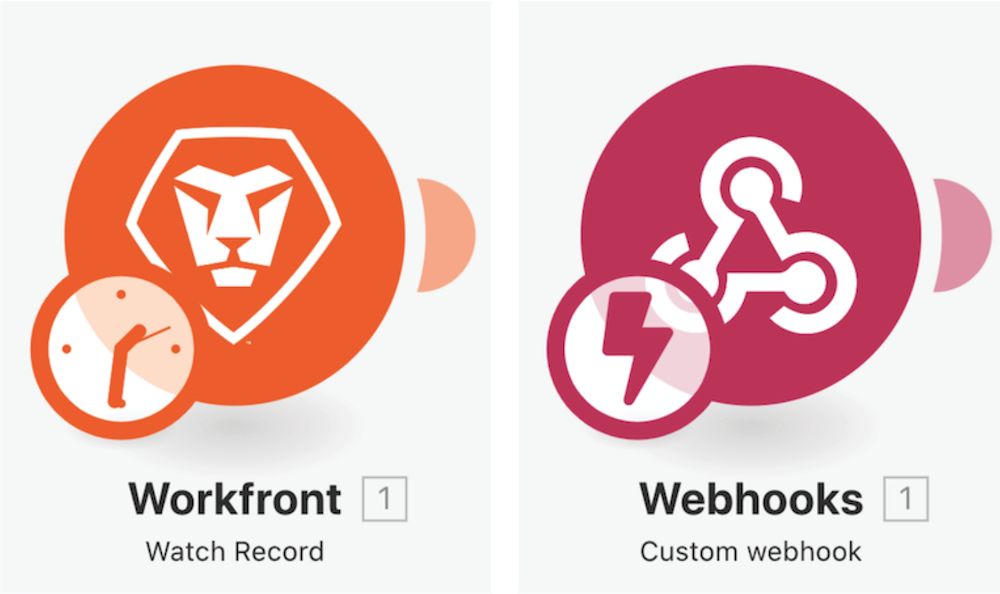
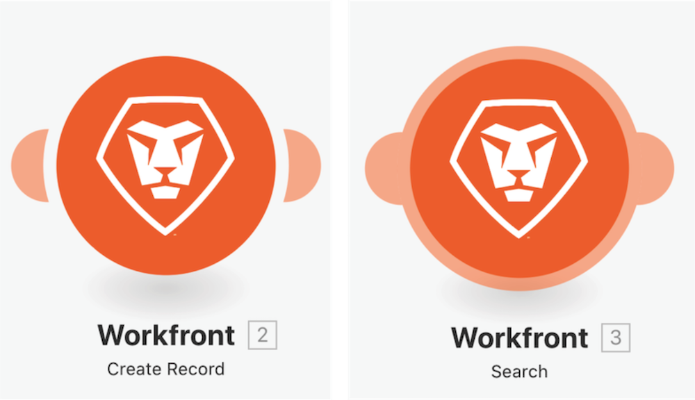

# Become familiar with additional apps and common modules

## Reminder on module types

### Trigger modules

Can only be used as the first module and can return zero, one, or more bundles which will be processed individually in subsequent modules, unless aggregated.  

* **Instant Trigger** (Lightning Bolt on Trigger)—Immediately triggered based upon webhook.
* **Scheduled Trigger** (Clock on Trigger)—Special capabilities to keep track of the last record processed. 

### Actions and search modules

* **Action** — Used to perform CRUD (Create, Read, Update, and Delete) operations.
* **Searches** — Used to search for zero, one, or more records and returns these as bundles which will be processed individually in subsequent modules, unless aggregated.

### Become familiar with additional apps and common modules

In this video, you will learn:

* What triggers, actions, and searches are and how they differ
* Types of modules found in different app connectors and how they function

>[!VIDEO](https://video.tv.adobe.com/v/335287/?quality=12)
