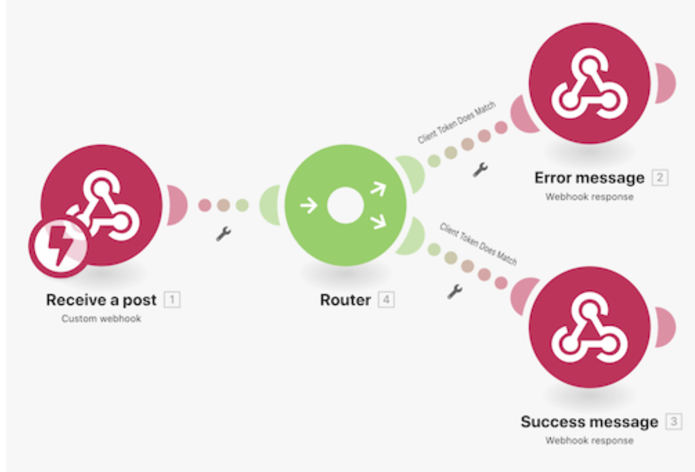
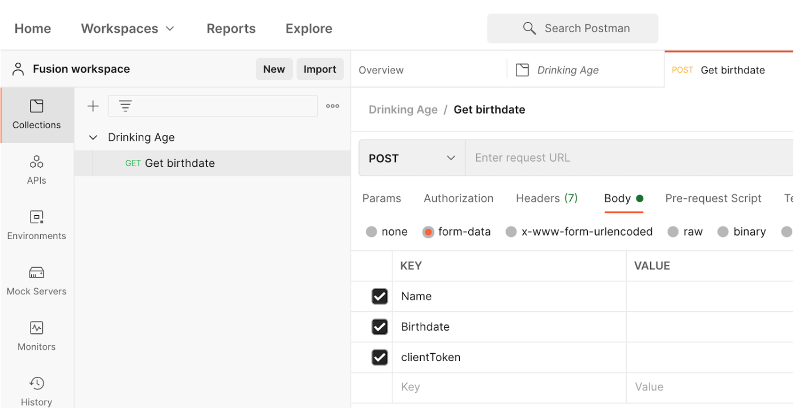

# Webhooks walkthrough

## Overview

This scenario creates a convenience store app so they can easily determine whether or not a customer is old enough to purchase alcohol. The cashier simply needs to post the name and birthdate of the customer AND a verified client token to a URL that’s been provided. Once entered, that will trigger our scenario to calculate the appropriate response and return it to the requestor.

## Webhooks walkthrough

Workfront recommends watching the exercise walkthrough video before trying to recreate the exercise in your own environment.

>[!VIDEO](https://video.tv.adobe.com/v/335292/?quality=12)

>[!TIP]
>
>For step-by-step instructions on completing the walkthrough, go to the [Webhooks walkthrough](https://experienceleague.adobe.com/docs/workfront-learn/tutorials-workfront/fusion/exercises/webhooks.html?lang=en) exercise.

## Postman setup

To follow along with the walkthrough exercise, you need to download the free Postman application. Follow the steps below to navigate to the right area of Postman for the exercise.

1. Create a workspace, then open it.
1. Click on the New tab and create a new collection named Drinking Age.
1. Click on the New tab again and create a new GET request named GET birthdate.
1. Change the request action from GET to POST.
1. Go to the Body subtab area below the POST URL field.
1. Choose form-data below the Authorization subtab.
1. Create three keys for Name, Birthdate, and clientToken.

## Your turn

This practice exercise builds on what you learned in the walkthrough, but the solution is not provided.

Create a Workfront webhook that is waiting for new updates created and then logs the date, the name of the person who made the update, and what the update says. Email yourself this information. 

**Hint**: Use the Workfront Watch Events trigger module to create your webhook. Also, in Workfront updates are called notes.

**Challenge**: Can you find and add the URL for where the update was made for easy access?

## Want to learn more? We recommend the following:

[Workfront Fusion documentation](https://experienceleague.adobe.com/docs/workfront/using/adobe-workfront-fusion/workfront-fusion-2.html?lang=en)
